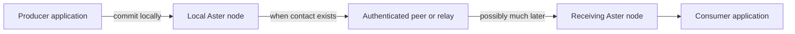

# Aster

**Keep data moving when the network disappears.**

Aster is an offline-first data mesh for applications that cannot depend on a
continuous path to a service. Applications commit data to a local node. Aster
protects it at the source, stores it durably, and exchanges it when an
authenticated contact becomes available.

Direct connections, relays, and central infrastructure can help delivery, but
none is required for the data model to remain correct. Aster is designed for
field teams, vehicles, sensors, and edge systems that move between connected,
constrained, and disconnected operation.

> [!IMPORTANT]
> Aster is an evaluation-stage reference implementation, not a
> production-authorized system. Event has a live networked API; State and
> Record synchronize between selected nodes but use stopped-node
> application APIs; Blob publication and reading are local to one selected
> node. Review the [security gates](docs/security.md) and
> [conformance status](docs/conformance.md) before planning a deployment.

## See it work

The capability tour starts real processes with independent stores and
identities, publishes while disconnected, reconnects the nodes over direct
Iroh contacts, and verifies that a second pass has nothing left to transfer.

```sh
mise install
mise run tour
```

Two focused tours expose the less familiar boundaries:

```sh
mise run tour-relay    # a relay carries protected data it cannot read
mise run tour-control  # revocation, rekey, and captured-node exclusion
```

The tours retain their working directories for inspection. The
[capability tour](docs/quickstart/capability-tour.md) explains each result and
its limits.

## How Aster moves data



- **Offline publication.** Success means the item is durable locally, not that
  a server happened to be reachable.
- **Store-and-forward delivery.** Protected data can cross several intermittent
  contacts, including relays without content access.
- **Source authentication.** Identity and protected semantic metadata survive
  every hop; carrier identity alone never grants data access.
- **Deterministic convergence.** Nodes reconcile without trusting wall clocks
  or assuming one always-online coordinator.

Read [Core concepts](docs/concepts.md) for the ten-minute mental model.

## Choose a data class

The data class defines how an item converges. It is more than a storage label.

| Class | Best for | Convergence behavior |
|---|---|---|
| **State** | Current position, device status, latest setting | Selects one current value per logical key while retaining meaningful concurrent history |
| **Event** | Messages, observations, audit entries | Preserves immutable publisher order and makes sequence gaps detectable |
| **Record** | Plans, forms, annotations, mutable documents | Preserves concurrent versions for explicit, guarded application resolution |
| **Blob** | Imagery, maps, attachments, large binary objects | Identifies immutable chunked content and supports authenticated streaming |

The [data-class guide](docs/concepts.md#choosing-a-data-class) includes a
decision tree and worked examples.

## Integrate an application

For new integrations, start with the local ConnectRPC agent. It exposes the
live Event authority over Connect, gRPC, and gRPC-Web using a checked-in
Protobuf schema and does not require a hosted Buf Schema Registry.

| Integration | Start here | Current boundary |
|---|---|---|
| **Connect, gRPC, or gRPC-Web** | [ConnectRPC agent](docs/quickstart/connect-agent.md) | Live Event and local status; authenticated loopback process |
| **Rust selected node** | [Selected Event API](docs/quickstart/selected-event-api.md) | Live Event publish, query, durable delivery, gaps, and status |
| **State, Record, or Blob in Rust** | [State](docs/quickstart/selected-state-api.md), [Record](docs/quickstart/selected-record-api.md), and [Blob](docs/quickstart/selected-blob-api.md) | Exclusive stopped-node handles; Blob remains local |
| **Rust semantic API** | [Rust quickstart](docs/quickstart/rust.md) | Broader proven semantic surface used as the migration source |
| **Python, Go, or C** | [Language quickstarts](docs/quickstart/README.md) | Offline semantic API through the current C ABI, not the selected live node |

The [application recipes](docs/application-recipes.md) show all four data
classes, queries, subscriptions, batches, deletion, conflicts, and emission
policy. Kubernetes, Zarf, and UDS integrations should treat the ConnectRPC
agent as the application boundary; deployment packaging and protected
provisioning remain open work.

## Current implementation boundary

| Surface | Implemented | Still open |
|---|---|---|
| **Event** | Source-authenticated direct-Iroh reconciliation; live Rust and local ConnectRPC APIs; durable consume/carry selectors and at-least-once delivery | Atomic subscription update, hosted discovery/relay, and broader physical-network acceptance |
| **State** | Source-authenticated publication, causal projection, and direct-Iroh reconciliation under explicit interests | Live application handle, subscriptions, relay cache, expiry, and garbage collection |
| **Record** | Conflict-preserving projection, exact-sibling guarded resolution, and direct-Iroh reconciliation | Live application handle, automatic merge execution, expiry, and garbage collection |
| **Blob** | Authenticated immutable publication, verified encrypted-depot streaming, and direct semantic-v5 source/carrier range transfer with durable resume state | Live application API, route-only relay/custody, representative remote evidence, retention, and garbage collection |
| **Operations** | Manually admitted direct addresses, reference mission provisioning, and bounded same-UID Unix software zeroization | Protected operational provisioning, NAT/hosted relay, BTLE platform integration, physical sanitization, and release authorization |

The [capability roadmap](docs/implementation/capability-roadmap.md) is the
planning and merge-review view. The
[requirements status](docs/implementation/requirements-status.md) remains the
authority for exact evidence and open acceptance gates.

## When Aster fits

Aster is a strong fit when:

- applications must keep publishing without peers or infrastructure online;
- data may cross several intermittent contacts before reaching a consumer;
- links are too constrained to resend an entire dataset;
- conflicts must remain explicit and reproducible without wall-clock ordering;
- relays should forward authorized data without reading it; or
- one application model must survive movement between carriers.

Aster is not a message broker, general-purpose database, VPN, radio manager, or
real-time media transport. If every client can reliably reach one service, a
conventional database or broker will usually be simpler.

## Find the next document

| Goal | Read |
|---|---|
| Understand the model | [Core concepts](docs/concepts.md) |
| Run a working example | [Capability tour](docs/quickstart/capability-tour.md) |
| Build an application | [ConnectRPC agent](docs/quickstart/connect-agent.md) or [language quickstarts](docs/quickstart/README.md) |
| Understand trust and component boundaries | [Selected architecture](docs/architecture.md) |
| Connect nodes or evaluate carriers | [Carriers and contacts](docs/transports.md) |
| Implement compatible protocol bytes | [Protocol](docs/protocol.md), [wire grammar](docs/wire.cddl), and [security objects](docs/envelope.md) |
| Assess progress or readiness | [Capability roadmap](docs/implementation/capability-roadmap.md), [requirements status](docs/implementation/requirements-status.md), [conformance](docs/conformance.md), and [security](docs/security.md) |
| Review development inputs and provenance | [Public development provenance record](docs/provenance/independent-development-record.md) |
| Browse all project records | [Documentation index](docs/README.md) |

## Repository map

| Area | Purpose |
|---|---|
| [`crates`](crates) | Selected node, carrier, persistence, protocol, semantic reference, and conformance implementations |
| [`bindings`](bindings) | C ABI plus Go and Python wrappers |
| [`docs`](docs) | Guides, concepts, specifications, decisions, and evidence |
| [`lab`](lab) | Controlled network and impairment experiments |
| [`fuzz`](fuzz) | Parser and protocol robustness targets |

## Build and verify

```sh
mise install
mise run check
```

See [CI and local validation](docs/ci.md) for narrower checks and the precise
claim attached to each gate.

## License

Licensed under the Apache License, Version 2.0. See `LICENSE`.
Distribution notices for approved dependency exceptions are in
[THIRD_PARTY_NOTICES.md](THIRD_PARTY_NOTICES.md).
