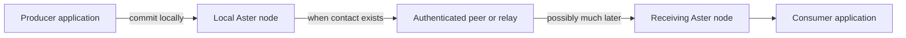

# Aster

**Keep data moving when the network disappears.**

Aster is an offline-first data mesh for applications that cannot depend on a
continuous path to a service. Applications commit data to a local node. Aster
protects it at the source, stores it durably, and exchanges it when an
authenticated contact becomes available.

Direct connections, relays, and central infrastructure can help delivery, but
none is required for the data model to remain correct. Aster is designed for
field teams, vehicles, sensors, and edge systems that move between connected,
constrained, and disconnected operation.

> [!IMPORTANT]
> Aster is an evaluation-stage reference implementation, not a
> production-authorized system. Event, State, Record, and Blob have live Rust
> APIs; Event alone also has a local ConnectRPC API. State, Record, and Blob
> retain stopped-node facades for exclusive use. State's live Rust API includes
> durable positive-current-version delivery; it is not a materialized-view,
> synthetic-withdrawal, dynamic-network-interest, or contact-status surface.
> The live Blob API is limited
> to peerless-capable durable publication and bounded page reads; it is not a
> subscription or convergence-status surface. Review the
> [security gates](docs/security.md) and
> [conformance status](docs/conformance.md) before planning a deployment.

A [retained 7,752-byte v2 live State/Record receipt](docs/implementation/evidence/selected-live-mutable-6cabb4c.json)
(SHA-256
`054945ecf94e8bfba1b130f6a5f47e9b1e0e17ad69f3b1472085a1d10f05eeaa`)
binds signed source commit `6cabb4c`. On one loopback host, two
same-implementation participants completed six actor lifetimes, with at most two
actors concurrent. They published State and conflicting Record revisions while
peerless; eight direct `CONTACT` records then accounted for 7/7/7 selected items
offered/fetched/inserted. State first retained two concurrent heads, then a
causally later successor observed and superseded both. After the other actor
observed that successor, it published an authenticated empty tombstone that
observed and superseded all three predecessors; both actors selected the
tombstone as current, and one immediate peerless restart reproduced that exact
projection. Record conflict rejection, guarded resolution, superseded
originals, exact retry, and restart also passed. Six graceful shutdowns closed
four retained handles, while Event, control, and Blob counters remained zero.

That receipt is bounded evidence, not a broader acceptance claim. Its
source-to-execution link is operator-attested, not cryptographically proven or
reproducible; secret artifacts were inspected by metadata only, and the ordered
State observation/publication chain is producer-attested. The restart proves
one immediate peerless reopen, not indefinite tombstone retention, compaction,
garbage collection, or delete-wins. It does not cover physical hosts, NAT,
Internet, relay, BTLE, independent implementations, scale beyond two
participants, resource thresholds, long-duration operation, or evidence for
the newer live Blob mechanism or, by itself, live Event/Blob application
acceptance. Finite State/Record TTL, durable Record/Blob delivery, State
status/materialized-view/synthetic-withdrawal behavior, dynamic State network
interests, selected-node language bindings,
representative physical or mixed-implementation acceptance, and release
authorization remain open.

A separate [retained 9,656-byte v1 State-delivery receipt](docs/implementation/evidence/selected-live-state-subscription-8912fc3.json)
(SHA-256
`7d0b568dd4d57c3f2967da55953896829261877513c59c51a0b274eeda69485f`)
binds signed source commit `8912fc33571449d1beb4a4cb0f204b5dcd44e8c2`.
On one same-implementation loopback host, two participants ran three processes,
10 actor lifetimes, and 10 positive direct contacts. After a receiver process
was forcibly terminated following a flushed unacknowledged poll, a fresh
process redelivered the same State identity as attempt 2, acknowledged it,
accepted idempotent re-acknowledgement, and then polled empty. The run also
retained application/network selector separation, withheld an authorized but
network-uninterested State, suppressed acknowledged and superseded ancestors,
delivered an explicit current tombstone, and replayed the subscription on one
final peerless reopen. This is bounded positive-current-version delivery
evidence—not a State status or materialized-view/transition feed, dynamic
network-interest mutation, physical/NAT/relay/BTLE or mixed-implementation
result, scale beyond two, resource/soak result, or release authorization.

A [retained 9,573-byte v1 live-Event receipt](docs/implementation/evidence/selected-live-event-c464129.json)
(SHA-256
`4d71d04e4ebcc9f63c0e84e7f11e83bf1f3d1ad2ca8608486cdcc875b6dfeef0`)
binds signed source `c464129`. On one same-implementation loopback host, a
peerless publisher durably created three alpha Events plus one authorized beta
Event. A priority-threshold direct contact delivered alpha sequences 1 and 3,
exposed the authenticated half-open gap `[2,3)`, and left the beta Event
withheld. After the receiver child was forcibly terminated following a flushed,
unacknowledged poll, a fresh process redelivered the same two Event IDs as
attempt 2 and completed acknowledgement plus idempotent re-acknowledgement. A
normal contact then delivered alpha sequence 2 and closed the gap.

That receipt also observes `PolicyChangedSinceContact` after a temporary beta
subscription, followed by exact removal and idempotent removal, but no fresh
post-change contact or beta delivery. Its awaiting observations have zero—not
positive—failed contact attempts. It is bounded direct-Iroh software evidence,
not physical-host, NAT/Internet, relay, BTLE, mixed-implementation, scale,
resource/soak, State/Record/Blob acceptance, reproducible-build, release, or
production evidence.

A [retained 10,728-byte v2 live-Blob receipt](docs/implementation/evidence/selected-live-blob-044d90f.json)
(SHA-256
`4fea2ffbd16608862a67167fb1b8fcb6d5d8b4b82c576aa9a6b7e25ee9c55909`)
binds signed source commit `044d90ff07c8e754b3d490cb810d42de3c915e3d`
with `Good` signature status. Its three participants ran 11 actor lifetimes and
32 error-free direct `CONTACT` records: a publisher committed while peerless; a replica
received all 98,638 carrier bytes; a receiver retained an interrupted
exactly-one-contact 16,384-byte prefix, reopened peerless with that exact
progress, resumed exactly 16,384 bytes from the different replica without
refetching the source, fetched the exact remaining 65,870 bytes, reconstructed
all 98,638 carrier bytes, and reopened peerless for a final authenticated read.
Its source-to-execution link remains operator-attested, not cryptographically
proven. This is one-host, same-implementation evidence of graceful same-process
actor/store/provider reopen only. It does not prove process-crash, power-loss,
long-offline, arbitrary-peer, or route-only resume; NAT, Internet, relay, or
BTLE paths; independent-implementation interoperability; scale beyond three
participants; resource thresholds or soak; physical sanitization; or release
authorization.

A [retained two-cell receipt](docs/implementation/requirements-status.md#selected-iroh-nat-retained-receipt)
observes the selected Event path on one Darwin arm64 host through isolated
Docker Linux namespace NATs: one relay-disabled cone cell selected Direct, and
one restrictive direct-blocked cell selected the exact operator-pinned
controlled Iroh connectivity relay. Each cell delivered and acknowledged one
exact 32-byte Event and replayed as an exact no-op. This is one-host software
namespace-NAT evidence only—not discovery or punching, temporal fallback
chronology, representative or physical NAT, public Internet or public/default
relay, independent implementation, BTLE, other-class relay, complete-MVP, or
release evidence.

## See it work

The capability tour starts real processes with independent stores and
identities, publishes while disconnected, reconnects the nodes over direct
Iroh contacts, and verifies that a second pass has nothing left to transfer.

```sh
mise install
mise run tour
```

Two focused tours expose the less familiar boundaries:

```sh
mise run tour-relay    # a relay carries protected data it cannot read
mise run tour-control  # revocation, rekey, and captured-node exclusion
```

The tours retain their working directories for inspection. The
[capability tour](docs/quickstart/capability-tour.md) explains each result and
its limits.

## How Aster moves data



- **Offline publication.** Success means the item is durable locally, not that
  a server happened to be reachable.
- **Store-and-forward delivery.** Protected data can cross several intermittent
  contacts, including relays without content access.
- **Source authentication.** Identity and protected semantic metadata survive
  every hop; carrier identity alone never grants data access.
- **Deterministic convergence.** Nodes reconcile without trusting wall clocks
  or assuming one always-online coordinator.

Read [Core concepts](docs/concepts.md) for the ten-minute mental model.

## Choose a data class

The data class defines how an item converges. It is more than a storage label.

| Class | Best for | Convergence behavior |
|---|---|---|
| **State** | Current position, device status, latest setting | Selects one current value per logical key while retaining meaningful concurrent history |
| **Event** | Messages, observations, audit entries | Preserves immutable publisher order and makes sequence gaps detectable |
| **Record** | Plans, forms, annotations, mutable documents | Preserves concurrent versions for explicit, guarded application resolution |
| **Blob** | Imagery, maps, attachments, large binary objects | Identifies immutable chunked content and supports authenticated streaming |

The [data-class guide](docs/concepts.md#choosing-a-data-class) includes a
decision tree and worked examples.

## Integrate an application

For new integrations, start with the local ConnectRPC agent. It exposes the
live Event authority over Connect, gRPC, and gRPC-Web using a checked-in
Protobuf schema and does not require a hosted Buf Schema Registry.

| Integration | Start here | Current boundary |
|---|---|---|
| **Connect, gRPC, or gRPC-Web** | [ConnectRPC agent](docs/quickstart/connect-agent.md) | Live Event and local status; authenticated loopback process |
| **Rust selected node** | [Selected Event API](docs/quickstart/selected-event-api.md) | Live Event publish, query, durable delivery, gaps, and status |
| **State or Record in Rust** | [State](docs/quickstart/selected-state-api.md) and [Record](docs/quickstart/selected-record-api.md) | Cloneable live actor handles plus exclusive stopped-node facades; direct-Iroh reconciliation under explicit interests; State adds durable positive-current-version delivery |
| **Blob in Rust** | [Blob](docs/quickstart/selected-blob-api.md) | Cloneable `RunningNode::selected_blobs()` handle for durable file publication and bounded pages, plus an exclusive stopped streaming facade; already-durable Blob data can transfer directly under semantic v5 |
| **Rust semantic API** | [Rust quickstart](docs/quickstart/rust.md) | Broader proven semantic surface used as the migration source |
| **Python, Go, or C** | [Language quickstarts](docs/quickstart/README.md) | Offline semantic API through the current C ABI, not the selected live node |

The [application recipes](docs/application-recipes.md) show all four data
classes, queries, subscriptions, batches, deletion, conflicts, and emission
policy. Kubernetes, Zarf, and UDS integrations should treat the ConnectRPC
agent as the application boundary; deployment packaging and protected
provisioning remain open work.

## Current implementation boundary

| Surface | Implemented | Still open |
|---|---|---|
| **Event** | Source-authenticated reconciliation over direct Iroh or one operator-pinned controlled Iroh connectivity relay; live Rust and local ConnectRPC APIs; durable consume/carry selectors and at-least-once delivery | Atomic subscription update, hosted discovery/public relay, and broader physical-network acceptance |
| **State** | Source-authenticated live or stopped publication/query, causal projection, direct-Iroh reconciliation under explicit interests, durable positive-current-version delivery, and bounded retained one-host evidence including forced-process redelivery | Contact/status and materialized-view/synthetic-withdrawal behavior, dynamic network-interest mutation, selected-node bindings, finite TTL, relay acceptance, expiry/garbage collection, and representative physical/mixed evidence |
| **Record** | Live or stopped conflict-preserving query/publication, exact-sibling guarded resolution, direct-Iroh reconciliation, and bounded retained one-host evidence | Durable subscriptions, selected-node bindings, automatic merge execution, finite TTL, relay acceptance, expiry/garbage collection, and representative physical/mixed evidence |
| **Blob** | Authenticated immutable publication through a cloneable live Rust handle or exclusive stopped facade; live reads return at most one zeroize-on-drop 64-KiB page; direct semantic-v5 source/carrier transfer has durable resume state and bounded retained one-host interrupted/reopened/different-peer resume, completion, read, and reopen evidence | Blob subscription or convergence status, route-only relay/custody, arbitrary-peer resume, crash/power-loss/long-offline recovery, large/RSS acceptance, representative physical or mixed-implementation evidence, retention, garbage collection, and release authorization |
| **Operations** | Manually admitted direct addresses, an operator-pinned controlled relay, bounded one-host software namespace-NAT acceptance, reference mission provisioning, and bounded same-UID Unix software zeroization | Protected operational provisioning, discovery, representative/physical NAT, public/default relay selection, BTLE platform integration, physical sanitization, and release authorization |

The [capability roadmap](docs/implementation/capability-roadmap.md) is the
planning and merge-review view. The
[requirements status](docs/implementation/requirements-status.md) remains the
authority for exact evidence and open acceptance gates.

## When Aster fits

Aster is a strong fit when:

- applications must keep publishing without peers or infrastructure online;
- data may cross several intermittent contacts before reaching a consumer;
- links are too constrained to resend an entire dataset;
- conflicts must remain explicit and reproducible without wall-clock ordering;
- relays should forward authorized data without reading it; or
- one application model must survive movement between carriers.

Aster is not a message broker, general-purpose database, VPN, radio manager, or
real-time media transport. If every client can reliably reach one service, a
conventional database or broker will usually be simpler.

## Find the next document

| Goal | Read |
|---|---|
| Understand the model | [Core concepts](docs/concepts.md) |
| Run a working example | [Capability tour](docs/quickstart/capability-tour.md) |
| Build an application | [ConnectRPC agent](docs/quickstart/connect-agent.md) or [language quickstarts](docs/quickstart/README.md) |
| Understand trust and component boundaries | [Selected architecture](docs/architecture.md) |
| Connect nodes or evaluate carriers | [Carriers and contacts](docs/transports.md) |
| Implement compatible protocol bytes | [Protocol](docs/protocol.md), [wire grammar](docs/wire.cddl), and [security objects](docs/envelope.md) |
| Assess progress or readiness | [Capability roadmap](docs/implementation/capability-roadmap.md), [requirements status](docs/implementation/requirements-status.md), [conformance](docs/conformance.md), and [security](docs/security.md) |
| Review development inputs and provenance | [Public development provenance record](docs/provenance/independent-development-record.md) |
| Browse all project records | [Documentation index](docs/README.md) |

## Repository map

| Area | Purpose |
|---|---|
| [`crates`](crates) | Selected node, carrier, persistence, protocol, semantic reference, and conformance implementations |
| [`bindings`](bindings) | C ABI plus Go and Python wrappers |
| [`docs`](docs) | Guides, concepts, specifications, decisions, and evidence |
| [`lab`](lab) | Controlled network and impairment experiments |
| [`fuzz`](fuzz) | Parser and protocol robustness targets |

## Build and verify

```sh
mise install
mise run check
```

See [CI and local validation](docs/ci.md) for narrower checks and the precise
claim attached to each gate.

## License

Licensed under the Apache License, Version 2.0. See `LICENSE`.
Distribution notices for approved dependency exceptions are in
[THIRD_PARTY_NOTICES.md](THIRD_PARTY_NOTICES.md).
