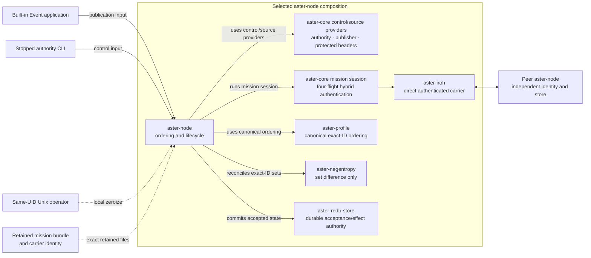
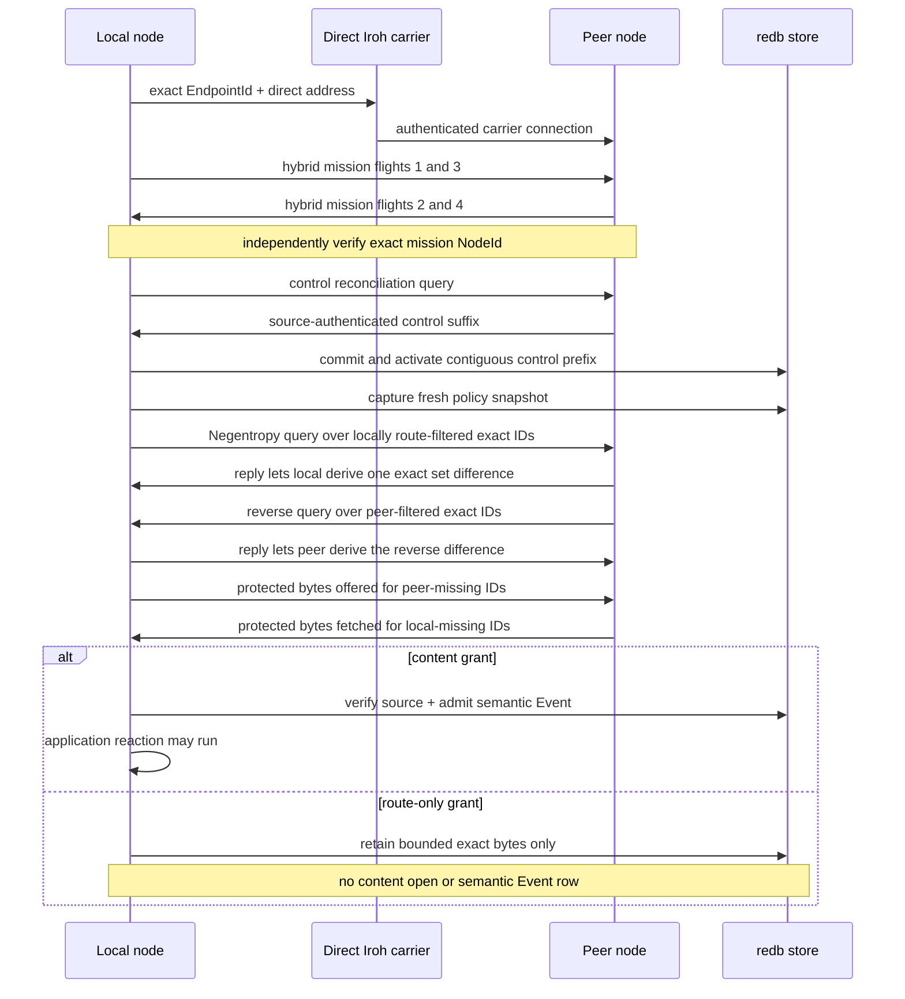
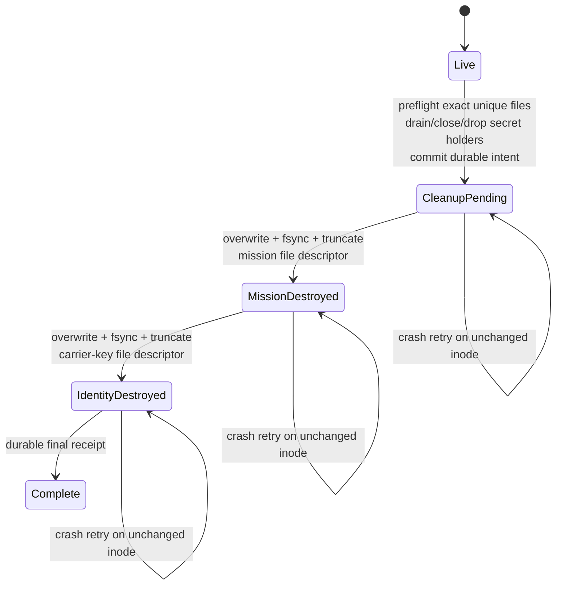

# Selected production-lane architecture

This page depicts the bounded control/Event composition that executes today.
It is intentionally narrower than Aster's complete protocol and semantic
reference implementation. State, Record, Blob, generalized applications and
subscriptions, finite-TTL custody, protected operational provisioning,
additional carriers, and release authorization remain outside this selected
lane.

## Components and trust boundaries

`aster-node` is the sole composition root. `aster-iroh` authenticates only the
carrier endpoint and provides bounded direct exchange. The mission `NodeId` is
independent from the Iroh `EndpointId`. `aster-negentropy` computes exact-ID set
difference; it does not transfer objects, establish causality, or make policy.
`aster-redb-store` is the selected durable authority for accepted Events,
ordered control effects, policy snapshots, route-only representations, and the
terminal zeroization marker.

## One authenticated contact

The ordering is security-relevant: mission authentication precedes inventory;
control reconciliation and durable activation precede Event inventory; a fresh
policy snapshot filters every peer's route visibility; and content admission is
separate from forwarding authority.

## Identity and authorization are deliberately separate

| Layer | Proves or decides | Does not imply |
|---|---|---|
| Carrier | Exact direct Iroh endpoint | Mission membership or data access |
| Mission | Hybrid-session possession of the expected mission `NodeId` | Control authority, source authorship, route, or content grant |
| Control | Ordered authority/delegation chain and policy effect | Event source identity or plaintext access |
| Event source | Publisher and protected semantic header | Permission for every peer to route or read it |
| Route policy | Whether an exact representation may be advertised/carried | Content decryption or semantic admission |
| Content policy | Whether protected bytes may become a semantic Event | Authority to alter source identity or control state |

## Bounded terminal zeroization

Every non-`Live` phase denies normal opens. Terminal-safe inspection and data
rows remain available. The same-UID Unix operator may enter through owner-only
live IPC or a stopped exclusive-writer path; there is no carrier or mission-
control trigger. Pathnames remain as zero-length tombstones. Physical media,
copy-on-write history, snapshots, swap, backups, database rollback/replacement,
and non-Unix behavior are outside the proof.

## Follow the evidence

- [Capability tour](quickstart/capability-tour.md) — fastest visible behavior.
- [Carriers and contacts](transports.md) — selected and migration-source carrier boundaries.
- [Mesh CLI guide](quickstart/mesh-cli.md) — phase-by-phase and retained receipts.
- [Requirements status](implementation/requirements-status.md) — exact credited rows and open gaps.
- [Security model](security.md) — production gates and explicit non-claims.
