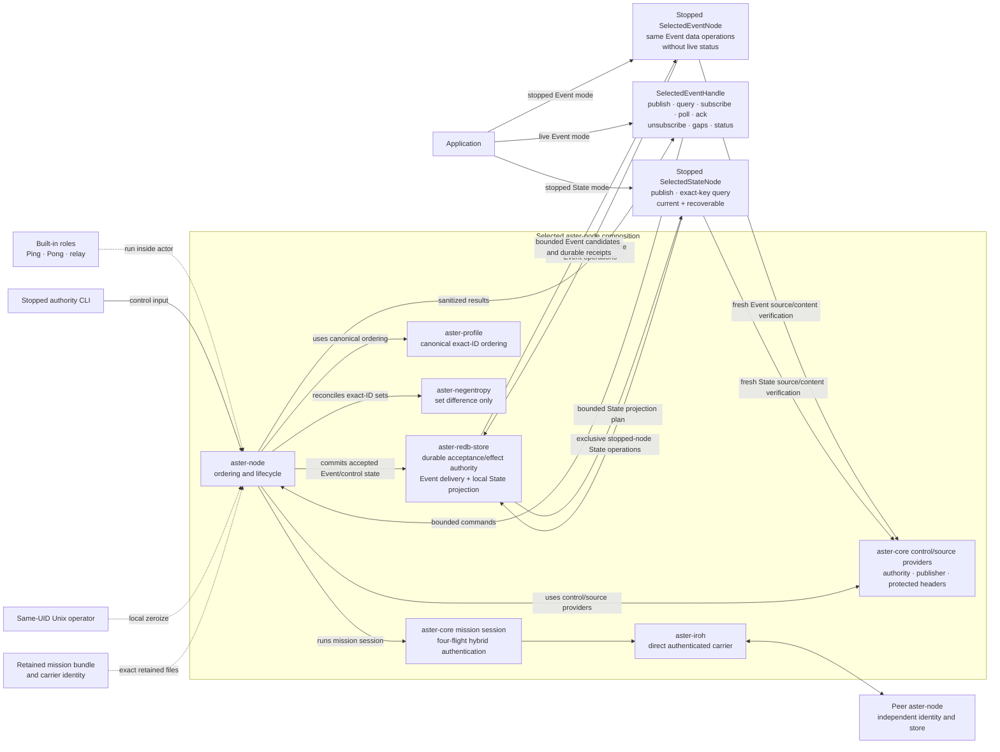
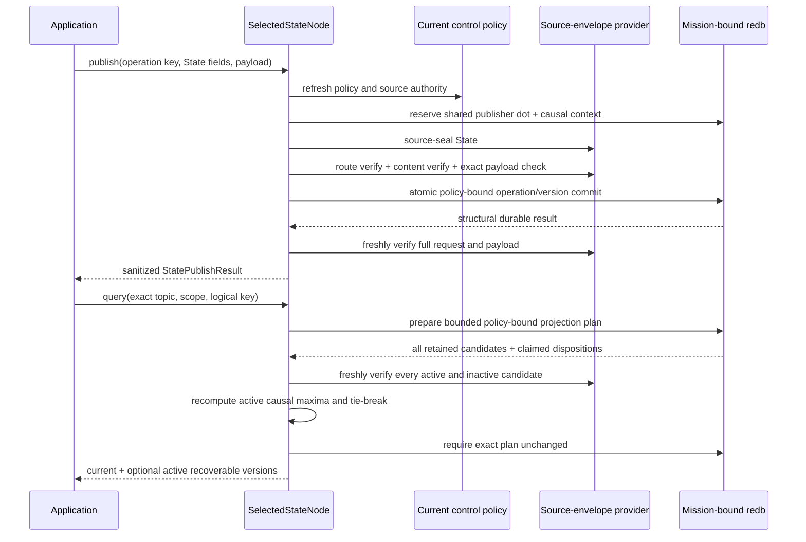
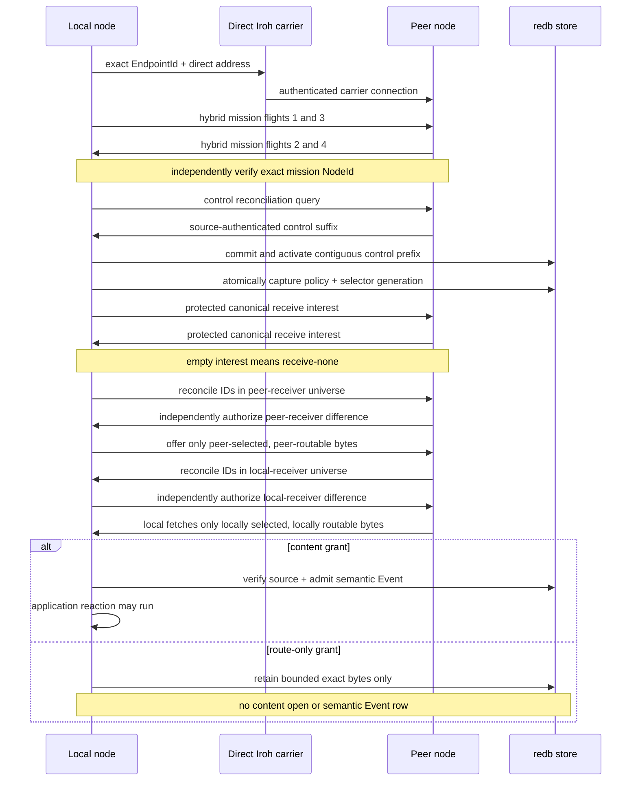
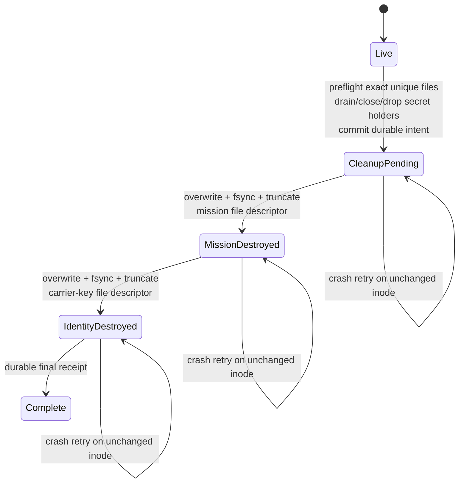

# Selected production-lane architecture

This page depicts the bounded control/Event composition and local State
projection that execute today.
It is intentionally narrower than Aster's complete protocol and semantic
reference implementation. The live selected Event API provides publish,
bounded query, durable subscribe/poll/ack, idempotent unsubscribe, authenticated
gap inspection, and bounded peer/last-contact status through the running node's
sole actor. The stopped Event handle provides the same data operations when no
runtime owns the store. An exclusive stopped `SelectedStateNode` additionally
provides source-authenticated State publication and exact-key causal projection.
State has no live handle or reconciliation frames in this slice. Record, Blob,
atomic subscription update, finite-TTL custody, protected operational
provisioning, additional carriers, generalized control administration, and
release authorization remain outside this selected lane.

## Components and trust boundaries



`aster-node` is the sole composition root. `aster-iroh` authenticates only the
carrier endpoint and provides bounded direct exchange. The mission `NodeId` is
independent from the Iroh `EndpointId`. `aster-negentropy` computes exact-ID set
difference; it does not transfer objects, establish causality, or make policy.
`aster-redb-store` is the selected durable authority for accepted Events and
local State versions, their shared publisher causal frontier, ordered control
effects, policy/selector snapshots, at-least-once Event delivery, route-only
Event representations, and the terminal zeroization marker. State operation
rows have dedicated count/byte ceilings and also participate in aggregate store
quotas; no unbounded idempotency table is implied.

The live handle does not open a second store. It sends commands over a bounded
channel to the actor that already owns the mission-bound writer. Commands that
insert or remove selectors take the actor's policy write lease; other
application operations and contacts use a policy read lease. Shutdown or
zeroization closes admission and rejects queued commands before the authority
is released. The stopped handle can acquire that authority only after the live
actor has exited.

## Local State publication and projection

The selected State facade uses the same mission, control policy, source-envelope
provider, writer lock, and causal ledger as Event. A State publisher counter
therefore cannot restart at one or reuse an Event dot. State storage is additive
and does not alter the Event frame grammar or either Event reconciliation lane.



The durable operation mapping is structural state inside the privileged store,
not an application capability. Even an exact replay must pass current mission,
revocation, source, topic, scope, and content authorization before the original
result is returned. A previously committed old-epoch operation can resolve only
under that current authority; a future-epoch representation is rejected. The
facade then freshly verifies the returned semantic identity, protected header,
and exact plaintext against the complete publication request.

Projection is causal and clock-independent. For one exact topic/scope/logical
key, a version dominates another only when its authenticated causal context
observes the other's dot. The active causal maxima are retained; the greatest
complete semantic State ID is the deterministic current version, and any other
maxima are `Concurrent`. Dominated versions are `Superseded`. The store supplies
a structural plan, the facade independently recomputes that result from freshly
verified capabilities, and the store rechecks the exact plan before return.

Inactive revoked or old-epoch rows are still included in the bounded plan and
freshly verified so they cannot hide structural corruption, but they are not
returned as application current or recoverable values. A current tombstone is
returned visibly as authenticated State with an empty payload. There is no
delete-wins rule, and deletion is not collapsed into an unauthenticated
`None`. Expiry, garbage collection, State subscriptions, live State commands,
and State transfer remain unimplemented.

## Live application command and status flow

```mermaid
sequenceDiagram
    participant A as Application
    participant H as SelectedEventHandle
    participant N as RunningNode actor
    participant L as Policy lease
    participant S as Mission-bound redb
    participant C as Contact task

    A->>H: high-level Event operation
    H->>N: bounded command + one-shot reply
    alt subscribe or unsubscribe
        N->>L: acquire write lease
        N->>S: atomically update selector generation and delivery ledger
        S-->>N: durable selector receipt
    else publish
        N->>L: acquire read lease
        N->>N: validate request and source-seal Event
        N->>S: policy-bound idempotent commit
        S-->>N: durable publication result
    else query, poll, or gaps
        N->>L: acquire read lease
        N->>S: request bounded structural candidates or plan
        S-->>N: untrusted candidate page or plan
        N->>N: freshly verify source; verify content for returned data
        N->>S: recheck exact poll/gap plan when applicable
    else acknowledge or status
        N->>L: acquire read lease
        N->>S: check current policy, delivery ledger, or selector snapshot
        S-->>N: durable acknowledgement or local policy state
    end
    N-->>H: sanitized application result
    H-->>A: typed result

    C->>N: completed authenticated contact receipt
    N->>N: record peer, bounded remainder, and exact contact policy
    A->>H: status()
    H->>N: status command
    N->>S: current control and selector policy
    N-->>H: local last-contact snapshot
    H-->>A: typed status
    Note over A,N: LastContactComplete is not global convergence
```

Gap results follow the same trust rule. The store prepares a bounded structural
plan, the selected node freshly verifies every observed source position, and
the store rechecks the exact policy-bound plan before a half-open gap interval
is exposed. Absence of a returned gap says only that the locally observed,
verified positions in that page are contiguous; it is not publisher
completeness or mesh convergence.

## One authenticated contact



The ordering is security-relevant: mission authentication precedes inventory;
control reconciliation and durable activation precede protected interest or
Event inventory; each receiver gets an independent filtered reconciliation
universe; and content admission is separate from forwarding authority. Receive
intent never grants access: current source, epoch, revocation, and route policy
are rechecked at inventory, transfer, and commit boundaries.

## Identity and authorization are deliberately separate

| Layer | Proves or decides | Does not imply |
|---|---|---|
| Carrier | Exact direct Iroh endpoint | Mission membership or data access |
| Mission | Hybrid-session possession of the expected mission `NodeId` | Control authority, source authorship, route, or content grant |
| Control | Ordered authority/delegation chain and policy effect | Event source identity or plaintext access |
| Event source | Publisher and protected semantic header | Permission for every peer to route or read it |
| State source | Publisher, causal stamp, exact key, protected semantic header, and payload commitment | Live replication, permission for every peer, or a special delete-wins rule |
| Receive selector | Membership-visible topic/scope intent inside the protected mission session; empty means receive-none | Route or content authority, Event-ID disclosure, or scope-private subscription metadata |
| Route policy | Whether an exact representation may be advertised/carried | Content decryption or semantic admission |
| Content policy | Whether protected bytes may become a semantic Event | Authority to alter source identity or control state |

## Bounded terminal zeroization



Every non-`Live` phase denies normal opens. Terminal-safe inspection and data
rows remain available. The same-UID Unix operator may enter through owner-only
live IPC or a stopped exclusive-writer path; there is no carrier or mission-
control trigger. Pathnames remain as zero-length tombstones. Physical media,
copy-on-write history, snapshots, swap, backups, database rollback/replacement,
and non-Unix behavior are outside the proof.

## Follow the evidence

- [Capability tour](quickstart/capability-tour.md) — fastest visible behavior.
- [Selected Event API](quickstart/selected-event-api.md) — live publish/query,
  durable delivery, gaps, unsubscribe, and bounded status.
- [Selected State API](quickstart/selected-state-api.md) — stopped/local
  latest-value projection, recoverable history, and visible tombstones.
- [Carriers and contacts](transports.md) — selected and migration-source carrier boundaries.
- [Mesh CLI guide](quickstart/mesh-cli.md) — phase-by-phase and retained receipts.
- [Requirements status](implementation/requirements-status.md) — exact credited rows and open gaps.
- [Security model](security.md) — production gates and explicit non-claims.
