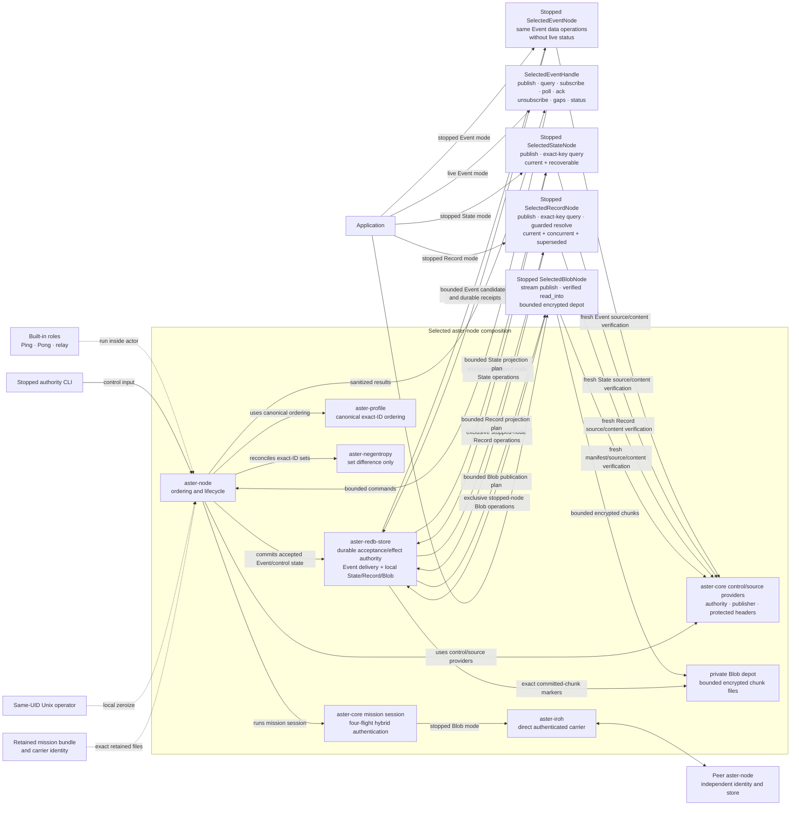
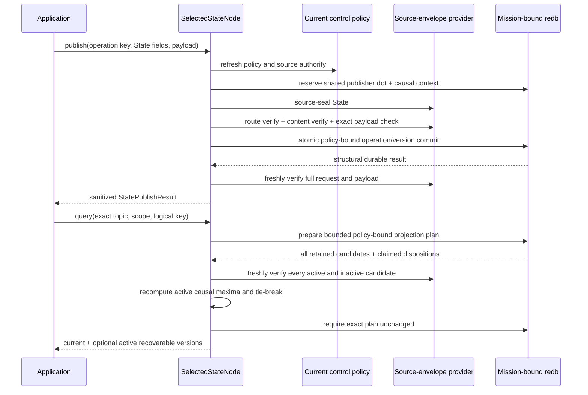
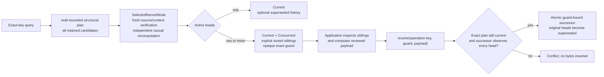
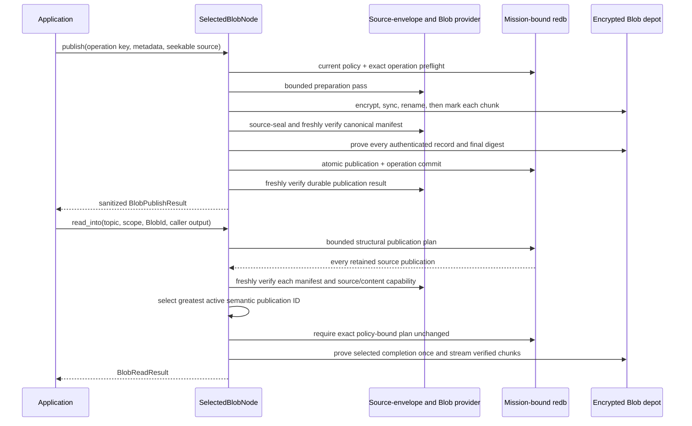
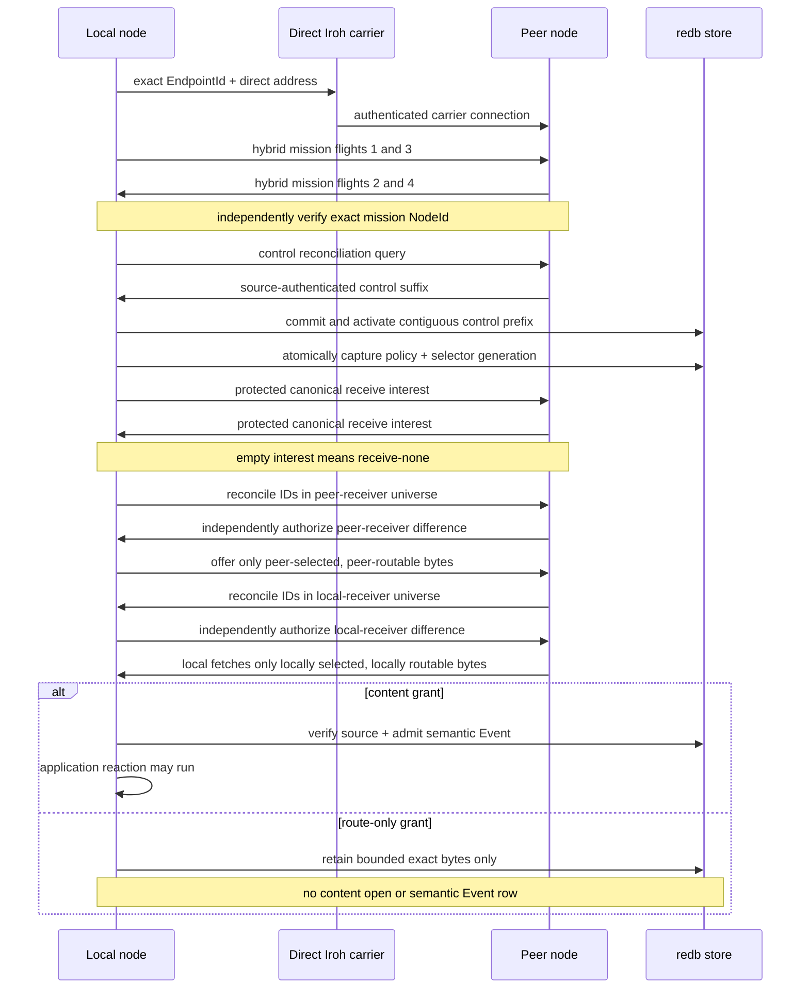
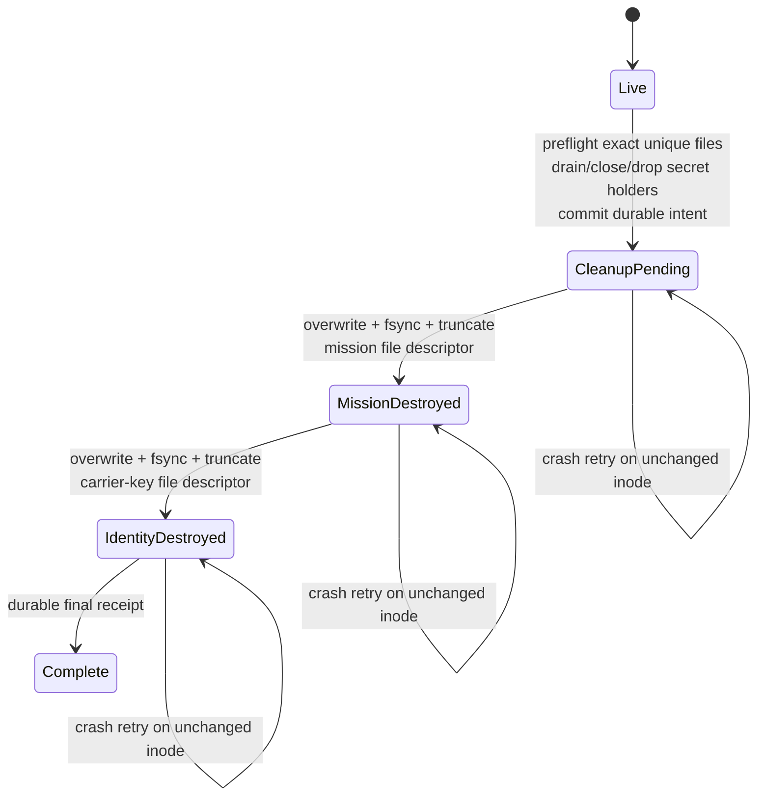

# Selected production-lane architecture

This page depicts the bounded control/Event composition and local State,
Record, and Blob surfaces that execute today.
It is intentionally narrower than Aster's complete protocol and semantic
reference implementation. The live selected Event API provides publish,
bounded query, durable subscribe/poll/ack, idempotent unsubscribe, authenticated
gap inspection, and bounded peer/last-contact status through the running node's
sole actor. The stopped Event handle provides the same data operations when no
runtime owns the store. An exclusive stopped `SelectedStateNode` additionally
provides source-authenticated State publication and exact-key causal projection.
An exclusive stopped `SelectedRecordNode` preserves and annotates exact-key
causal heads and accepts explicit application-reviewed resolution only through
an exact sibling guard. State and Record have no live handles or reconciliation
frames in this slice. An exclusive stopped `SelectedBlobNode` streams one
source-authenticated immutable object through a bounded encrypted local depot
without returning provider readers or key material. Blob likewise has no live
handle or reconciliation frames. Automatic registered-policy Record merge,
remote Blob chunk transfer, atomic subscription update, finite-TTL custody,
protected operational provisioning, additional carriers, generalized control
administration, and release authorization remain outside this selected lane.

## Components and trust boundaries



`aster-node` is the sole composition root. `aster-iroh` authenticates only the
carrier endpoint and provides bounded direct exchange. The mission `NodeId` is
independent from the Iroh `EndpointId`. `aster-negentropy` computes exact-ID set
difference; it does not transfer objects, establish causality, or make policy.
`aster-redb-store` is the selected durable authority for accepted Events and
local State, Record, and Blob publications, their shared publisher causal
frontier, ordered control effects, policy/selector snapshots, at-least-once Event delivery, route-only
Event representations, and the terminal zeroization marker. State, Record, and
Blob operation rows have separate dedicated count/byte ceilings and also
participate in aggregate store quotas; no unbounded idempotency table is
implied. Blob ciphertext is stored outside redb under separate committed-byte,
chunk, and variant ceilings, while redb remains the authority for exact
publication and committed-file markers. On its first successful open, redb
persists a domain-separated commitment over a random owner token, canonical
database path, and Unix device/inode when available. The fixed sibling depot’s
private marker must carry the same binding before any chunk/variant scan or
reclaim. The first database to initialize a parent’s depot wins; another cannot
adopt it. Moving/copying even an empty bound database to another path fails on
reopen. On Unix, a new inode also fails, moving the depot with the database does
not preserve the binding, and a same-path replacement cannot adopt an existing
depot. Non-Unix does not prove copied-database replacement/rollback resistance
at the same canonical path. No supported rebind/restore migration is provided
in this slice.

The live handle does not open a second store. It sends commands over a bounded
channel to the actor that already owns the mission-bound writer. Commands that
insert or remove selectors take the actor's policy write lease; other
application operations and contacts use a policy read lease. Shutdown or
zeroization closes admission and rejects queued commands before the authority
is released. The stopped handle can acquire that authority only after the live
actor has exited.

## Local State publication and projection

The selected State facade uses the same mission, control policy, source-envelope
provider, writer lock, and causal ledger as Event. A State publisher counter
therefore cannot restart at one or reuse an Event dot. State storage is additive
and does not alter the Event frame grammar or either Event reconciliation lane.



The durable operation mapping is structural state inside the privileged store,
not an application capability. Even an exact replay must pass current mission,
revocation, source, topic, scope, and content authorization before the original
result is returned. A previously committed old-epoch operation can resolve only
under that current authority; a future-epoch representation is rejected. The
facade then freshly verifies the returned semantic identity, protected header,
and exact plaintext against the complete publication request.

Projection is causal and clock-independent. For one exact topic/scope/logical
key, a version dominates another only when its authenticated causal context
observes the other's dot. The active causal maxima are retained; the greatest
complete semantic State ID is the deterministic current version, and any other
maxima are `Concurrent`. Dominated versions are `Superseded`. The store supplies
a structural plan, the facade independently recomputes that result from freshly
verified capabilities, and the store rechecks the exact plan before return.

Inactive revoked or old-epoch rows are still included in the bounded plan and
freshly verified so they cannot hide structural corruption, but they are not
returned as application current or recoverable values. A current tombstone is
returned visibly as authenticated State with an empty payload. There is no
delete-wins rule, and deletion is not collapsed into an unauthenticated
`None`. Expiry, garbage collection, State subscriptions, live State commands,
and State transfer remain unimplemented.

## Local Record conflict projection and guarded resolution

The selected Record facade uses the same mission, control policy,
source-envelope provider, writer lock, and causal ledger as Event and State.
Its tables, markers, exact/semantic indexes, and operation ledger remain
class-disjoint, while a Record publisher cannot reuse a causal dot already used
by either other class. Record storage is additive and does not alter the
Event-only frame grammar or reconciliation lanes.

For one exact topic/scope/logical key, every active causal maximum is a head.
The greatest complete semantic Record ID is marked `Current`; every other head
is returned as `Concurrent`; causally dominated active revisions are optionally
returned as `Superseded`. That deterministic current marker is a stable
projection, not a silent merge or discard.



Ordinary `publish` fails when its causal reservation observes two or more
existing heads, so it cannot bypass the explicit resolution path. The guard
binds the complete sorted sibling set and the policy-bound projection. The
durable operation digest binds the publication intent and sorted guarded head
identities: an exact retry returns the original commit, while the same operation
key with another head set fails.
The store requires a new resolution successor to observe every guarded head and
atomically rejects a stale guard if the projection advanced.

On query and resolution the store's rows and plan are privileged structural
inputs, not capabilities. The facade freshly verifies every retained active or
inactive candidate, recomputes heads and dispositions, and rechecks the exact
plan before exposure or commit. Inactive revoked or old-epoch rows are not
returned to the application. A current Record tombstone remains visible with an
empty payload; a concurrent tombstone has no delete-wins priority.

Registered merge policies are never run automatically by this selected slice.
Record has no live handle, subscription, inventory, Fetch/Offer frame, relay
cache, or network ingestion path. The local tests exercise independently
source-authenticated publishers, N-way heads, stale guards, restart/rekey retry,
and arrival/ID-order independence, but they are not disconnected-node or
cross-process acceptance. Finite TTL, expiry, garbage collection, and
retention-driven deletion remain unimplemented.

## Local Blob streaming and depot authority

The selected Blob facade uses the same mission, current control policy,
source-envelope provider, process-exclusive writer, and shared causal ledger as
Event, State, and Record. It adds no Blob frame or inventory identifier to the
selected wire. The selected profile is nonempty and fixes chunking at 64 KiB;
its `BlobId` commits the exact plaintext bytes, canonical chunk profile, and
media/schema identity metadata. It is not a metadata-independent whole-byte
content identifier.



The first publish pass uses one bounded, zeroizing plaintext chunk buffer and,
after completion, retains only a manifest-bounded digest vector and no
plaintext; the second uses bounded buffers to encrypt chunks. A chunk becomes
durable only after private temporary-file write and synchronization,
same-directory rename, directory synchronization, and an exact redb
committed-chunk marker. Unmarked
temporary or final files are not authority and are reclaimed on a writable
mission-bound reopen. A marker whose file is missing, truncated, or different
fails integrity and is never reconstructed from a filename or header claim.
A source publication is committed only after the exact authenticated manifest
equals every expected and committed depot record and the finalized manifest
digest.

The read plan is structural, not authorization. The facade freshly verifies
every retained active or inactive source publication, checks the exact topic,
scope, Blob ID, content group, epoch-specific depot variant, and source, then
independently recomputes the active deterministic selection. Only after an exact
plan recheck does it verify the selected depot completion and synchronously
stream plaintext into caller-owned output. No provider reader or copied epoch
key escapes the stopped handle. A late integrity failure can leave an already
verified prefix in caller-owned output, so applications needing all-or-none
replacement use their own temporary destination.

Exact operation retry rehashes the source, passes current policy and revocation
checks, and freshly verifies the historical publication and variant before
returning the original counter and marker. A different operation may commit a
new signed publication while reusing the same immutable completed variant in
one content group and epoch. Rekey creates a distinct encrypted variant even
when object identity is unchanged.

`BlobDepotLimits` bound canonical committed ciphertext-file bytes, durable
per-chunk metadata rows, and epoch-specific import variants. Chunk rows and
variants include unfinished resumable imports, which continue to consume
admission until a future explicit-GC policy exists. The limits do not claim to
measure redb allocation, directory blocks, snapshots, backups, swap, unrelated
attacker-created directory entries, or every filesystem overhead. Unix
depot operations use owner-controlled directory descriptors, no-follow checks,
and private modes; the non-Unix fallback is not credited with equivalent
filesystem hardening. Terminal software zeroization destroys the retained
mission and identity secrets and locks the store, but it does not erase Blob
ciphertext or establish physical sanitization. Live Blob commands, remote
chunk transfer/resume, carrier-neutral partials, subscription, finite TTL,
retention/GC, physical acceptance, and network reconciliation remain open.

## Live application command and status flow

```mermaid
sequenceDiagram
    participant A as Application
    participant H as SelectedEventHandle
    participant N as RunningNode actor
    participant L as Policy lease
    participant S as Mission-bound redb
    participant C as Contact task

    A->>H: high-level Event operation
    H->>N: bounded command + one-shot reply
    alt subscribe or unsubscribe
        N->>L: acquire write lease
        N->>S: atomically update selector generation and delivery ledger
        S-->>N: durable selector receipt
    else publish
        N->>L: acquire read lease
        N->>N: validate request and source-seal Event
        N->>S: policy-bound idempotent commit
        S-->>N: durable publication result
    else query, poll, or gaps
        N->>L: acquire read lease
        N->>S: request bounded structural candidates or plan
        S-->>N: untrusted candidate page or plan
        N->>N: freshly verify source; verify content for returned data
        N->>S: recheck exact poll/gap plan when applicable
    else acknowledge or status
        N->>L: acquire read lease
        N->>S: check current policy, delivery ledger, or selector snapshot
        S-->>N: durable acknowledgement or local policy state
    end
    N-->>H: sanitized application result
    H-->>A: typed result

    C->>N: completed authenticated contact receipt
    N->>N: record peer, bounded remainder, and exact contact policy
    A->>H: status()
    H->>N: status command
    N->>S: current control and selector policy
    N-->>H: local last-contact snapshot
    H-->>A: typed status
    Note over A,N: LastContactComplete is not global convergence
```

Gap results follow the same trust rule. The store prepares a bounded structural
plan, the selected node freshly verifies every observed source position, and
the store rechecks the exact policy-bound plan before a half-open gap interval
is exposed. Absence of a returned gap says only that the locally observed,
verified positions in that page are contiguous; it is not publisher
completeness or mesh convergence.

## One authenticated contact



The ordering is security-relevant: mission authentication precedes inventory;
control reconciliation and durable activation precede protected interest or
Event inventory; each receiver gets an independent filtered reconciliation
universe; and content admission is separate from forwarding authority. Receive
intent never grants access: current source, epoch, revocation, and route policy
are rechecked at inventory, transfer, and commit boundaries.

## Identity and authorization are deliberately separate

| Layer | Proves or decides | Does not imply |
|---|---|---|
| Carrier | Exact direct Iroh endpoint | Mission membership or data access |
| Mission | Hybrid-session possession of the expected mission `NodeId` | Control authority, source authorship, route, or content grant |
| Control | Ordered authority/delegation chain and policy effect | Event source identity or plaintext access |
| Event source | Publisher and protected semantic header | Permission for every peer to route or read it |
| State source | Publisher, causal stamp, exact key, protected semantic header, and payload commitment | Live replication, permission for every peer, or a special delete-wins rule |
| Record source | Publisher, causal stamp, exact key, protected semantic header, and payload commitment | Live replication, automatic merge execution, permission for every peer, or delete-wins |
| Blob source/depot | Publisher, causal stamp, immutable object identity, canonical manifest, exact encrypted chunk records, content group, and key epoch | Live or remote transfer, metadata-independent content identity, physical sanitization, or permission for every peer |
| Receive selector | Membership-visible topic/scope intent inside the protected mission session; empty means receive-none | Route or content authority, Event-ID disclosure, or scope-private subscription metadata |
| Route policy | Whether an exact representation may be advertised/carried | Content decryption or semantic admission |
| Content policy | Whether protected bytes may become a semantic application item | Authority to alter source identity or control state |

## Bounded terminal zeroization



Every non-`Live` phase denies normal opens. Terminal-safe inspection and data
rows remain available. The same-UID Unix operator may enter through owner-only
live IPC or a stopped exclusive-writer path; there is no carrier or mission-
control trigger. Pathnames remain as zero-length tombstones. Physical media,
copy-on-write history, snapshots, swap, backups, database rollback/replacement,
and non-Unix behavior are outside the proof.

## Follow the evidence

- [Capability tour](quickstart/capability-tour.md) — fastest visible behavior.
- [Selected Event API](quickstart/selected-event-api.md) — live publish/query,
  durable delivery, gaps, unsubscribe, and bounded status.
- [Selected State API](quickstart/selected-state-api.md) — stopped/local
  latest-value projection, recoverable history, and visible tombstones.
- [Selected Record API](quickstart/selected-record-api.md) — stopped/local
  explicit conflict projection and exact-sibling guarded resolution.
- [Selected Blob API](quickstart/selected-blob-api.md) — stopped/local bounded
  encrypted publication and freshly verified streaming read.
- [Carriers and contacts](transports.md) — selected and migration-source carrier boundaries.
- [Mesh CLI guide](quickstart/mesh-cli.md) — phase-by-phase and retained receipts.
- [Requirements status](implementation/requirements-status.md) — exact credited rows and open gaps.
- [Security model](security.md) — production gates and explicit non-claims.
