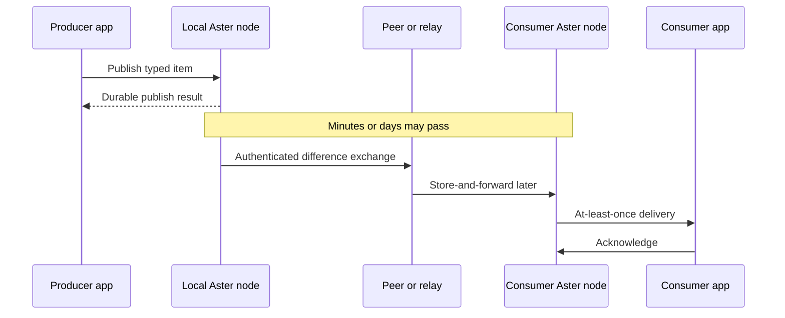

# Core concepts

This guide gives application developers and system integrators the mental model
needed to use Aster correctly. It intentionally avoids wire-format detail.

## The one-minute model

An Aster **node** is a durable local participant embedded in or hosted beside an
application. The application publishes typed **items**. Each item belongs to a
named **topic** inside an administrative **scope**.

A publish call commits locally before it succeeds. Later, when two authorized
nodes have contact, they authenticate, compare exact inventories, and transfer
only the differences relevant to their configured interests. A receiving node
verifies and stores an item before exposing it to an application. Contacts can
end at any point; durable progress survives and can resume through another peer.



There is no global coordinator and correctness never depends on a wall clock.

## Anatomy of an item

Every publication answers a different question:

| Field | Question it answers | Example |
|---|---|---|
| Data class | How should copies converge? | `State` |
| Topic | What kind of application data is this? | `position.current` |
| Scope | Where is it allowed to propagate? | `mission/team/alpha` |
| Logical key | Which entity or stream does it belong to? | `unit-7` |
| Payload | What are the application bytes? | JSON, Protobuf, CBOR, or any agreed encoding |
| Priority | How urgently should it use constrained resources? | `Immediate` |
| TTL | When does it stop being useful? | 60 seconds |
| Publisher identity | Who authenticated it at the source? | Provisioned NodeID |

Aster treats the payload as bytes. Your application owns its schema and content
encoding. The data class, topic, scope, priority, and TTL are Aster semantics and
are authenticated with the item.

### Topic, scope, and logical key are different

These three fields are easy to conflate:

- **Topic** groups the same kind of data. Subscribers ask for topics.
- **Scope** is a propagation and authorization boundary. A topic name can appear
  in many scopes without making those scopes peers.
- **Logical key** identifies the subject within a topic. For State and Record it
  is usually the thing being updated.

For example, `position.current` / `mission/team/alpha` / `unit-7` means “the
current position of unit 7, shared inside team alpha.”

Topics are 1–128 bytes and use letters, numbers, `.`, `_`, and `-`. Scopes are
also 1–128 bytes and add `/` for hierarchy. Empty, `.` and `..` scope segments
are invalid.

## Choosing a data class

Choose based on how disconnected updates should behave, not on payload size
alone.

### State: “what is true now?”

Use State for replaceable current values such as position, health, presence, or
the active configuration of a device.

```text
topic:       position.current
logical key: unit-7
payload:     {"lat": 38.9, "lon": -77.0}
ttl:         60 seconds
```

Sequential updates supersede earlier values. Concurrent updates are recognized
without trusting timestamps and converge to one projected value: the
lexicographically greatest full ItemID. Losing concurrent heads remain
recoverable by setting `Query::include_recoverable_versions`; a normal
`query()` result is a projection, not deletion. The explicit `conflicts()` and
`resolve()` workflow applies to Record siblings. State is usually small and
often has a short TTL.

Do not use State for history you need to retain. Use Event for that.

### Event: “what happened?”

Use Event for immutable entries such as messages, observations, audit records,
or sensor samples.

Each publisher has a durable event sequence. Receivers preserve events and can
ask Aster for gaps in that publisher's sequence. Different publishers do not
pretend to share a single global clock or ordering authority.

Entries may share a logical key to name their application stream. Event query
and subscription results preserve every matching entry; unlike State and
Record, Event entries are never collapsed by logical key.

Do not repeatedly overwrite one Event logical key to model a mutable object. Use
State or Record.

### Record: “what document are we editing?”

Use Record for mutable structured data that may be edited on disconnected nodes:
plans, forms, annotations, or workflows.

If two nodes make concurrent changes, Aster keeps the sibling versions and
surfaces a conflict annotation. Direct and forwarded replicated ingestion never
execute application merge code. Applications inspect the current sibling set
and call `resolve()` explicitly; the sibling-set guard rejects a stale
resolution.

Rust can register a process-local, application-supplied policy ID for a topic.
While that registration is live, the high-level conflict API includes the ID in
matching annotations. Registration does not execute the policy and is not
durable across restart. Automatic registered-policy merge required by §5.3 is
therefore partial.

Use Record instead of State when concurrent versions must remain inspectable.

### Blob: “what large immutable content is this?”

Use Blob for imagery, maps, attachments, model files, and other large immutable
content. Blob payloads use a separate streaming writer and reader; generic
publish APIs reject them.

Aster chunks and authenticates Blob content and retains partial verified ranges
so an interrupted transfer can resume. The Blob ID is derived from the whole-
plaintext digest, per-chunk plaintext digests, and identity-bearing manifest
fields including chunk size, media type, and schema ID. The same bytes published
with a different chunk size therefore have a different Blob ID. Reuse and read
also require the exact authenticated manifest and route commitment; Blob ID
equality alone is insufficient. The current profile does not support a zero-byte
Blob.

Use State, Event, or Record to publish small metadata that refers to a Blob ID.
That lets consumers decide whether and when to fetch the large content.

### Selection table

| If your data… | Choose |
|---|---|
| Has one replaceable current value per entity | State |
| Is an immutable history entry | Event |
| Can be edited concurrently and must not lose a version | Record |
| Is a large immutable byte sequence | Blob |

## Framework mechanisms

### Offline-first publication

A successful publish result means the item and its local causal metadata are
durably committed. It does **not** mean another node has received the item. This
is what lets the same application code work online, behind a relay, or fully
disconnected.

The durable publisher counter must never roll backward. If a node loses its
complete store and external anti-rollback state, it must be reprovisioned with a
new identity instead of starting again from counter one.

### Query versus subscription

- A **query** returns a bounded view of items already stored locally. Use it to
  render current state or recover after startup.
- A **subscription** is a durable at-least-once delivery cursor. Poll it for
  work, process each delivery idempotently, and acknowledge only after the
  application has committed its own result.

If a process stops before acknowledgment, delivery may be repeated. The stable
ItemID is the application deduplication key. Acknowledging the projected current
State or Record head does not make one of its causally superseded ancestors
current again; independent concurrent Record siblings remain separate work.

### Causality and conflicts

Aster tracks causal relationships explicitly. Wall-clock time may help an
interface explain when something appeared, but it never decides whether one
update happened after another.

- State converges to one deterministic projected current value; losing
  concurrent heads remain recoverable when requested.
- Event is append-only and detects per-publisher gaps.
- Record preserves concurrent siblings, exposed through `conflicts()`, until a
  causally dominating revision supersedes them. Explicit resolution publishes
  such a revision for the exact observed sibling set; automatic
  registered-policy resolution is not implemented.
- Blob is immutable and therefore does not merge.

### Deletion with tombstones

A deletion is a published tombstone, not a local row removal. It participates in
sync so an offline node cannot reintroduce an older value merely by returning
within the tombstone-retention window. The deployment baseline is 30 days of
offline tolerance plus a 15-day margin; the current default is therefore 45
days. Returning after the configured bound can resurrect data. Configure the
tombstone and superseded-version windows through
[`ApplicationNodeOptions`](../crates/aster-core/src/api.rs), and align them
with the deployment's offline tolerance.

### Priority and TTL

Priority and time-to-live answer independent questions:

- **Priority** says how urgently an item should be scheduled and how strongly it
  should survive storage pressure: Routine, Priority, Immediate, or Flash.
- **TTL** says how long the item remains useful. An absent TTL means durable;
  zero means already expired. An item with known `age >= TTL` MUST NOT be
  offered, requested, retransmitted, or sent and MUST enter garbage collection.
  If finite-TTL age cannot be bounded after a reboot or power loss, the item is
  non-forwardable until a trusted time source proves it unexpired; it may remain
  local with indeterminate age. See the normative [TTL
  rules](protocol.md#10-ttl-and-freshness-without-synchronized-clocks).

A Flash item can still have a ten-second TTL. A Routine item can be durable.
Applications should set both deliberately rather than deriving one from the
other.

### Emission policy

A node can set a minimum emitted priority or enter receive-only mode. Any
threshold above Routine suppresses discovery as well as lower-priority
application and supporting traffic. ReceiveOnly suppresses discovery, inventory,
and item transmission, but mandatory authentication and link acknowledgements
may still be emitted to ingest data on a connection-oriented transport. It is
not a physical radio-silence claim. The protocol also defines PassiveOnly, in
which the framework originates no bytes, but current application and language-
binding APIs do not expose that mode. Emission policy is local: it can restrict
use of a signed authorization, never broaden one.

### Bounded storage and backpressure

Node options bound item count, stored bytes, and retention. Lower-priority data
is the first candidate under configured pressure. Blob storage and incomplete
transfer staging are separately bounded so unauthenticated partial data cannot
evict committed application data.

Applications should monitor quota usage and treat quota errors as policy or
capacity signals, not transient network failures.

### Atomic batches

Explicit batches commit 2–64 ordered items atomically. Members must share their
publisher, data class, topic, scope, and active content epoch. A rejected batch
commits nothing and consumes no publisher counter or Event sequence.

The default retained-dual policy keeps unchanged format-2 singleton
representations so an intermittent semantic-v1 peer remains reachable.
Batch-only is an explicit compatibility tradeoff with a substantial byte
difference: in the protocol example with 64 items, 256 route groups, and
128-byte scope/topic values, compact authentication is 39,414 bytes versus
1,207,414 bytes with retained singletons (about 30 times larger). These are
serialized-object sizes, not transport-throughput measurements.

Blob batches finalize 2–64 distinct streaming writers atomically without
exposing manifests or route commitments to application code.

## Routing and propagation

### Contacts and carriers

A **carrier** moves opaque fragments: UDP/IP, BTLE, a future radio adapter, or
another implementation of the narrow link contract. It does not define item
meaning, encryption, reconciliation, or conflict behavior.

A **contact** is an authenticated synchronization session with a peer. The host
chooses among deployment-configured carriers; individual publish calls never
select a transport. See [Carriers and contacts](transports.md).

### Relays

A relay stores and forwards within a scope. It can receive routing access
without content access, so it can move authorized opaque payloads it cannot
decrypt. The stable source-authenticated item is unchanged across relay hops.

Because transfer progress is attached to verified objects rather than a
particular connection, a node can receive part of an object from one relay and
finish through another.

### Bridges

A bridge moves selected data across scope boundaries. This is deliberately more
controlled than relaying:

1. A bridge node creates an enrollment for one directed scope edge.
2. An authority enables that edge with exact topics, priorities, and a hop limit.
3. The bridge may narrow that policy for a particular route, but never broaden
   it.
4. Consumers can distinguish the source-authenticated `origin_scope` from the
   `current_scope` where the authorized projection is visible.
5. A reader in the target scope still needs the origin scope/topic/content-epoch
   grant. Bridging moves protected bytes; it never grants the right to read them.

Bridge route handles and authorization IDs are durable opaque identifiers.
Application code never handles sealed wrappers, route keys, or transport
choices.

### Provisioning, epochs, and rekey

Nodes receive an opaque authority-issued provisioning bundle containing identity
and permitted scope/topic access. The checked-in quickstart bundle is public,
disposable test material and must never be confused with an operational
provisioning workflow.

Routing keys and content keys are separate. A routing-only node may forward
protected metadata and ciphertext without obtaining the topic content key. A
scope rekey creates a fresh epoch and explicit recipient set so a captured or
removed node can be excluded from future data.

The high-level APIs can issue a recipient-filtered scope rekey while keeping
keys, provider handles, credentials, and sealed controls out of the application
surface. The complete authority-side signed public-registry administration
workflow is not shipped: the caller must provide the opaque signed registry and
independently retain and enforce its registry-generation high-water mark.

## Security boundaries in plain language

- Every delivered item is encrypted and authenticated at its source.
- Every contact mutually authenticates before replication.
- A carrier sees opaque Aster fragments, not topics, scopes, identities, roles,
  or payloads in clear protocol bytes.
- Public header and handshake fields still expose opaque selectors and protocol
  negotiation values; stable selectors permit traffic correlation.
- Relays may have routing access without content access.
- Encryption does not hide endpoints, timing, packet sizes, RF energy, or the
  fact that Aster traffic exists.
- The portable cryptographic provider uses the fixed NIST-algorithm profile, but
  the project does not claim FIPS 140-3 module validation or production
  authorization.

Read [Security](security.md) for the actual threat model, controls, and open
deployment gates.

## Terms you will see

| Term | Meaning |
|---|---|
| Node | A provisioned, durable Aster participant |
| Item | One source-authenticated application publication |
| ItemID | Stable semantic identity and deduplication key for an item |
| Topic | Named content channel |
| Scope | Administrative propagation and authorization boundary |
| Contact | One authenticated peer synchronization session |
| Adjacency | Protocol/internal term for an authenticated peer contact |
| Carrier / Link | Transport adapter for opaque fragments |
| Relay | Store-and-forward node operating within authorized scope access |
| Bridge | Authority-controlled movement across scopes |
| Tombstone | Replicated deletion marker |
| Epoch | Version of routing or content access material |
| Provisioning bundle | Opaque local identity and access input issued by an authority |

## Next steps

- Run a [language quickstart](quickstart/README.md).
- Learn how to [connect nodes over IP or BTLE](transports.md).
- For application behavior, use the Rust, C, Go, or Python API documentation.
- For interoperability, continue to the normative [protocol](protocol.md).
