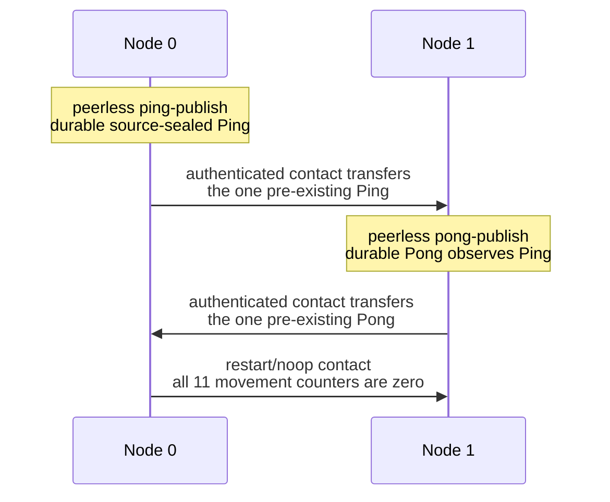

# Aster capability tour

This is the shortest path from a checkout to visible Aster behavior. Each tour
uses real operating-system processes, independent redb stores, direct Iroh
contacts, the hybrid mission session, source-sealed Events, and durable
restart/no-op verification. Tour artifacts are retained under a fresh temporary
directory so you can inspect every receipt afterward.

The boundary is deliberately small: one-host loopback, Event-only,
unprotected-reference provisioning, and no physical or mixed-implementation
evidence. Passing these tours is not production authorization.

## Pick a tour

| Tour | Command | What it makes visible |
|---|---|---|
| Fastest | `mise run tour` | Two endpoints publish Ping and causal Pong while peerless, transfer each durable Event in a later contact, restart, and prove equal inventory moves nothing. |
| Relay | `mise run tour-relay` | Adds a payload-blind middle node. The relay stores exact protected bytes but gets no content grant and creates no semantic Event row. |
| Control | `mise run tour-control` | Adds ordered Flash revocation, recipient-filtered epoch rekey, authority-absent forwarding, and captured-node exclusion. |

The repository pins Rust 1.97.1 and supports Rust 1.91 as its MSRV. Install the
pinned tools first:

```sh
mise install
mise run tour
```

The selected CLI currently requires Unix. The demonstrations bind local UDP
loopback sockets, so a host firewall or sandbox must permit loopback UDP.

## What the quick tour proves

The two-node tour is five causal cohorts and eight child-process executions:



Look for these terminal receipts:

```text
PING status=received ... source_authenticated=true ttl=none
PONG status=received ... causal_observation=verified ttl=none
DEMO_RESULT status=pass scenario=ping-pong nodes=2 processes=8 ...
```

IDs vary on every run because identities and sealed representations are fresh.
`transfer_id` identifies exact sealed bytes; `semantic_id` identifies the
authenticated Event. They are deliberately different.

## See a payload-blind relay

```sh
mise run tour-relay
```

The script prints all three stopped-state inspections. The endpoints (nodes 0
and 2) end with `events=2 route_cached_events=0`. The middle node ends with
`events=0 route_cached_events=2`: it retained the protected representations
needed for forwarding without receiving content access or creating semantic
rows.

The demo root printed by the script remains available for exploration:

```sh
rg '^APPLICATION ' /path/from-the-script/logs
rg '^CONTACT .*status=pass' /path/from-the-script/logs
```

Each directed edge begins with exactly one durable Event difference. A passing
edge receipt moves exactly that one Event and reports all control counters zero.
The final restart reports no Event or control movement.

## See revocation and recipient-filtered rekey

```sh
mise run tour-control
```

The four-role scenario commits an ordered revocation and scope rekey, forwards
them while the authority process and authority carrier node are absent, and
then publishes and forwards epoch-two Ping/Pong through explicit causal
barriers. Look for:

```text
CONTROL_RESULT status=pass ... captured_sync=denied ... survivor_epoch=2 ...
DEMO_RESULT status=pass scenario=control nodes=4 processes=23 ...
```

The captured node retains stale epoch-one signing material, but eligible peers
reject it and it receives neither epoch-two key material nor content. Exclusion
is not key destruction.

Run one auto-port tour at a time. For concurrent invocations, assign disjoint
explicit port blocks, for example:

```sh
ASTER_TOUR_BASE_PORT=62000 mise run tour-relay
ASTER_TOUR_BASE_PORT=62200 mise run tour-control
```

## Explore the destructive local lifecycle safely

Only do this against a disposable tour root. The operation is intentionally
irreversible for the retained mission and carrier-key file contents:

```sh
ASTER_TOUR_PARENT="$(mktemp -d)"
export ASTER_TOUR_PARENT
sh tools/aster-tour.sh quick

ASTER_BIN="$(sed -n '1p' "$ASTER_TOUR_PARENT/aster-bin.path")"
"$ASTER_BIN" zeroize \
  --state "$ASTER_TOUR_PARENT/quick/node-0" \
  --mission-bundle-unprotected-reference \
    "$ASTER_TOUR_PARENT/quick/node-0/mission.unprotected-reference.bundle"

"$ASTER_BIN" inspect --state "$ASTER_TOUR_PARENT/quick/node-0"
```

The final inspection reports `zeroization=complete` and keeps application rows
available for audit. The hook overwrites, synchronizes, and truncates exact
retained files to owner-only zero-length tombstones. It is same-UID Unix bounded
software erasure—not inode deletion, remote zeroization, physical-media
sanitization, snapshot/swap/backup removal, or database rollback resistance.

## Manual equivalent

The tour helper is only a transparent shell wrapper. To run the relay path by
hand:

```sh
ASTER_DEMO_PARENT="$(mktemp -d)"
cargo run --locked -p aster-node --bin aster -- \
  demo --nodes 3 --root "$ASTER_DEMO_PARENT/mesh"

for node in 0 1 2; do
  cargo run --locked -p aster-node --bin aster -- inspect \
    --state "$ASTER_DEMO_PARENT/mesh/node-$node"
done
```

Continue with the [full mesh CLI guide](mesh-cli.md) for exact phase receipts,
manual node configuration, zeroization recovery boundaries, and retained test
evidence. Read the [selected architecture](../architecture.md) to see where
carrier, mission, control, source, route, content, storage, and reconciliation
authority live.
