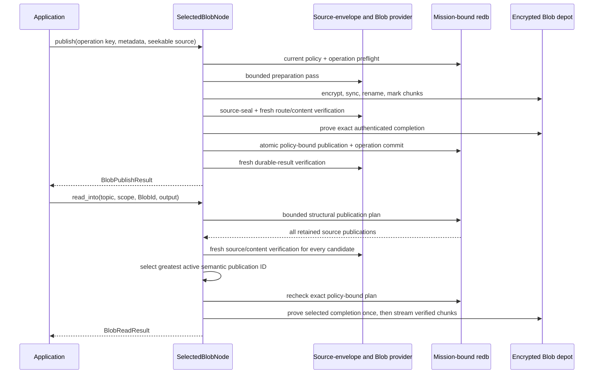

# Selected Blob API quickstart

This is the shortest path to Aster's **selected live Blob application surface**,
its exclusive stopped streaming facade, and the semantic-v5 direct transfer
boundary for already-durable Blobs. `RunningNode::selected_blobs()` returns a
cloneable `SelectedBlobHandle`: an application may durably publish an owned
regular file while the node has no peers and may read one freshly authenticated
plaintext page at a time while the actor owns the store. Each live page is at
most 64 KiB and zeroizes its owned plaintext allocation on drop.

The live surface is deliberately small. It has async `publish` and `read_page`,
but no Blob subscription, peer status, or convergence-status operation. The
exclusive `SelectedBlobNode` remains available when no runtime owns the same
store and provides synchronous seekable-source publication plus streaming
`read_into`. Separately, semantic v5 reconciles already-durable Blob sources and
direct carrier ranges between current content-capable peers. The default offer
is `[5, 4, 3, 2, 1]`; v1-v4 emit zero Blob frames, and stable wire/ABI, source,
manifest, and `ASTRBT01` formats remain version 1.

A [retained 8,220-byte live-Blob receipt](../implementation/evidence/selected-live-blob-036d068.json)
(SHA-256
`484eafe504d958881dc7b871fbf788f733d9c8814e02fc27253ece38e6169735`)
binds source commit `036d068a8d055154beeffe265ceea8cf97079fa6` with
`Good` signature status; 49 verifier tests pass. Its source-to-execution link
remains operator-attested, not cryptographically proven. It is one-host,
same-implementation direct-loopback evidence of peerless publication, later
complete transfer, bounded live page reads, and a graceful same-process
actor/store/provider reopen only. It does not prove partial or different-peer
resume, process-crash, power-loss, or long-offline recovery, physical
sanitization, independent-implementation interoperability, or release
authorization. Nothing in this guide claims route-only Blob custody,
large-Blob/RSS acceptance, representative physical networking, or broader
acceptance.

## Use the live actor API

Start the node as described in the [selected Event quickstart](selected-event-api.md),
then retain a clone of the Blob handle. The configured peer list may be empty;
publication success means the signed publication and encrypted depot content
are durable locally, not that any peer received them.

```rust
use aster_mesh::Priority;
use aster_node::application::{
    BlobPublishRequest, BlobReadPageRequest, BlobReadRequest,
    MAX_SELECTED_BLOB_PAGE_BYTES,
};
use std::{fs::File, io::Write};

let blobs = running.selected_blobs();
let published = blobs
    .publish(
        BlobPublishRequest {
            operation_key: b"my-app/blob/input-v1".to_vec(),
            topic: topic.clone(),
            scope: scope.clone(),
            priority: Priority::Priority,
            media_type: Some("application/octet-stream".into()),
            schema_id: Vec::new(),
        },
        File::open(input_path)?,
    )
    .await?;

let read = BlobReadRequest {
    id: published.id,
    topic,
    scope,
};
let mut output = File::create(output_path)?;
let mut offset = 0;
loop {
    let page = blobs
        .read_page(BlobReadPageRequest {
            blob: read.clone(),
            offset,
            max_bytes: MAX_SELECTED_BLOB_PAGE_BYTES,
        })
        .await?;
    output.write_all(page.as_bytes())?;
    if page.complete {
        break;
    }
    offset = page.next_offset();
}
```

The live publisher accepts a nonempty regular file of at most 64 MiB, with its
cursor at exactly zero, and fixes the selected chunk size at 64 KiB. The file is
moved into a bounded, joined worker rather than cloned into the actor command.
The returned result is durable and operation-key idempotent. Retrying the exact
operation with the same source and identity metadata recovers the original
publisher counter and acceptance marker; reusing that operation key for
different content or metadata fails closed as a conflict.

Cancellation before enqueue cannot publish. Cancellation after enqueue has an
indeterminate result because the worker may have committed; retry the exact
operation key to recover the authoritative outcome. Graceful shutdown and live
zeroization close application admission, reject queued commands, and join the
Blob worker before releasing the store authority. Retained handles then return
sanitized `StateUnavailable`. A `BlobReadPage` zeroizes its private plaintext
buffer on drop, but bytes copied by the application, the caller's source file,
and externally cloned file descriptors remain caller custody. A blocking or
hostile filesystem syscall can delay the joined worker and therefore delay
shutdown or zeroization; no bounded shutdown-latency claim is made for such a
file provider.

## Run the example

Install the pinned toolchain, create a disposable two-node fixture, and provide
one nonempty input file. The demo provisions a mission bundle and releases its
stores before the Blob example opens node 0 exclusively.

```sh
mise install
ASTER_BLOB_ROOT="$(mktemp -d)"
printf 'selected Blob streaming example\n' > "$ASTER_BLOB_ROOT/input.bin"
cargo run --locked -p aster-node --bin aster -- \
  demo --nodes 2 --root "$ASTER_BLOB_ROOT/mesh"

cargo run --locked -p aster-node --example blob_application -- \
  "$ASTER_BLOB_ROOT/mesh/node-0" \
  "$ASTER_BLOB_ROOT/mesh/node-0/mission.unprotected-reference.bundle" \
  "$ASTER_BLOB_ROOT/input.bin" \
  "$ASTER_BLOB_ROOT/output.bin"
cmp "$ASTER_BLOB_ROOT/input.bin" "$ASTER_BLOB_ROOT/output.bin"
```

Expect one line shaped like:

```text
BLOB id=<64 hex characters> bytes=<n> chunks=<n> inserted=true media_type=application/octet-stream
```

Run the `cargo run ... --example blob_application` command again against the
same paths. The fixed operation key and unchanged source resolve the original
durable publication, so `inserted=false`; the Blob ID remains identical and
`cmp` still succeeds. Changing the input or identity metadata under that same
operation key fails closed rather than silently rebinding the operation.

The fixture persists explicitly unprotected reference mission material. It is
appropriate for this disposable demonstration, not operational provisioning.
Remove the temporary directory when you no longer need it.

## Use the stopped streaming API

The complete runnable source is
[`crates/aster-node/examples/blob_application.rs`](../../crates/aster-node/examples/blob_application.rs).
Its central shape is:

```rust
let mut blobs = SelectedBlobNode::open_unprotected_reference(
    state_directory,
    mission_bundle,
)?;

let mut input = std::fs::File::open(input_path)?;
let published = blobs.publish(
    BlobPublishRequest {
        operation_key: b"my-app/blob/input-v1".to_vec(),
        topic: topic.clone(),
        scope: scope.clone(),
        priority: Priority::Priority,
        media_type: Some("application/octet-stream".into()),
        schema_id: Vec::new(),
    },
    &mut input,
)?;

let mut output = std::fs::File::create(output_path)?;
let read = blobs.read_into(
    BlobReadRequest {
        id: published.id,
        topic,
        scope,
    },
    &mut output,
)?;
assert_eq!(read.id, published.id);
```

## Opt in to semantic-v5 transfer

The runtime does not infer Blob receive intent from State/Record interests. Add
an exact Blob selector to `NodeConfig::mutable_interests`; descendant scope is
rejected for Blob because one selector must bind one current content epoch:

```rust
let mutable_interests = MutableSourceInterests::new(state, record).with_blob(vec![
    SourceInterestSelector::new(blob_topic, blob_scope, false),
]);
```

This composes with peerless live publication rather than changing its success
condition. A source may publish through `selected_blobs()` with no peers, shut
down, and later restart with an exact configured peer. On a v5 contact, a
content-capable interested receiver can durably stage the source and missing
carrier ranges, promote only after whole-Blob verification, and read the Blob
through its own live handle. The receiver's completed publication and page
reads survive another peerless restart. Current same-implementation loopback
tests exercise that sequence; there is not yet a retained receipt, physical
carrier run, or mixed-implementation acceptance artifact for it.

The provider turns that exact topic/scope and the current epoch into an opaque
32-byte peer proof inside the protected v5 contact. Every Blob inventory,
source, and range send requires the authenticated peer to have both the current
content proof and current route authorization and to remain nonrevoked.
Route-only peers cannot use the selected Blob lane. The source-envelope and
complete manifest plan reconcile first; carrier requests begin only after that
pending source is durably staged.

Each carrier request extends one exact contiguous prefix by at most 16 KiB. The
prefix is peer-neutral: its durable key is the source transfer ID plus strict
kind-2 carrier ID, not the peer or session, so after runtime/store/provider-cache
teardown and reopen any other eligible content peer can continue at the first
missing byte. The requester's
Finish remaining count is echoed for sequencing only; each exact Result/Ack
tuple binds the accepted prefix.

Network admission is bounded to 64 MiB of plaintext and 1,024 chunks. Pending
source/manifest/prefix state is bounded to 10,000 rows and 64 MiB. A pending
source, partial prefix, and even carrier-complete depot are not an ordinary Blob
publication. Visibility appears only after the exact depot completion, a fresh
provider pass that decrypts/authenticates every chunk and whole Blob, and a
fresh current route/physical-lineage proof agree in one redb promotion
transaction.

Same-epoch key replacement invalidates old peer proofs and withholds old rows,
but it is not a transparent physical replacement. Redb rejects another physical
lineage for the same `(BlobID, content group, numeric epoch)` with
`PhysicalLineageConflict`; republishing or resuming that Blob requires advancing
the numeric epoch.

Terminal or stale cleanup therefore does not erase the last physical-lineage
witness. It removes pending source, prefix, and authenticated-cache visibility,
but deliberately retains the exact depot import, its expected or committed
chunk rows, any chunk files and finalized digest already present, and their
reserved/committed accounting. That bounded staging is not a publication and
cannot be read or served; it remains charged to the configured depot byte,
chunk, and variant quotas until a future explicit GC protocol. An exact-lineage
retry can resume it, while a different lineage at the same numeric epoch still
fails and must advance the epoch.

Source/store/cache transitions are locally serialized. A successful abort
removes the old authenticated claim, rereads durable source state, and freshly
authenticates any exact concurrent restage before restoring its claim. Terminal
multi-carrier scheduling advances past the lexicographically greatest carrier
ID, not the last manifest record.

Normal and `AtLeast` run the v5 lane because `AtLeast` filters Event only.
`ReceiveOnly` advertises, requests, stages, promotes, and counts zero Blob work.
The live handle does not change those contact rules and reports no Blob peer or
convergence status. The selected slice still has no route-only Blob
relay/custody, Blob subscription, Blob TTL/expiry/GC, metadata-independent
whole-byte identity or deduplication, 100+ MiB/RSS or resource acceptance,
representative physical carrier or mixed-implementation acceptance, retained
live-Blob receipt, or release authorization.

`publish` requires a seekable source because it makes two bounded passes. The
first computes the whole-content and per-chunk digests with one bounded,
zeroizing plaintext chunk buffer; after that pass it retains only the
manifest-bounded digest vector and no plaintext. The second encrypts and
durably commits independently authenticated chunks. The selected profile fixes
chunking at 64 KiB and rejects empty input. The canonical manifest is capped at
one MiB.

Choose an operation key for the application effect, not an individual attempt.
The key is bounded to 1–256 bytes. Exact retry rehashes the caller's source,
passes current policy and revocation checks, freshly verifies the original
publication and completed depot variant, and returns its original publisher
counter and acceptance marker. A different operation over the same Blob may
commit a distinct signed publication while reusing the completed encrypted
variant in the same content group and epoch.

## Keep identity claims exact

`BlobId` is immutable object identity for:

- the exact plaintext bytes;
- the selected canonical chunk profile; and
- the media-type and schema identity metadata.

Changing any of those inputs produces another ID. This is not a separate pure
whole-byte `BlobContentId`, and this slice does not claim metadata-independent
physical deduplication. A scope rekey also creates a distinct encrypted depot
variant even when the `BlobId` stays the same. Exact retry of an authorized old
operation returns its historical publication without allocating a new variant;
a new operation at the active epoch installs or reuses that epoch's variant.

## Follow the durable verification boundary

Signed publication metadata and exact source-envelope bytes live in redb.
Potentially large ciphertext chunks live in the private sibling
`blob-depot-v1` directory. A chunk becomes durable in this order:

1. write and synchronize a private temporary file;
2. rename it to its canonical final name;
3. synchronize the containing directory; and
4. atomically record the matching committed-chunk marker in redb.

An unmarked temporary or final file is not authority and is reclaimed on a
mission-bound writable reopen. A marked missing, truncated, or mismatched file
is an integrity failure and is never silently repaired. A signed Blob
publication commits only after every authenticated manifest record equals both
the expected and committed durable record and the finalized manifest digest is
exact.

The database is pinned to one physical depot owner from its first successful
Store open, before the depot exists. Redb persists a domain-separated
commitment over a random owner token, the canonical database path, and, on
Unix, the exact device/inode backing identity; the sibling depot’s private
marker must carry the same binding before any chunk/variant scan or reclaim.
The first database to initialize that parent’s fixed depot wins; another
database is rejected without adopting or cleaning it. Moving/copying even an
empty bound database to another path fails on reopen. On Unix, a new inode also
fails, moving the depot with the database does not preserve the binding, and a
same-path replacement cannot adopt an existing depot. This slice has no
supported depot-rebind or backup-restore migration. Non-Unix retains the
database-token and canonical-path binding, but a copied database restored over
that same path is not distinguishable; equivalent inode/rollback resistance is
not claimed.
Legacy owner-token or owner-binding migration is all-or-none: only canonical
empty Blob rows/counters with no fixed depot root may acquire the missing
fields. Partial fields, any logical Blob state, or any fixed depot root fail
without repair.



The redb read plan is structural, not authorization. The facade freshly
authenticates every retained publication, checks exact topic, scope, Blob ID,
variant, source identity, and active epoch, excludes revoked or inactive
publications, independently recomputes the deterministic active selection, and
rechecks the complete plan before opening the selected depot variant.

`read_into` never returns a provider reader or copied epoch key. It borrows the
node and caller output synchronously, verifies each chunk's stored record,
ciphertext digest, AEAD tag, plaintext digest, and final whole-content digest,
and reports the core streaming engine's peak chunk-buffer capacity. Store
adapters may concurrently use additional independently chunk-bounded buffers;
the field is not a whole-operation memory measurement. If a later chunk or the
final digest fails, the caller-owned output may already contain an
independently verified prefix; write to a temporary destination if all-or-none
application output is required.

## Understand the current limits

`StoreLimits` account for signed Blob publications and durable operation rows
alongside Event, State, Record, control, and route-cache rows. Separate
`BlobDepotLimits` bound ciphertext-file bytes reserved by every durable expected
chunk record, durable per-chunk metadata rows, and epoch-specific import
variants. Those bounds include both committed content and unfinished resumable
imports, so abandoned but structurally valid staging retained after terminal or
stale network cleanup continues to consume byte, chunk, and variant admission
until a future explicit-GC policy is implemented.
The defaults are 512 MiB, 100,000 chunk rows, and 4,096 variants. These limits
do not account for redb allocation, directory blocks, snapshots, backups, swap,
an attacker-created population of unrelated directory entries, or every host
filesystem overhead; they are not a complete physical-storage or sanitization
claim.

On Unix, depot directories are opened relative to owner-controlled directory
descriptors with no-follow checks and private modes. Non-Unix uses a narrower
path-based fallback and does not receive equivalent hardened-filesystem credit.
Blob ciphertext remains after software zeroization, but mission and content
secrets are destroyed and the terminal store cannot reopen normally. Physical
media sanitization is explicitly outside this evidence.

The stopped handle takes the same process-exclusive store authority used by
the live actor and stopped State and Record facades. Stop that actor and drop
every other stopped facade before opening `SelectedBlobNode`; use
`RunningNode::selected_blobs()` instead while the actor is running. Continue
with the [selected architecture](../architecture.md), the
[selected Record API](selected-record-api.md), the
[selected State API](selected-state-api.md), the
[selected Event API](selected-event-api.md), and the
[requirements status](../implementation/requirements-status.md) for the exact
partial credit and remaining network, acceptance, and release gaps.
