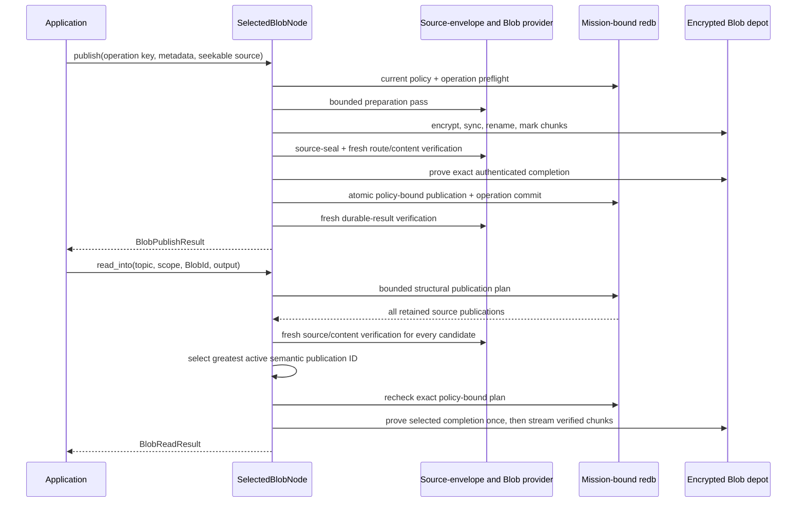

# Selected Blob API quickstart

This is the shortest path to Aster's **selected local Blob streaming surface**.
It opens the selected mission-bound store while no runtime owns it, streams a
nonempty file into an encrypted crash-resumable depot, commits one
source-authenticated publication, and streams the freshly verified bytes back
to a caller-owned output.

This first Blob slice is deliberately stopped and local. It does not put Blob
on the Event-only reconciliation wire and has no live handle, subscription,
relay, remote chunk transfer, or language binding. The example demonstrates
local durability, bounded-memory streaming, and exact retry—not mesh delivery,
any-peer resume, physical sanitization, or acceptance completion.

## Run the example

Install the pinned toolchain, create a disposable two-node fixture, and provide
one nonempty input file. The demo provisions a mission bundle and releases its
stores before the Blob example opens node 0 exclusively.

```sh
mise install
ASTER_BLOB_ROOT="$(mktemp -d)"
printf 'selected Blob streaming example\n' > "$ASTER_BLOB_ROOT/input.bin"
cargo run --locked -p aster-node --bin aster -- \
  demo --nodes 2 --root "$ASTER_BLOB_ROOT/mesh"

cargo run --locked -p aster-node --example blob_application -- \
  "$ASTER_BLOB_ROOT/mesh/node-0" \
  "$ASTER_BLOB_ROOT/mesh/node-0/mission.unprotected-reference.bundle" \
  "$ASTER_BLOB_ROOT/input.bin" \
  "$ASTER_BLOB_ROOT/output.bin"
cmp "$ASTER_BLOB_ROOT/input.bin" "$ASTER_BLOB_ROOT/output.bin"
```

Expect one line shaped like:

```text
BLOB id=<64 hex characters> bytes=<n> chunks=<n> inserted=true media_type=application/octet-stream
```

Run the `cargo run ... --example blob_application` command again against the
same paths. The fixed operation key and unchanged source resolve the original
durable publication, so `inserted=false`; the Blob ID remains identical and
`cmp` still succeeds. Changing the input or identity metadata under that same
operation key fails closed rather than silently rebinding the operation.

The fixture persists explicitly unprotected reference mission material. It is
appropriate for this disposable demonstration, not operational provisioning.
Remove the temporary directory when you no longer need it.

## Use the stopped streaming API

The complete runnable source is
[`crates/aster-node/examples/blob_application.rs`](../../crates/aster-node/examples/blob_application.rs).
Its central shape is:

```rust
let mut blobs = SelectedBlobNode::open_unprotected_reference(
    state_directory,
    mission_bundle,
)?;

let mut input = std::fs::File::open(input_path)?;
let published = blobs.publish(
    BlobPublishRequest {
        operation_key: b"my-app/blob/input-v1".to_vec(),
        topic: topic.clone(),
        scope: scope.clone(),
        priority: Priority::Priority,
        media_type: Some("application/octet-stream".into()),
        schema_id: Vec::new(),
    },
    &mut input,
)?;

let mut output = std::fs::File::create(output_path)?;
let read = blobs.read_into(
    BlobReadRequest {
        id: published.id,
        topic,
        scope,
    },
    &mut output,
)?;
assert_eq!(read.id, published.id);
```

`publish` requires a seekable source because it makes two bounded passes. The
first computes the whole-content and per-chunk digests with one bounded,
zeroizing plaintext chunk buffer; after that pass it retains only the
manifest-bounded digest vector and no plaintext. The second encrypts and
durably commits independently authenticated chunks. The selected profile fixes
chunking at 64 KiB and rejects empty input. The canonical manifest is capped at
one MiB.

Choose an operation key for the application effect, not an individual attempt.
The key is bounded to 1–256 bytes. Exact retry rehashes the caller's source,
passes current policy and revocation checks, freshly verifies the original
publication and completed depot variant, and returns its original publisher
counter and acceptance marker. A different operation over the same Blob may
commit a distinct signed publication while reusing the completed encrypted
variant in the same content group and epoch.

## Keep identity claims exact

`BlobId` is immutable object identity for:

- the exact plaintext bytes;
- the selected canonical chunk profile; and
- the media-type and schema identity metadata.

Changing any of those inputs produces another ID. This is not a separate pure
whole-byte `BlobContentId`, and this slice does not claim metadata-independent
physical deduplication. A scope rekey also creates a distinct encrypted depot
variant even when the `BlobId` stays the same. Exact retry of an authorized old
operation returns its historical publication without allocating a new variant;
a new operation at the active epoch installs or reuses that epoch's variant.

## Follow the durable verification boundary

Signed publication metadata and exact source-envelope bytes live in redb.
Potentially large ciphertext chunks live in the private sibling
`blob-depot-v1` directory. A chunk becomes durable in this order:

1. write and synchronize a private temporary file;
2. rename it to its canonical final name;
3. synchronize the containing directory; and
4. atomically record the matching committed-chunk marker in redb.

An unmarked temporary or final file is not authority and is reclaimed on a
mission-bound writable reopen. A marked missing, truncated, or mismatched file
is an integrity failure and is never silently repaired. A signed Blob
publication commits only after every authenticated manifest record equals both
the expected and committed durable record and the finalized manifest digest is
exact.

The database is pinned to one physical depot owner from its first successful
Store open, before the depot exists. Redb persists a domain-separated
commitment over a random owner token, the canonical database path, and, on
Unix, the exact device/inode backing identity; the sibling depot’s private
marker must carry the same binding before any chunk/variant scan or reclaim.
The first database to initialize that parent’s fixed depot wins; another
database is rejected without adopting or cleaning it. Moving/copying even an
empty bound database to another path fails on reopen. On Unix, a new inode also
fails, moving the depot with the database does not preserve the binding, and a
same-path replacement cannot adopt an existing depot. This slice has no
supported depot-rebind or backup-restore migration. Non-Unix retains the
database-token and canonical-path binding, but a copied database restored over
that same path is not distinguishable; equivalent inode/rollback resistance is
not claimed.
Legacy owner-token or owner-binding migration is all-or-none: only canonical
empty Blob rows/counters with no fixed depot root may acquire the missing
fields. Partial fields, any logical Blob state, or any fixed depot root fail
without repair.



The redb read plan is structural, not authorization. The facade freshly
authenticates every retained publication, checks exact topic, scope, Blob ID,
variant, source identity, and active epoch, excludes revoked or inactive
publications, independently recomputes the deterministic active selection, and
rechecks the complete plan before opening the selected depot variant.

`read_into` never returns a provider reader or copied epoch key. It borrows the
node and caller output synchronously, verifies each chunk's stored record,
ciphertext digest, AEAD tag, plaintext digest, and final whole-content digest,
and reports the core streaming engine's peak chunk-buffer capacity. Store
adapters may concurrently use additional independently chunk-bounded buffers;
the field is not a whole-operation memory measurement. If a later chunk or the
final digest fails, the caller-owned output may already contain an
independently verified prefix; write to a temporary destination if all-or-none
application output is required.

## Understand the current limits

`StoreLimits` account for signed Blob publications and durable operation rows
alongside Event, State, Record, control, and route-cache rows. Separate
`BlobDepotLimits` bound canonical committed ciphertext-file bytes, durable
per-chunk metadata rows, and epoch-specific import variants. The latter two
include unfinished resumable imports, so abandoned but structurally valid
staging consumes admission until a future explicit-GC policy is implemented.
The defaults are 512 MiB, 100,000 chunk rows, and 4,096 variants. These limits
do not account for redb allocation, directory blocks, snapshots, backups, swap,
an attacker-created population of unrelated directory entries, or every host
filesystem overhead; they are not a complete physical-storage or sanitization
claim.

On Unix, depot directories are opened relative to owner-controlled directory
descriptors with no-follow checks and private modes. Non-Unix uses a narrower
path-based fallback and does not receive equivalent hardened-filesystem credit.
Blob ciphertext remains after software zeroization, but mission and content
secrets are destroyed and the terminal store cannot reopen normally. Physical
media sanitization is explicitly outside this evidence.

The stopped handle takes the same process-exclusive store authority used by
the live Event actor and stopped State and Record facades. Stop that actor and
drop every other stopped facade before opening `SelectedBlobNode`. Continue
with the [selected architecture](../architecture.md), the
[selected Record API](selected-record-api.md), the
[selected State API](selected-state-api.md), the
[selected Event API](selected-event-api.md), and the
[requirements status](../implementation/requirements-status.md) for the exact
partial credit and remaining network, acceptance, and release gaps.
