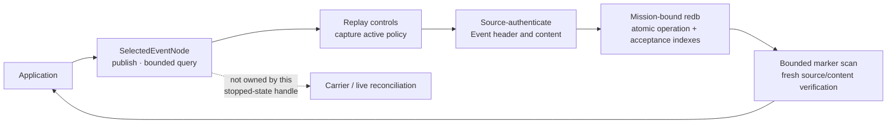

# Selected Event API quickstart

This is the shortest application-code path into the **selected production-lane
store and security composition**. It opens a stopped node, publishes one
source-authenticated Event without a peer, and queries the freshly verified
application projection. The compiled example uses only
`aster_node::application`; it does not construct envelopes, select
cryptography, inspect sealed bytes, choose a carrier, or drive reconciliation.

This is the first Event API foundation, not the completed application surface.
It currently provides Event publish and bounded query. Public authenticated gap
inspection, durable subscribe/poll/ack, subscription-aware replication
filtering, a live actor handle with peer/sync status, finite TTL, State, Record,
Blob, language bindings, and operational protected provisioning remain open.

## Run the compiled example

Install the pinned toolchain, then create a disposable two-node fixture. The
demo finishes and releases both stores before the application example opens
node 0, so the publication below is local and peerless.

```sh
mise install
ASTER_EVENT_ROOT="$(mktemp -d)"
cargo run --locked -p aster-node --bin aster -- \
  demo --nodes 2 --root "$ASTER_EVENT_ROOT/mesh"

cargo run --locked -p aster-node --example event_application -- \
  "$ASTER_EVENT_ROOT/mesh/node-0" \
  "$ASTER_EVENT_ROOT/mesh/node-0/mission.unprotected-reference.bundle"
```

The example publishes `asset-7=ready` to the fixture's provisioned
`mesh.ping-pong` topic and `demo/mesh` scope, then queries that stream. Expect
output shaped like this (the authenticated ID and sequence depend on the
retained fixture):

```text
published id=<64 hex characters> sequence=<n> inserted=true
event id=<same ID> sequence=<n> key=asset-7 payload=ready
```

Run the second command again. Its fixed application operation key makes the
retry idempotent: `inserted=false`, and it returns the original semantic Event
identity instead of consuming another publisher counter or Event sequence.

The fixture persists an explicitly unprotected reference mission bundle. It is
suitable for this disposable demonstration, not operational provisioning.
Remove the temporary directory when you no longer need it.

## Use the API

The complete runnable source is
[`crates/aster-node/examples/event_application.rs`](../../crates/aster-node/examples/event_application.rs).
Its central operation is:

```rust
use aster_node::application::{
    EventPublishRequest, EventQuery, Priority, Scope, SelectedEventNode, Topic,
};

let mut node = SelectedEventNode::open_unprotected_reference(state, mission)?;
let published = node.publish(EventPublishRequest {
    operation_key: b"my-app/asset-7/ready".to_vec(),
    predecessor: None,
    topic: Topic::new("mesh.ping-pong")?,
    scope: Scope::new("demo/mesh")?,
    priority: Priority::Priority,
    logical_key: b"asset-7".to_vec(),
    payload: b"ready".to_vec(),
    tombstone: false,
})?;

let page = node.query(EventQuery {
    topic: Some(Topic::new("mesh.ping-pong")?),
    scope: Some(Scope::new("demo/mesh")?),
    logical_key: Some(b"asset-7".to_vec()),
    ..EventQuery::default()
})?;
println!("{} {}", published.id, page.items.len());
```

Choose an operation key that identifies the application effect, not a random
attempt. Reusing it with the same request returns the original commit; reusing
it with different content fails closed. Resolution still requires the caller
to remain authorized by current mission policy. Topics and scopes must be
authorized by that policy. Tombstones must have an empty payload. There is
deliberately no finite-TTL field while authenticated cumulative forwarding age
and expiry are unimplemented.

`EventQuery::limit` bounds accepted rows **scanned**, not only matching rows
returned. A selective page can therefore contain no items while `has_more` is
true. Continue with its `scanned_through` acceptance marker. Returned items are
active, policy-authorized, and freshly source/content verified; transfer IDs,
sealed bytes, keys, route caches, and reconciliation state are not exposed.

Operations return a sanitized `ApplicationError`. Use its stable `kind()` for
control flow; raw store tables, transfer identities, source-envelope failures,
carrier errors, and provider internals are deliberately not available through
the error or its source chain.

The durable store already audits publisher sequence gaps internally, but PR A
does not expose them directly. A later slice must derive a public gap view from
freshly source-verified, currently authorized Events. Likewise, peer and
synchronization status arrives with the live actor rather than being
manufactured by this stopped-state handle.

## Where this handle sits



The exclusive handle owns the selected redb writer lock. Do not run it beside
the `aster node` process for the same state directory. The next stacked slices
add durable consumer delivery and a live actor without creating a second store
authority.

Continue with the [capability tour](capability-tour.md) to watch protected
Events cross real process boundaries, the [selected architecture](../architecture.md)
for the complete authority split, and the [requirements status](../implementation/requirements-status.md)
for the exact credited and open obligations.

This compiled sample is selected-lane evidence relevant to `DM-7-16`,
`DM-7-17`, and `DM-7-20`; documentation or a local-only run does not by itself
move their conservative status. The requirements ledger records the additional
real-process and acceptance evidence each row still needs.
