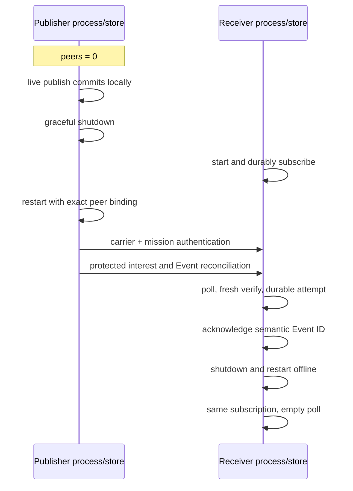
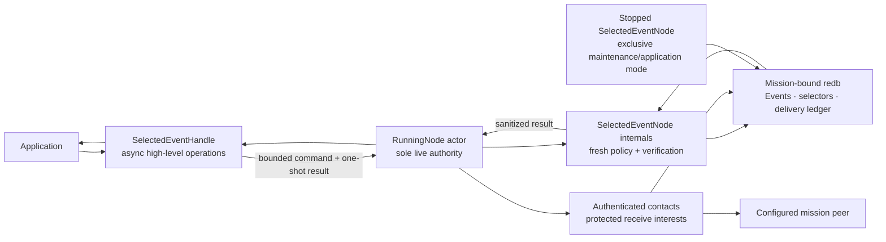

# Selected Event API quickstart

This is the shortest application-code path into the **selected production-lane
store, runtime, and security composition**. The live API starts the sole node
actor, publishes while no peer is configured, queries and consumes the durable
Event locally, inspects authenticated stream gaps and contact status, and shuts
down cleanly. Application code does not construct envelopes, select
cryptography, inspect sealed bytes, choose a carrier, or drive reconciliation.

The selected Event surface now provides live and stopped-state publish, bounded
query, durable subscribe/poll/ack, idempotent unsubscribe, and authenticated gap
inspection. A live `SelectedEventHandle` additionally reports bounded peer and
last-contact status while the actor owns the store. State, Record, Blob, finite
TTL, subscription update, selected-node language bindings, protected
operational provisioning, and generalized control administration remain open.

## Run the live example

Install the pinned toolchain, then create a disposable two-node fixture. The
demo finishes and releases both stores before the application example opens
node 0. The example deliberately configures no peers, so its publication and
application delivery succeed offline through the running actor.

```sh
mise install
ASTER_EVENT_ROOT="$(mktemp -d)"
cargo run --locked -p aster-node --bin aster -- \
  demo --nodes 2 --root "$ASTER_EVENT_ROOT/mesh"

cargo run --locked -p aster-node --example live_event_application -- \
  "$ASTER_EVENT_ROOT/mesh/node-0" \
  "$ASTER_EVENT_ROOT/mesh/node-0/mission.unprotected-reference.bundle" \
  demo/mesh mesh.ping-pong
```

Among the runtime lifecycle lines, expect one application line shaped like:

```text
LIVE_EVENT id=<64 hex characters> inserted=true query_items=<n> deliveries=<n> gaps=0 scanned_through=<n> sync=Offline
```

`query_items` and `deliveries` can exceed one because the disposable demo
already populated the topic. The example filters its query to the local
publisher, acknowledges every returned delivery, reports only gaps anchored by
freshly verified local observations, unsubscribes, and gracefully shuts down.

Run the same example again. Its fixed publication operation key makes publish
idempotent, so `inserted=false` and the original Event identity returns. Because
the example deliberately unsubscribes at the end, the next subscribe is a new
replacement selector with a new delivery ledger; existing matching Events can
therefore be delivered again. This is replacement behavior, not a subscription
update claim.

The fixture persists explicitly unprotected reference mission bundles. They are
suitable for this disposable demonstration, not operational provisioning.
Remove the temporary directory when you no longer need it.

## Prove offline publish and later synchronization

On Unix, the focused integration test uses separate operating-system processes
and independent stores. It publishes through the live handle with no peer
configured, stops that process, starts a subscribed receiver, restarts the
publisher with the exact peer binding, receives and acknowledges the Event,
then restarts the receiver and verifies that the acknowledgement remains
durable:

```sh
cargo test --locked -p aster-node --test mesh_cli \
  offline_publish_later_real_process_sync_poll_ack_and_restart -- \
  --exact --nocapture
```

This is current-code loopback evidence for one same-implementation Event flow.
It is not the stakeholder-set supported offline interval, all-reachable-node
convergence, physical-network acceptance, mixed-implementation
interoperability, or a no-loss claim for State, Record, and Blob.



## Use the live API

The complete runnable source is
[`crates/aster-node/examples/live_event_application.rs`](../../crates/aster-node/examples/live_event_application.rs).
Its central shape is:

```rust
let running = start_node(NodeConfig {
    state,
    bind: "127.0.0.1:0".parse()?,
    mission,
    peers: Vec::new(),
    sync_interval: Duration::from_millis(250),
    run_for: None,
    application: NodeApplication::Relay,
})
.await?;
let events = running.selected_events();

let subscription = events
    .subscribe(EventSubscriptionRequest {
        operation_key: b"my-app/ops/consume".to_vec(),
        topic: topic.clone(),
        scope: scope.clone(),
        include_descendant_scopes: false,
    })
    .await?;

let published = events
    .publish(EventPublishRequest {
        operation_key: b"my-app/asset-7/ready".to_vec(),
        predecessor: None,
        topic: topic.clone(),
        scope: scope.clone(),
        priority: Priority::Priority,
        logical_key: b"asset-7".to_vec(),
        payload: b"ready".to_vec(),
        tombstone: false,
    })
    .await?;

let page = events
    .query(EventQuery {
        publisher: Some(events.identity()),
        topic: Some(topic.clone()),
        scope: Some(scope.clone()),
        ..EventQuery::default()
    })
    .await?;

let deliveries = events
    .poll(EventPollRequest {
        subscription: subscription.id,
        delivery_limit: 128,
        scan_limit: 128,
    })
    .await?;
for delivery in deliveries.deliveries {
    events
        .acknowledge(subscription.id, delivery.event.id)
        .await?;
}

let status = events.status().await?;
let gaps = events
    .gaps(EventGapQuery {
        publisher: events.identity(),
        topic,
        scope,
        after_sequence: 0,
        scan_limit: 128,
    })
    .await?;

events.unsubscribe(subscription.id).await?;
running.shutdown().await?;
```

Choose an operation key that identifies the application effect, not a random
attempt. Reusing it with the same publish request returns the original commit;
reusing it with different content fails closed. Topics and scopes must be
authorized by current mission policy. Tombstones must have an empty payload.
The selected Event slice authenticates and returns priority, but does not yet
schedule contacts, retries, or eviction by that value. That behavior remains
open in the constrained-operation stack.
There is deliberately no finite-TTL field while authenticated cumulative
forwarding age and expiry remain unimplemented.

`EventQuery::limit` bounds accepted rows **scanned**, not only matching rows
returned. A selective page can therefore contain no items while `has_more` is
true. Continue with its `scanned_through` acceptance marker. Returned items are
active, policy-authorized, and freshly source/content verified; transfer IDs,
sealed bytes, keys, route caches, and reconciliation state are not exposed.

A subscription operation key identifies one durable Consume selector. Reusing
the key with the same topic/scope contract returns the same subscription;
changing that contract while it exists fails closed. `scan_limit` bounds
pending plus accepted rows freshly source-verified in a poll, while
`delivery_limit` bounds returned Events. An attempt is incremented durably
before return, so an unacknowledged Event repeats after a process crash.
Acknowledging its semantic Event identity is idempotent.

`unsubscribe` atomically removes the selector and purges its pending and
acknowledgement ledger. Retrying removal returns `AlreadyAbsent`. To change a
selector, unsubscribe and then subscribe to the replacement. Those are two
distinct operations and can create an interval with no receive selector; Aster
does not claim an atomic or seamless subscription update.

## Interpret gaps conservatively

`EventGapQuery` selects one exact publisher/topic/scope stream. Its
`after_sequence` is exclusive and `scan_limit` bounds accepted positions that
the node freshly source- and content-verifies. Each returned `EventGap` is a
half-open interval `[start_sequence, end_sequence)` anchored by the verified
Event at `end_sequence`. Continue from `scanned_through_sequence`; a full page's
`has_more` is deliberately conservative and can be followed by an empty page.

Gap truth is local and store-ledger anchored. No gap in a page means only that
the freshly verified positions already observed by this mission-bound store
were contiguous over that scanned interval. It does **not** prove that the
publisher has emitted nothing later, that no unseen higher sequence exists, or
that the mesh has converged. A trailing absence without a later authenticated
anchor is not reported as a gap.

## Interpret status conservatively

`SelectedEventStatus` is an in-memory observation of this running actor, not a
durable or global synchronization checkpoint.

| `EventSyncStatus` | Exact meaning |
|---|---|
| `Offline` | No peers are configured. Local publish, query, and delivery still work. |
| `NoActiveConfiguredPeers` | Peers are configured, but current control policy marks all of them revoked. |
| `AwaitingAuthenticatedContact` | At least one active configured peer has not completed an authenticated contact in this process. |
| `LastContactComplete` | Every active configured peer's most recent authenticated contact under the current control/selector policy reported no bounded control or Event work remaining. |
| `WorkRemained` | At least one most recent authenticated contact reported bounded work still remaining. |
| `PolicyChangedSinceContact` | Control state or the durable selector generation changed after at least one peer's most recent authenticated contact. |

Each `AuthenticatedPeerStatus` identifies a mission-authenticated peer, its
process-local completed-contact count, its current active/revoked disposition,
and the result of its last contact. `authenticated_contacts` is the sum of
those observations; `failed_contact_attempts` is a local runtime counter.

`LastContactComplete` is **not** global convergence, current reachability,
durable peer knowledge, or proof that a peer possesses every Event. It reports
only the last bounded negotiation with each currently active configured peer.
Restarting the actor begins a new status observation window.

## One authority, two application modes



The live actor and stopped handle never run as two store authorities. The live
handle sends bounded commands to the actor that already owns the mission-bound
writer. Selector-changing commands serialize against contact policy capture;
query, poll, gap, and status results are freshly policy-bound. Shutdown and
zeroization close handle admission and reject queued work before the actor
releases its authority. The stopped `SelectedEventNode` remains useful when no
runtime owns that same state directory.

Operations return a sanitized `ApplicationError`. Use its stable `kind()` for
control flow; raw store tables, transfer identities, source-envelope failures,
carrier errors, and provider internals are deliberately unavailable through
the error or its source chain. The lower-level `aster-redb-store` crate is
unpublished and privileged; its plans are not cryptographic capabilities for
application callers.

The live runtime projects application `Consume` selectors and internal
route-only `Carry` selectors into a canonical protected interest. Empty means
**receive nothing**, never wildcard. Each direction independently intersects
the receiver's interest with current route authority. `Carry` can retain exact
protected bytes without exposing plaintext or creating application delivery;
overlapping `Consume` wins for local delivery.

Continue with the [capability tour](capability-tour.md) for a fast visible mesh,
the [selected architecture](../architecture.md) for the complete authority
split, and the [requirements status](../implementation/requirements-status.md)
for exact credited and open obligations.
