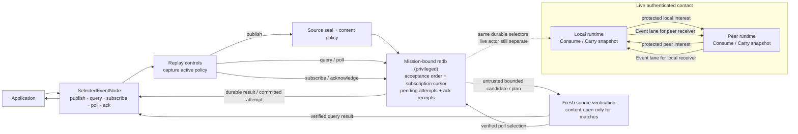

# Selected Event API quickstart

This is the shortest application-code path into the **selected production-lane
store and security composition**. It opens a stopped node, publishes one
source-authenticated Event without a peer, and queries the freshly verified
application projection. The compiled example uses only
`aster_node::application`; it does not construct envelopes, select
cryptography, inspect sealed bytes, choose a carrier, or drive reconciliation.

This stacked Event slice provides publish, bounded query, durable
subscribe/poll/ack, and subscription-aware Event reconciliation. It is still a
stopped-state handle rather than the completed live application surface.
Public authenticated gap inspection, subscription update/delete, a live actor
handle with peer/sync status, finite TTL, State, Record, Blob, language
bindings, and operational protected provisioning remain open.

## Run the compiled example

Install the pinned toolchain, then create a disposable two-node fixture. The
demo finishes and releases both stores before the application example opens
node 0, so the publication below is local and peerless.

```sh
mise install
ASTER_EVENT_ROOT="$(mktemp -d)"
cargo run --locked -p aster-node --bin aster -- \
  demo --nodes 2 --root "$ASTER_EVENT_ROOT/mesh"

cargo run --locked -p aster-node --example event_application -- \
  "$ASTER_EVENT_ROOT/mesh/node-0" \
  "$ASTER_EVENT_ROOT/mesh/node-0/mission.unprotected-reference.bundle"
```

The example publishes `asset-7=ready` to the fixture's provisioned
`mesh.ping-pong` topic and `demo/mesh` scope, then queries that stream. Expect
output shaped like this (the authenticated ID and sequence depend on the
retained fixture):

```text
published id=<64 hex characters> sequence=<n> inserted=true
event id=<same ID> sequence=<n> key=asset-7 payload=ready
subscription id=<64 hex characters> inserted=true published_event=delivered-attempt-1
```

Run the `cargo run --locked -p aster-node --example event_application` command
again with the same two paths. Its fixed application operation key makes the
retry idempotent: `inserted=false`, and it returns the original semantic Event
identity instead of consuming another publisher counter or Event sequence. The
fixed subscription operation key also returns `inserted=false`; because the
first run acknowledged the delivery, the final field reports
`AlreadyAcknowledged` rather than delivering it again.

The fixture persists an explicitly unprotected reference mission bundle. It is
suitable for this disposable demonstration, not operational provisioning.
Remove the temporary directory when you no longer need it.

## Use the API

The complete runnable source is
[`crates/aster-node/examples/event_application.rs`](../../crates/aster-node/examples/event_application.rs).
Its central operation is:

```rust
use aster_node::application::{
    EventPollRequest, EventPublishRequest, EventQuery, EventSubscriptionRequest,
    Priority, Scope, SelectedEventNode, Topic,
};

let mut node = SelectedEventNode::open_unprotected_reference(state, mission)?;
let topic = Topic::new("mesh.ping-pong")?;
let scope = Scope::new("demo/mesh")?;
let published = node.publish(EventPublishRequest {
    operation_key: b"my-app/asset-7/ready".to_vec(),
    predecessor: None,
    topic: topic.clone(),
    scope: scope.clone(),
    priority: Priority::Priority,
    logical_key: b"asset-7".to_vec(),
    payload: b"ready".to_vec(),
    tombstone: false,
})?;

let page = node.query(EventQuery {
    topic: Some(topic.clone()),
    scope: Some(scope.clone()),
    logical_key: Some(b"asset-7".to_vec()),
    ..EventQuery::default()
})?;

let subscription = node.subscribe(EventSubscriptionRequest {
    operation_key: b"my-app/mesh-ping-pong/consume".to_vec(),
    topic,
    scope,
    include_descendant_scopes: false,
})?;
let deliveries = node.poll(EventPollRequest {
    subscription: subscription.id,
    delivery_limit: 128,
    scan_limit: 128,
})?;
for delivery in deliveries.deliveries {
    println!("{} attempt={}", delivery.event.id, delivery.attempt);
    node.acknowledge(subscription.id, delivery.event.id)?;
}
println!("{} {}", published.id, page.items.len());
```

Choose an operation key that identifies the application effect, not a random
attempt. Reusing it with the same request returns the original commit; reusing
it with different content fails closed. Resolution still requires the caller
to remain authorized by current mission policy. Topics and scopes must be
authorized by that policy. Tombstones must have an empty payload. There is
deliberately no finite-TTL field while authenticated cumulative forwarding age
and expiry are unimplemented.

`EventQuery::limit` bounds accepted rows **scanned**, not only matching rows
returned. A selective page can therefore contain no items while `has_more` is
true. Continue with its `scanned_through` acceptance marker. Returned items are
active, policy-authorized, and freshly source/content verified; transfer IDs,
sealed bytes, keys, route caches, and reconciliation state are not exposed.

A subscription operation key identifies one durable Consume selector. Reusing
the key with the same topic/scope contract returns the same subscription;
changing that contract fails closed. `scan_limit` bounds pending plus accepted
rows freshly source-verified in a poll, while `delivery_limit` bounds returned
Events. The store advances its private discovery cursor only after every row in
the unfiltered plan has been authenticated. A selective poll can therefore be
empty with `has_more=true`; poll again. An attempt is incremented durably before
return, so an unacknowledged Event repeats after a process crash. Acknowledging
its semantic Event identity is idempotent.

The live runtime projects both application `Consume` selectors and internal
route-only `Carry` selectors into a canonical protected interest. An empty
selector set means **receive nothing**, never wildcard. After mission and
control authentication, each contact exchanges those interests and reconciles
two independent directional universes—one for each receiver. A selector only
narrows exchange: fresh source verification, active epoch/revocation state, and
the receiver's current route grant are rechecked before every offer, fetch, and
commit. `Carry` can retain exact protected bytes without exposing plaintext or
creating an application delivery. If any matching local `Consume` selector
overlaps a `Carry` selector, `Consume` wins for that Event; `Carry` cannot
suppress an otherwise authorized application delivery.

Selector topic/scope names are protected from network outsiders by the mission
session, but they are visible to the authenticated mission peer, matching the
current membership-visible forwarding-metadata model. A peer without the route
grant still receives no matching Event ID or bytes. Scope-private subscription
metadata would require a later opaque, provider-owned selector design and is
not claimed here.

Operations return a sanitized `ApplicationError`. Use its stable `kind()` for
control flow; raw store tables, transfer identities, source-envelope failures,
carrier errors, and provider internals are deliberately not available through
the error or its source chain.

The lower-level `aster-redb-store` crate is unpublished and privileged. Its
poll-plan/commit-selection API trusts the selected-node composition to supply
freshly verified classifications; it is not a cryptographic capability for
application callers. Use `SelectedEventNode` for the supported safe boundary.

The durable store already audits publisher sequence gaps internally, but the
selected Event API does not expose them directly. A later slice must derive a public gap view from
freshly source-verified, currently authorized Events. Likewise, peer and
synchronization status arrives with the live actor rather than being
manufactured by this stopped-state handle.

## Where this handle sits



The exclusive handle owns the selected redb writer lock. Do not run it beside
the `aster node` process for the same state directory. A later stacked slice
adds a live application actor without creating a second store authority.

Continue with the [capability tour](capability-tour.md) to watch protected
Events cross real process boundaries, the [selected architecture](../architecture.md)
for the complete authority split, and the [requirements status](../implementation/requirements-status.md)
for the exact credited and open obligations.

This compiled sample and the authenticated two-topic contact tests are
selected-lane evidence relevant to `DM-5.2-02`, `DM-5.2-06` through
`DM-5.2-08`, `DM-5.5-02`, `DM-7-16`, `DM-7-17`, and `DM-7-20`. The
requirements ledger keeps every claim bounded to the selected Event slice and
records the remaining real-process, multi-class, physical, and independent
acceptance evidence.
