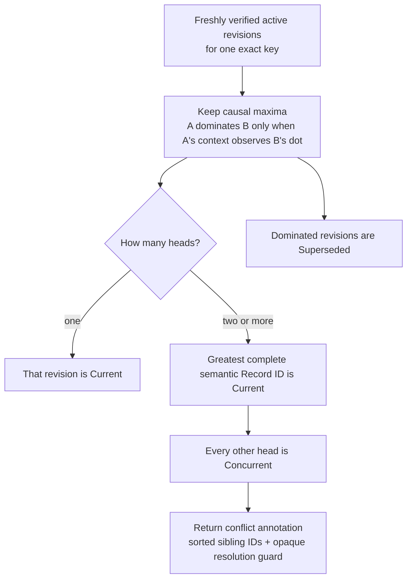
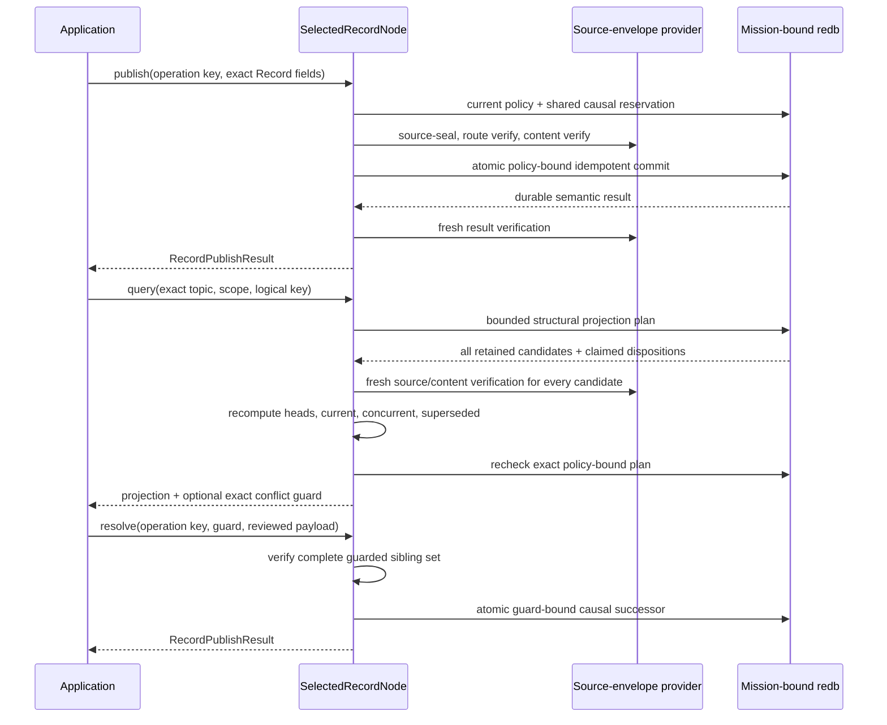

# Selected Record API quickstart

This is the shortest path to Aster's **selected Record conflict
projection**. It opens the selected mission-bound redb store while no runtime
owns it, publishes two source-authenticated revisions for one logical key, and
reads the deterministic current revision plus recoverable history. Application
code never constructs an envelope, handles cryptographic keys, reads sealed
bytes, or runs untrusted merge code during ingest.

The application handle remains deliberately stopped and exclusive; there is no
live Record publish/query handle, durable Record subscription, or language
binding. A separately running node can now reconcile already durable revisions
over a mission-authenticated, class-specific Negentropy lane when the receiver
configures an exact topic/scope interest. Ingest never executes registered merge
code, so concurrent heads remain durable and explicit. Finite TTL, expiry,
garbage collection, automatic registered-policy merge, broader relay
acceptance, and independent interoperability remain open.

## Run the example

Install the pinned toolchain, then create a disposable two-node fixture. The
demo provides a mission bundle and releases its stores before the Record
example opens node 0 exclusively.

```sh
mise install
ASTER_RECORD_ROOT="$(mktemp -d)"
cargo run --locked -p aster-node --bin aster -- \
  demo --nodes 2 --root "$ASTER_RECORD_ROOT/mesh"

cargo run --locked -p aster-node --example record_application -- \
  "$ASTER_RECORD_ROOT/mesh/node-0" \
  "$ASTER_RECORD_ROOT/mesh/node-0/mission.unprotected-reference.bundle"
```

Expect one line shaped like:

```text
RECORD current=<64 hex characters> value=moving counter=<n> ready_inserted=true moving_inserted=true concurrent=0 superseded=1 conflict=false
```

Run the Record example again against the same directory. Both fixed operation
keys resolve their original durable publications, so `ready_inserted=false`
and `moving_inserted=false`; the current semantic identity and value remain
stable. The publisher counter need not start at one because selected Event,
State, and Record publications intentionally share one authenticated causal
counter and frontier.

The fixture persists explicitly unprotected reference mission material. It is
appropriate for this disposable demonstration, not operational provisioning.
Remove the temporary directory when you no longer need it.

For a quick executable conflict proof, run the focused selected-node test. It
constructs three independently source-authenticated heads, proves an ordinary
publish cannot collapse them, resolves the exact guard, retries that operation
after restart, then proves the same operation key cannot resolve a later,
different head set:

```sh
cargo test --locked -p aster-node \
  application::record::tests::n_way_conflict_requires_explicit_guarded_resolution_and_retry_is_stable \
  -- --exact
```

This is an in-process mechanism test over one mission-bound store. The network
test below separately exercises disconnected publishers and a real carrier.

## Reconcile disconnected Record revisions

Stop `SelectedRecordNode` before starting the network actor; both deliberately
own the same mission-bound store exclusively. On every receiving node, add one
repeatable exact interest for each desired topic and scope:

```sh
aster node ... --record-interest reports@mission/alpha
```

An empty Record interest set means receive-none, never wildcard. Topic/scope
interest is only desired receipt: current mission membership, route authority,
content authority, source authentication, revocation, and scope epoch still
have to pass. Remote finite-TTL Record is rejected until authenticated
cumulative forwarding age exists.

The current-code real-carrier acceptance test creates concurrent revisions on
two independent stores while disconnected, makes one mission-authenticated
direct Iroh contact, and verifies both exact revision inventories converge and
both causal heads remain present on both stores:

```sh
cargo test --locked -p aster-node \
  runtime::tests::real_iroh_contact_converges_state_and_disconnected_record_siblings \
  -- --exact
```

No application merge callback runs during ingest. This is bounded
same-implementation, one-host, two-node evidence, not a retained release
receipt, multi-hop/partition sweep, or automatic merge implementation.

## Use the stopped API

The complete runnable source is
[`crates/aster-node/examples/record_application.rs`](../../crates/aster-node/examples/record_application.rs).
Its central shape is:

```rust
let mut records = SelectedRecordNode::open_unprotected_reference(
    state_directory,
    mission_bundle,
)?;

records.publish(RecordPublishRequest {
    operation_key: b"my-app/record/asset-7/ready".to_vec(),
    topic: topic.clone(),
    scope: scope.clone(),
    priority: Priority::Priority,
    logical_key: b"asset-7".to_vec(),
    payload: b"ready".to_vec(),
    tombstone: false,
})?;

records.publish(RecordPublishRequest {
    operation_key: b"my-app/record/asset-7/moving".to_vec(),
    topic: topic.clone(),
    scope: scope.clone(),
    priority: Priority::Priority,
    logical_key: b"asset-7".to_vec(),
    payload: b"moving".to_vec(),
    tombstone: false,
})?;

let projection = records.query(RecordQuery {
    topic: topic.clone(),
    scope: scope.clone(),
    logical_key: b"asset-7".to_vec(),
    include_superseded_versions: true,
})?;
let current = projection.current.expect("published Record has a current revision");
assert_eq!(current.payload, b"moving");
assert_eq!(current.disposition, RecordVersionDisposition::Current);
assert!(projection.conflict.is_none());
```

Choose an operation key for the application effect, not for an individual
attempt. Reusing it with the same request and payload returns the original
commit; changing the request or payload fails closed. Topic, scope, publisher,
key epoch, logical key, priority, content length, tombstone flag, causal stamp,
and payload digest are authenticated. The selected store additionally bounds
operation keys to 1–256 bytes, logical keys to 1–4,096 bytes, retained versions
to 1,024 per exact key, and the dedicated durable Record operation ledger to
4,096 rows and 512 KiB. That ledger also participates in aggregate store
quotas. Priority is authenticated and returned, but this selected slice does not
schedule transmission, retry, or eviction by priority.

`RecordQuery` always identifies one exact topic, scope, and logical key. All
active causal heads are returned: one is deterministically marked `Current`
and the others are `Concurrent`. Setting `include_superseded_versions` returns
active versions observed by later revisions in a separate `superseded` list.
Every retained candidate is freshly verified regardless of that option.

## Keep conflicts explicit

Record never uses a wall-clock timestamp or arrival order to erase a conflict:



The deterministic current marker gives applications a stable projection; it
does not silently merge or discard the other heads. An ordinary `publish`
cannot collapse a conflict. When two or more heads exist it fails with
`ApplicationErrorKind::Conflict`, leaving every sibling unchanged.

Automatic registered-policy merge is intentionally absent. An application
that understands the document can inspect the verified siblings, compute a
deterministic result in its own code, and explicitly submit the exact guard it
inspected:

```rust
let projection = records.query(RecordQuery {
    topic,
    scope,
    logical_key,
    include_superseded_versions: true,
})?;
let conflict = projection.conflict.expect("two or more Record heads");
assert_eq!(
    conflict.siblings.as_slice(),
    conflict.resolution_guard.siblings(),
);

let resolved = records.resolve(RecordResolveRequest {
    operation_key: b"my-app/record/asset-7/resolve-v1".to_vec(),
    resolution_guard: conflict.resolution_guard,
    priority: Priority::Priority,
    payload: b"application-reviewed-result".to_vec(),
    tombstone: false,
})?;
assert!(resolved.inserted);
```

The guard binds the exact sorted head set, topic, scope, logical key, and
policy-bound projection. The resolution successor must causally observe every
guarded sibling. If another head arrives first, the stale guard fails
atomically and no application bytes are inserted. The durable operation digest
additionally binds the publication intent and sorted guarded head identities:
the same operation key cannot resolve a different head set. Retrying the exact
successful request returns its original commit, even
after its own successor has advanced the projection and after an authorized
rekey; a new operation cannot reuse an old-policy guard.

The current example remains intentionally conflict-free because one stopped
writer creates causally ordered successors. Selected-node tests construct
independently source-authenticated publishers and exercise two-way, N-way,
stale-guard, restart, rekey-retry, and both semantic-ID-order directions. That
is automated local mechanism evidence. The separate real-Iroh test establishes
only the bounded disconnected two-publisher transfer described above.

## Treat tombstones as authenticated Record revisions

A tombstone is another source-authenticated Record revision and must carry an
empty payload:

```rust
records.publish(RecordPublishRequest {
    operation_key: b"my-app/record/asset-7/deleted".to_vec(),
    topic: topic.clone(),
    scope: scope.clone(),
    priority: Priority::Priority,
    logical_key: b"asset-7".to_vec(),
    payload: Vec::new(),
    tombstone: true,
})?;
```

If that revision is current, `projection.current` remains `Some(RecordItem)`
with `tombstone == true`. Concurrent edits and tombstones follow the same
complete-semantic-ID ordering in both directions; deletion receives no special
delete-wins priority. Superseded and concurrent revisions remain recoverable in
this bounded slice. Expiry, explicit-policy garbage collection, and retention-
driven deletion are not implemented.

## Follow the verification boundary

On publish, the facade refreshes current control policy, reserves the next
shared causal dot and context, source-seals the Record, obtains route- and
content-verified capabilities, verifies the exact plaintext, and commits the
operation and revision atomically. An exact replay still has to pass current
policy, revocation, and authority checks before the original result is
returned.

On query, redb supplies a bounded structural plan, not an authorization
capability. The facade freshly authenticates every retained candidate, verifies
its plaintext and exact key, excludes revoked or stale-epoch revisions from the
application projection, independently recomputes every causal disposition and
head identity, and asks the store to recheck the exact policy-bound plan before
returning application data. Resolution adds the exact verified conflict guard
to that transaction.



The stopped handle takes the same process-exclusive store authority used by the
live actor and the stopped State facade. Stop that actor and drop any other
stopped facade before opening `SelectedRecordNode`, and close this handle before
starting the actor; Aster does not permit two writers around one policy
snapshot. Continue with the
[selected architecture](../architecture.md) for the full trust split, the
[selected State API](selected-state-api.md) for causal latest-value semantics,
the [selected Event API](selected-event-api.md) for the live networked surface,
and the [requirements status](../implementation/requirements-status.md) for the
exact partial credit and remaining gaps.
