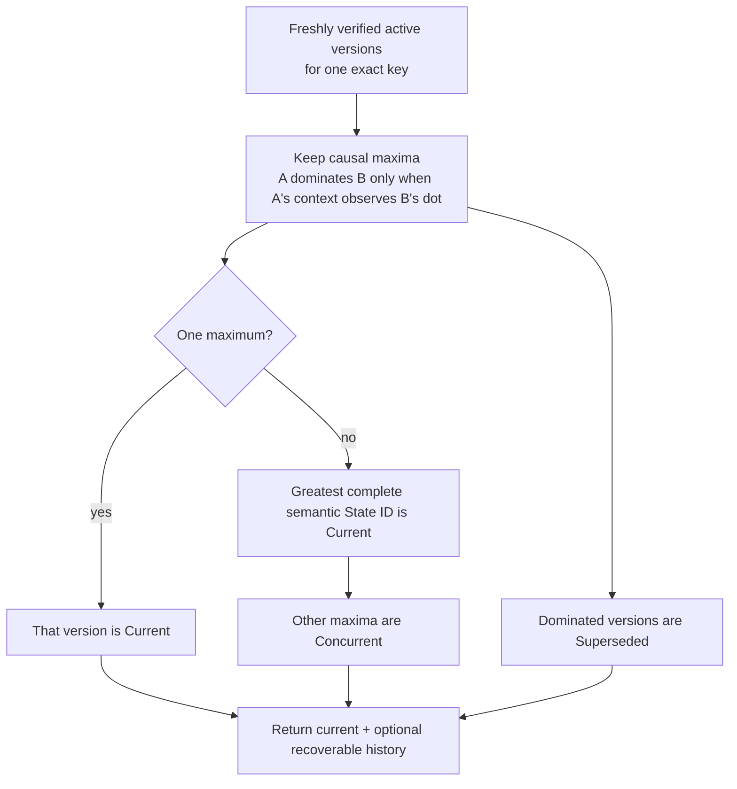
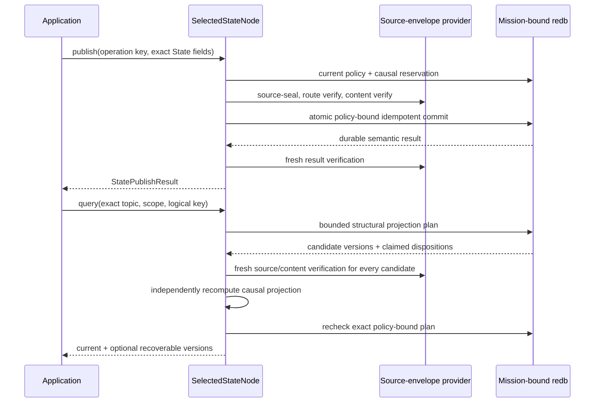

# Selected State API quickstart

This is the shortest path to Aster's **selected State projection**. It
opens the selected mission-bound redb store while no runtime owns it, publishes
two source-authenticated versions for one logical key, and reads the
deterministic latest value plus recoverable history. Application code never
constructs an envelope, handles cryptographic keys, reads sealed bytes, or runs
a reducer.

The application handle remains deliberately stopped and exclusive; there is no
live State publish/query handle, durable State subscription, or language
binding. A separately running node can now reconcile already durable State
objects over a mission-authenticated, class-specific Negentropy lane when the
receiver configures an exact topic/scope interest. Finite TTL, expiry, garbage
collection, broader relay acceptance, and independent interoperability remain
open. The local example below demonstrates the projection, while the focused
runtime test exercises one real-Iroh delivery.

## Run the example

Install the pinned toolchain, then create a disposable two-node fixture. The
demo provides a mission bundle and releases its stores before the State example
opens node 0 exclusively.

```sh
mise install
ASTER_STATE_ROOT="$(mktemp -d)"
cargo run --locked -p aster-node --bin aster -- \
  demo --nodes 2 --root "$ASTER_STATE_ROOT/mesh"

cargo run --locked -p aster-node --example state_application -- \
  "$ASTER_STATE_ROOT/mesh/node-0" \
  "$ASTER_STATE_ROOT/mesh/node-0/mission.unprotected-reference.bundle"
```

Expect one line shaped like:

```text
STATE current=<64 hex characters> value=moving counter=<n> ready_inserted=true moving_inserted=true recoverable=1
```

Run the State example again against the same directory. Both fixed operation
keys resolve their original durable publications, so `ready_inserted=false`
and `moving_inserted=false`; the current semantic identity and value remain
stable. The publisher counter need not start at one because selected Event and
State publications intentionally share one authenticated causal counter and
frontier.

The fixture persists explicitly unprotected reference mission material. It is
appropriate for this disposable demonstration, not operational provisioning.
Remove the temporary directory when you no longer need it.

## Reconcile durable State over a contact

Stop `SelectedStateNode` before starting the network actor; both deliberately
own the same mission-bound store exclusively. On every receiving node, add one
repeatable exact interest for each desired topic and scope:

```sh
aster node ... --state-interest sensors@mission/alpha
```

An empty State interest set means receive-none, never wildcard. Topic/scope
interest is only desired receipt: current mission membership, route authority,
content authority, source authentication, revocation, and scope epoch still
have to pass. Remote finite-TTL State is rejected until authenticated cumulative
forwarding age exists.

The current-code real-carrier acceptance test creates a durable State on one
store, makes a mission-authenticated direct Iroh contact, and verifies the other
independent redb store receives it:

```sh
cargo test --locked -p aster-node \
  runtime::tests::real_iroh_contact_converges_state_and_disconnected_record_siblings \
  -- --exact
```

This is bounded same-implementation, one-host, two-node evidence. It is not a
retained release receipt, a multi-hop/partition sweep, or proof of convergence
for every reachable subscriber.

## Use the stopped API

The complete runnable source is
[`crates/aster-node/examples/state_application.rs`](../../crates/aster-node/examples/state_application.rs).
Its central shape is:

```rust
let mut states = SelectedStateNode::open_unprotected_reference(
    state_directory,
    mission_bundle,
)?;

states.publish(StatePublishRequest {
    operation_key: b"my-app/state/asset-7/ready".to_vec(),
    topic: topic.clone(),
    scope: scope.clone(),
    priority: Priority::Priority,
    logical_key: b"asset-7".to_vec(),
    payload: b"ready".to_vec(),
    tombstone: false,
})?;

states.publish(StatePublishRequest {
    operation_key: b"my-app/state/asset-7/moving".to_vec(),
    topic: topic.clone(),
    scope: scope.clone(),
    priority: Priority::Priority,
    logical_key: b"asset-7".to_vec(),
    payload: b"moving".to_vec(),
    tombstone: false,
})?;

let projection = states.query(StateQuery {
    topic: topic.clone(),
    scope: scope.clone(),
    logical_key: b"asset-7".to_vec(),
    include_recoverable_versions: true,
})?;
let current = projection.current.expect("published State has a current value");
assert_eq!(current.payload, b"moving");
assert_eq!(current.disposition, StateVersionDisposition::Current);
```

Choose an operation key for the application effect, not for an individual
attempt. Reusing it with the same request and payload returns the original
commit; changing the request or payload fails closed. Topic, scope, publisher,
key epoch, logical key, priority, content length, tombstone flag, causal stamp,
and payload digest are authenticated. The selected store additionally bounds
operation keys to 1–256 bytes, logical keys to 1–4,096 bytes, retained versions
to 1,024 per exact key, and the dedicated durable State operation ledger to
4,096 rows and 512 KiB. That ledger also participates in aggregate store quotas.

`StateQuery` always identifies one exact topic, scope, and logical key. Setting
`include_recoverable_versions` returns active retained versions other than the
current one, annotated as `Concurrent` or `Superseded`. It does not weaken the
deterministic current projection.

## Understand causal latest value

State never uses wall-clock timestamps to choose a winner:



The tie-break compares the complete source-authenticated semantic State ID. It
does not imply last-writer-wins, delete-wins, or clock authority. Sequential
publication by one selected node normally makes the later version observe the
earlier dot, so the example's `ready` version is `Superseded`. Concurrent
maxima are preserved and surfaced rather than silently discarded.

## Treat tombstones as authenticated State

A tombstone is another source-authenticated State version and must carry an
empty payload:

```rust
states.publish(StatePublishRequest {
    operation_key: b"my-app/state/asset-7/deleted".to_vec(),
    topic: topic.clone(),
    scope: scope.clone(),
    priority: Priority::Priority,
    logical_key: b"asset-7".to_vec(),
    payload: Vec::new(),
    tombstone: true,
})?;
```

If that version is current, `projection.current` remains `Some(StateItem)` with
`tombstone == true`. The facade never turns authenticated deletion into an
indistinguishable absence. Concurrent edits and tombstones follow the same
semantic-ID tie-break; this slice has no special delete-wins rule. Retention is
bounded, but expiry and garbage collection are not implemented by this slice.

## Follow the verification boundary

On publish, the facade refreshes current control policy, reserves the next
shared causal dot and context, source-seals the State, obtains route- and
content-verified capabilities, verifies the exact plaintext, and commits the
operation and version atomically. A replay still has to pass current policy,
revocation, and authority checks before the original result is returned.

On query, redb supplies a bounded structural plan, not an authorization
capability. The facade freshly authenticates every retained candidate, verifies
its plaintext and exact key, excludes revoked or stale-epoch versions,
independently recomputes every causal disposition, and asks the store to recheck
the exact policy-bound plan before returning application data.



The stopped handle takes the same process-exclusive store authority used by the
live actor. Stop that actor before opening `SelectedStateNode`, and close this
handle before starting the actor; Aster does not permit two writers around one
policy snapshot. Continue with the
[selected architecture](../architecture.md) for the full trust split, the
[selected Event API](selected-event-api.md) for the live networked surface, and
the [requirements status](../implementation/requirements-status.md) for the
exact partial credit and remaining gaps.
