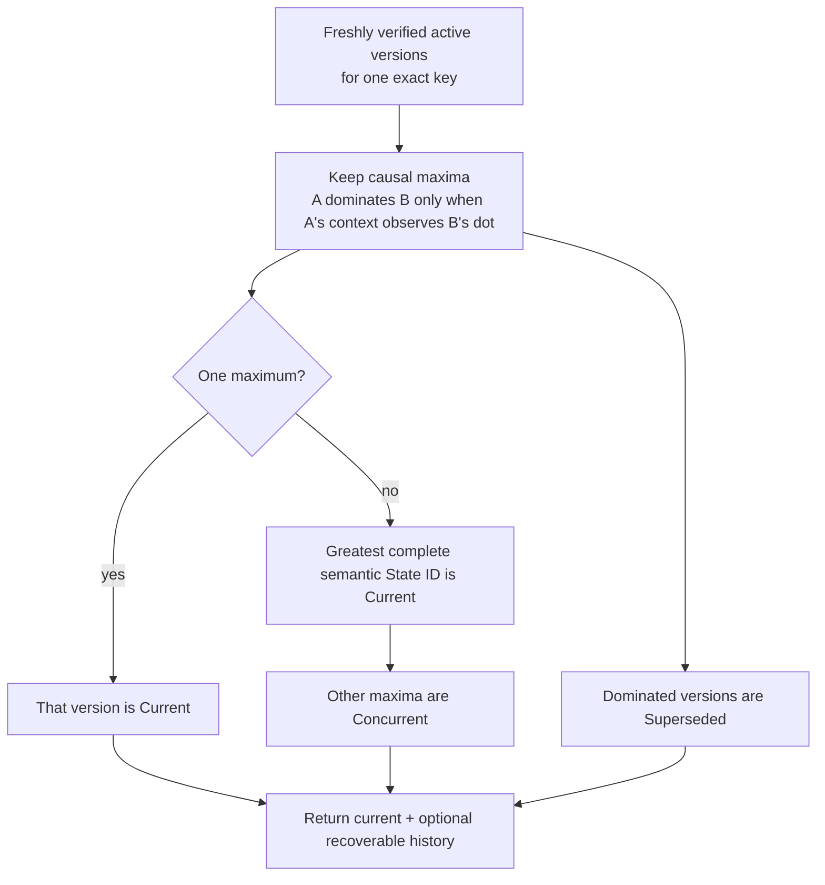
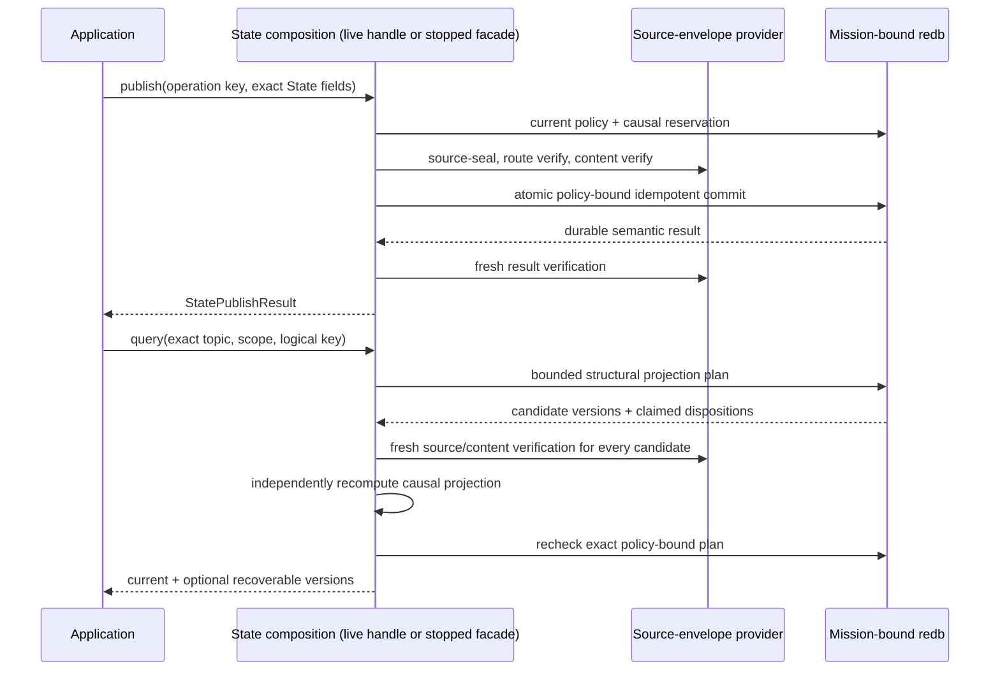

# Selected State API quickstart

This is the shortest path to Aster's **selected State projection**. A running
node exposes cloneable async publish/query handles, and the same composition
retains an exclusive stopped facade for maintenance or applications that do not
need networking. Both return the deterministic current value plus optional
recoverable history without exposing envelopes, cryptographic keys, sealed
bytes, or reducer internals.

`RunningNode::selected_state()` returns `SelectedStateHandle`. Its clones send
commands through the actor's one bounded Event/State/Record lane; they do not
open another store or policy authority. `SelectedStateNode` remains the stopped
facade and owns the mission-bound writer exclusively. State reconciles over a
semantic-v4/v5 mission-authenticated, class- and direction-specific Negentropy
lane when the receiver configures an exact topic/scope interest.

Durable State subscriptions, selected-node ConnectRPC/C/Go/Python bindings,
finite TTL, expiry, garbage collection, broader relay acceptance,
representative physical/mixed-implementation evidence, and release authorization
remain open. The selected store rejects every finite-TTL State object; there is
no forwarding-age path to enable yet.

## Run the stopped example

Install the pinned toolchain, then create a disposable two-node fixture. The
demo provides a mission bundle and releases its stores before the State example
opens node 0 exclusively.

```sh
mise install
ASTER_STATE_ROOT="$(mktemp -d)"
cargo run --locked -p aster-node --bin aster -- \
  demo --nodes 2 --root "$ASTER_STATE_ROOT/mesh"

cargo run --locked -p aster-node --example state_application -- \
  "$ASTER_STATE_ROOT/mesh/node-0" \
  "$ASTER_STATE_ROOT/mesh/node-0/mission.unprotected-reference.bundle"
```

Expect one line shaped like:

```text
STATE current=<64 hex characters> value=moving counter=<n> ready_inserted=true moving_inserted=true recoverable=1
```

Run the State example again against the same directory. Both fixed operation
keys resolve their original durable publications, so `ready_inserted=false`
and `moving_inserted=false`; the current semantic identity and value remain
stable. The publisher counter need not start at one because selected Event and
State publications intentionally share one authenticated causal counter and
frontier.

The fixture persists explicitly unprotected reference mission material. It is
appropriate for this disposable demonstration, not operational provisioning.
Remove the temporary directory when you no longer need it.

## Use the live actor API

Start a `RunningNode` as shown in the
[selected Event guide](selected-event-api.md), then obtain and clone its State
handle. Publication and query are async because the running actor remains the
sole store authority:

```rust
let states = running.selected_state();
let retained = states.clone();

let request = StatePublishRequest {
    operation_key: b"my-app/state/asset-7/live".to_vec(),
    topic: topic.clone(),
    scope: scope.clone(),
    priority: Priority::Priority,
    logical_key: b"asset-7".to_vec(),
    payload: b"moving".to_vec(),
    tombstone: false,
};
let published = states.publish(request.clone()).await?;
assert!(published.inserted);
assert!(!states.publish(request).await?.inserted); // exact durable retry

let query = StateQuery {
    topic,
    scope,
    logical_key: b"asset-7".to_vec(),
    include_recoverable_versions: true,
};
let projection = states.query(query.clone()).await?;
assert_eq!(projection.current.expect("current State").id, published.id);

running.shutdown().await?;
let closed = retained.query(query).await.expect_err("actor is closed");
assert_eq!(closed.kind(), ApplicationErrorKind::StateUnavailable);
assert_eq!(closed.operation(), "state query");
```

Graceful shutdown closes application admission before releasing the writer.
The bounded same-UID Unix zeroization path does the same before erasing retained
secret artifacts. Retained handle clones therefore fail closed with sanitized
`StateUnavailable`; they never reopen the store or continue on a stale policy.
Event, State, and Record clones share one bounded command queue, and contacts
remain governed by the same actor-owned policy/store authority.

Focused current-code automation covers peerless durability, exact retry,
restart, shutdown admission, and protected same-epoch rekey recovery:

```sh
cargo test --locked -p aster-node \
  runtime::tests::live_selected_state_and_record_are_durable_idempotent_and_close_admission \
  -- --exact
cargo test --locked -p aster-node \
  runtime::tests::protected_live_mutable_handles_cache_exact_retry_across_same_epoch_rekey \
  -- --exact
```

These focused commands are source-level current-code automation and do not by
themselves create a retained acceptance receipt. The separate retained run
below binds its claim to signed source and a frozen canonical projection.

## Reconcile live State over a contact

Use `SelectedStateHandle` while the network actor runs. If an application chose
the stopped `SelectedStateNode` facade instead, close it before starting the
actor because both deliberately require the same mission-bound writer. On every
receiving node, add one repeatable exact interest for each desired topic and
scope:

```sh
aster node ... --state-interest sensors@mission/alpha
```

An empty State interest set means receive-none, never wildcard. Topic/scope
interest is only desired receipt: current mission membership, route authority,
content authority, source authentication, revocation, and scope epoch still
have to pass. Remote finite-TTL State is rejected. Semantic versions 1 through
3 run their Event compatibility lanes but contain no State interest, inventory,
fetch, offer, result, or finish frames.

On semantic v4 or v5, Normal and every `AtLeast` Event threshold still run the
State lane; the threshold does not filter State. `ReceiveOnly` initiates and
discloses no State lane. An object is limited to 1 MiB, and selected State
storage is capped at 4,096 rows and 16 MiB of encoded source bytes. Capacity
saturation is an authenticated deferred outcome, not a duplicate or integrity
success. Fetch result and acknowledgement must match exactly, as must both
finish remainders. A durable cursor rotates the authenticated
peer/class/local-mode starting point so bounded contacts do not permanently
prefer the same ID.

The focused real-carrier automation publishes different State versions through
live handles on two peerless nodes, later makes direct mission-authenticated Iroh
contacts under exact interests, and verifies both live projections converge on
the same current and concurrent versions:

```sh
cargo test --locked -p aster-node \
  runtime::tests::live_mutable_handles_converge_disconnected_state_and_record_then_resolve \
  -- --exact
```

A separate [retained live mutable receipt](../implementation/evidence/selected-live-mutable-2ccfba0.json)
is a 5,660-byte canonical projection (SHA-256
`299a3c3b8d1685deb5980ed091797f7d46119562b67c3d853b94d8552c83b67a`)
bound to signed source `2ccfba0`. Two same-implementation participants ran six
actor lifetimes with at most two concurrent and published State and Record while
peerless. Four direct `CONTACT` records formed paired equal accounting with
aggregate 5/5/5 selected items offered/fetched/inserted. The two State
publications produced the max-ID `Current`/other `Concurrent` projection in four
connected-and-restart views. Six graceful shutdowns completed, four retained
handles closed, and Event/control/Blob counters stayed zero.

The receipt's source-to-execution link is operator-attested, not
cryptographically proven or reproducible, and secret artifacts were inspected
by metadata only. It is one-host loopback evidence, not physical, NAT/relay,
BTLE, mixed-implementation, scale, resource, long-duration, Event/Blob-live, or
release acceptance. Additional current-code regressions cover exact
result/acknowledgement, capacity deferral, and fair rotation. Same-epoch old
lineage is withheld from ordinary current projection/query and network
inventory/transfer; only an exact idempotent publish retry may recover its
committed result through strict cached/projection/historical verification. The
receipt is not a multi-hop/partition sweep or proof of convergence for every
interested peer.

## Use the stopped API

The complete runnable source is
[`crates/aster-node/examples/state_application.rs`](../../crates/aster-node/examples/state_application.rs).
Its central shape is:

```rust
let mut states = SelectedStateNode::open_unprotected_reference(
    state_directory,
    mission_bundle,
)?;

states.publish(StatePublishRequest {
    operation_key: b"my-app/state/asset-7/ready".to_vec(),
    topic: topic.clone(),
    scope: scope.clone(),
    priority: Priority::Priority,
    logical_key: b"asset-7".to_vec(),
    payload: b"ready".to_vec(),
    tombstone: false,
})?;

states.publish(StatePublishRequest {
    operation_key: b"my-app/state/asset-7/moving".to_vec(),
    topic: topic.clone(),
    scope: scope.clone(),
    priority: Priority::Priority,
    logical_key: b"asset-7".to_vec(),
    payload: b"moving".to_vec(),
    tombstone: false,
})?;

let projection = states.query(StateQuery {
    topic: topic.clone(),
    scope: scope.clone(),
    logical_key: b"asset-7".to_vec(),
    include_recoverable_versions: true,
})?;
let current = projection.current.expect("published State has a current value");
assert_eq!(current.payload, b"moving");
assert_eq!(current.disposition, StateVersionDisposition::Current);
```

Choose an operation key for the application effect, not for an individual
attempt. Reusing it with the same request and payload returns the original
commit; changing the request or payload fails closed. Topic, scope, publisher,
key epoch, logical key, priority, content length, tombstone flag, causal stamp,
and payload digest are authenticated. The selected store additionally bounds
operation keys to 1–256 bytes, logical keys to 1–4,096 bytes, retained versions
to 1,024 per exact key, and the dedicated durable State operation ledger to
4,096 rows and 512 KiB. That ledger also participates in aggregate store quotas.

`StateQuery` always identifies one exact topic, scope, and logical key. Setting
`include_recoverable_versions` returns active retained versions other than the
current one, annotated as `Concurrent` or `Superseded`. It does not weaken the
deterministic current projection.

## Understand causal latest value

State never uses wall-clock timestamps to choose a winner:



The tie-break compares the complete source-authenticated semantic State ID. It
does not imply last-writer-wins, delete-wins, or clock authority. Sequential
publication by one selected node normally makes the later version observe the
earlier dot, so the example's `ready` version is `Superseded`. Concurrent
maxima are preserved and surfaced rather than silently discarded.

## Treat tombstones as authenticated State

A tombstone is another source-authenticated State version and must carry an
empty payload:

```rust
states.publish(StatePublishRequest {
    operation_key: b"my-app/state/asset-7/deleted".to_vec(),
    topic: topic.clone(),
    scope: scope.clone(),
    priority: Priority::Priority,
    logical_key: b"asset-7".to_vec(),
    payload: Vec::new(),
    tombstone: true,
})?;
```

If that version is current, `projection.current` remains `Some(StateItem)` with
`tombstone == true`. The facade never turns authenticated deletion into an
indistinguishable absence. Concurrent edits and tombstones follow the same
semantic-ID tie-break; this slice has no special delete-wins rule. Retention is
bounded, but expiry and garbage collection are not implemented by this slice.

## Follow the verification boundary

On publish, the facade refreshes current control policy, reserves the next
shared causal dot and context, source-seals the State, obtains route- and
content-verified capabilities, verifies the exact plaintext, and commits the
operation and version atomically. A replay still has to pass current policy,
revocation, and authority checks before the original result is returned.

On query, redb supplies a bounded structural plan, not an authorization
capability. The facade freshly authenticates every retained candidate, verifies
its plaintext and exact key, excludes revoked or stale-epoch versions,
independently recomputes every causal disposition, and asks the store to recheck
the exact policy-bound plan before returning application data.



The stopped handle takes the same process-exclusive store authority used by the
live actor. Stop that actor before opening `SelectedStateNode`, and close this
facade before starting the actor; Aster does not permit two writers around one
policy snapshot. The live `SelectedStateHandle` instead routes commands to the
already-running authority. Continue with the
[selected architecture](../architecture.md) for the full trust split, the
[selected Event API](selected-event-api.md) for the live networked surface, and
the [requirements status](../implementation/requirements-status.md) for the
exact partial credit and remaining gaps.
