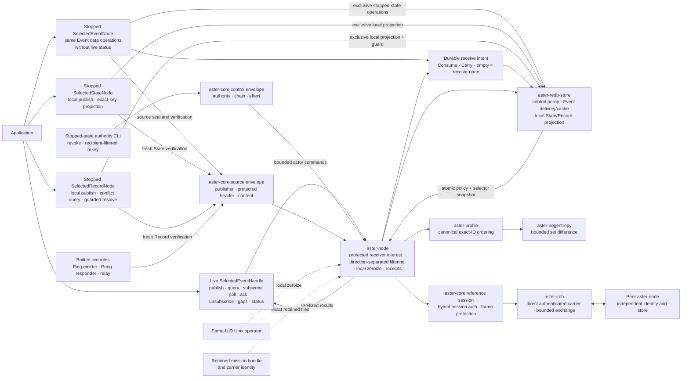
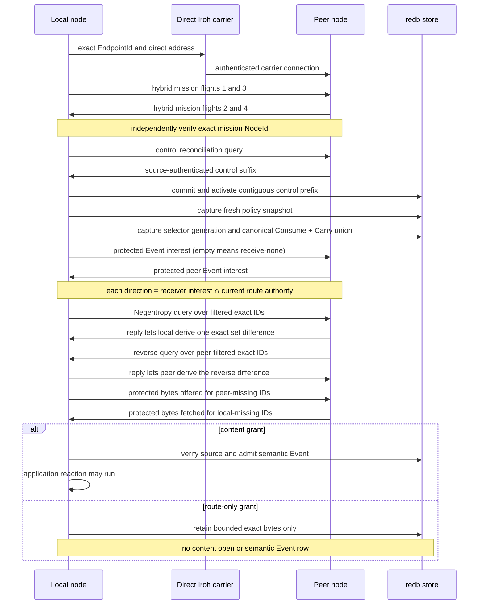

# Carriers and contacts

This guide distinguishes the selected direct-Iroh carrier/storage composition
from the proven semantic implementation whose protocol and carrier behavior is
being migrated onto it. Read [Core concepts](concepts.md) first if terms such as
node, topic, or scope are new.

## The important separation

Application semantics, mission authentication, control/source authorization,
and carrier mechanics have separate owners. The selected composition now
exercises source-authenticated control and Event paths plus stopped/local State
and Record projections:



`aster-iroh` knows only endpoint lifecycle and bounded exchange.
`aster-negentropy` knows only exact-transfer-ID set difference.
`aster-redb-store` is the mission-bound transaction authority for the audited
contiguous control prefix, active policy snapshots, accepted Events,
causal/operation ledgers, durable Consume/Carry selector generations, Event
delivery cursors/pending attempts/acknowledgements, and bounded route-only
representations. It also holds disjoint local State and Record versions,
operations, and exact-key projection plans on the same causal frontier; those
classes never enter the carrier diagram's Event reconciliation lanes.
`aster-profile` owns the canonical full-ID vocabulary and ordering, not policy
or semantic identity. `aster-node` is the only selected composition root. This
diagram is the selected control/Event lane only; broader semantic/reference
components are migration sources, not co-running authorities.

The requirements still demand transport-neutral, source-authenticated items.
The proven `aster-core` semantic implementation supplies the migration source
for the hybrid-PQ handshake, protected control/source envelopes,
recipient-filtered rekey, source authentication, data classes, causality,
custody/TTL, scopes, and policy. Those mechanisms are ported, not rewritten.
The selected node now uses the existing reference session before inventory, the
existing control provider before Event, and the existing source envelope for
Event. It freshly verifies exact sealed bytes before admission, serving,
restart, and application reaction. This is bounded control/Event credit only;
the old implementation is not removed until each replacement passes equivalent
tests.

## What is implemented today

| Carrier path | Current capability | What is not yet claimed |
|---|---|---|
| Selected direct Iroh | Manually admitted exact endpoint ID and socket, direct authenticated QUIC, bounded exchange, hosted discovery/relay/port mapping disabled | Carrier authentication is not mission or control/source authorization; NAT, hosted relay, physical-network acceptance, and multi-carrier failover remain open |
| Selected virtual mesh CLI and live Event actor | Real 2–32-node Ping/Pong line plus explicit four-role control scenario; independent identities/stores, mission auth before inventory, ordered Flash controls before source-sealed Event transfer, current scope/epoch route filtering, payload-blind relay cache, restart/idempotency, no-op verification, a live high-level Event handle, stopped/local State and Record facades, and a same-UID Unix local software-zeroization hook | The retained parent PR-A/pre-subscription N=3/13-process, default N=4/18-process, and N=8/38-process Ping/Pong plus explicit N=4/23-process control receipts passed with disclosed transient/denial stderr. The generic line has `2N+1` cohorts and `5N-2` children, isolates both publications and every directed-edge transfer, moves exactly one pre-existing Event per transfer edge with all control counters zero, and finishes with all 11 reconciliation counters zero. The control receipt separately proves converged controls, no-contact Ping publication, later Event forwarding, and four causal Pong barriers before its no-op. A separate parent-slice real-child zeroization receipt passed. PR B adds durable Event Consume/Carry selectors and protected receiver filtering; PR C adds current-code automated evidence for live publish/query/delivery, unsubscribe, authenticated gap inspection, last-contact status, and one real-process offline-publish/later-sync flow. Local State and Record add current-code source/test evidence only; neither enters a contact. No slice relabels the retained parent roots. Provisioning is unprotected-reference; status is not global convergence; non-Unix and physical/copy-on-write/snapshot/swap/backup sanitization, database rollback resistance, generalized/repeated control management, finite TTL, networked State/Record, Blob, the full range, many-node scale, and physical multi-system acceptance remain open. |
| Current semantic in-memory link | Full high-level host contact, authentication, reconciliation, resume, and failure tests | It is a test carrier and is not wired to the selected composition |
| Current semantic UDP/IP | Nonblocking link, manual endpoint mapping, protected local discovery, rendezvous helpers, opaque relay components | Migration onto the selected node; full host acceptance on physical or operational networks |
| Current semantic NAT/rendezvous and relay | Bounded rendezvous, endpoint-punching, and opaque-relay helpers with local software tests | Selected-node integration and a two-device representative-NAT direct/fallback result |
| Current semantic BTLE | MTU-aware link, unicast plus an advertisement primitive, disconnect handling, platform `BleRadio` seam | Selected-node integration; a shipped Android, iOS, Linux, or controller-specific radio driver; complete one-to-many profile |
| LoRa, serial, file | The requirements and semantic design do not preclude them | No selected adapters ship |

Code presence is not deployment credit. See the tracked
[production requirements status](implementation/requirements-status.md) and
[Conformance](conformance.md) for the current evidence and open gates.

## Selected direct-Iroh contact

For the fastest two-node result, run `mise run tour` from the
[capability tour](quickstart/capability-tour.md). The fastest relay example uses
three nodes and is documented in the [live mesh CLI quickstart](quickstart/mesh-cli.md):

```sh
ASTER_DEMO_PARENT="$(mktemp -d)"
cargo run --locked -p aster-node --bin aster -- \
  demo --nodes 3 --root "$ASTER_DEMO_PARENT/mesh"
```

Omitting `--scenario` keeps Ping/Pong for every supported node count. The
separate role-bound control receipt uses exactly four nodes:

```sh
ASTER_CONTROL_PARENT="$(mktemp -d)"
cargo run --locked -p aster-node --bin aster -- \
  demo --nodes 4 --scenario control --root "$ASTER_CONTROL_PARENT/mesh"
```

In that bounded loopback scenario a payload-blind relay forwards one ordered
revocation/rekey suffix while the authority CLI and authority carrier node are
offline. After the survivor commits that prefix, a separate one-process cohort
publishes epoch-two Ping with no configured peer or contact; only the following
cohort forwards the Event into the relay. After the captured-node denials, four
more barriers deliver that durable Ping to node 0, publish causal Pong with no
peer or contact, move Pong into the relay, and return it to node 2. Eligible
members reject the captured member, but the captured store retains stale
epoch-one local signing material. That negative condition is intentional:
rekey/exclusion is not destruction. A separately invoked local hook covers the
selected node's retained secret artifacts.
See the [CLI quickstart](quickstart/mesh-cli.md#run-the-four-role-control-scenario)
for the exact boundary.

For separately managed processes, initialize a unique persistent state root on
each system, exchange the endpoint IDs printed by `aster init`, and separately
provision a reference mission bundle and mission `NodeId` for each node.
Configure both sides with exact
`CARRIER_ID@IP:PORT=MISSION_NODE_ID_HEX64` bindings and pass each local bundle
through `--mission-bundle-unprotected-reference`. The carrier fails closed when
its handshake identity is not in the configured allowlist; the node then fails
closed unless the mission identity also matches. Its direct path does not
perform hosted address lookup, relay discovery, or port mapping.

Iroh carrier authentication is not Aster mission authentication and does not
satisfy zero trust by itself. `aster-node` carries the existing `aster-core`
four-flight hybrid session over that carrier, binds mission `NodeId`
independently from Iroh `EndpointId`, and gates inventory on success. Event then
uses the existing source-protected envelope after the existing ordered control
provider has reconciled and activated a gap-free prefix: current peer scope/epoch
route grants remain an upper bound on inventory and Offer; the receiver's
mission-protected canonical Consume/Carry interest narrows each direction
further, and empty interest means receive-none. Content grants gate semantic
acceptance and reaction; revoked mission principals fail closed.
The live selected Event handle now composes high-level operations and bounded
authenticated last-contact status with this path. `LastContactComplete` reports
only the most recent bounded negotiation with each active configured peer; it
does not assert global convergence. Networked State/Record, Blob, generalized control
administration, repeated multi-scope lifecycle, finite-TTL custody, and
protected provisioning remain to be composed.
The mission bundle is owner-only on Unix but explicitly unprotected-reference
at rest; other platforms fail closed because that owner-only contract cannot be
verified.



This is the manual direct-Iroh, Event-only selected slice with
unprotected-reference provisioning. Carrier authentication does not grant
mission membership, route authority does not grant content access, and a
subscription cannot expand either authority. Consume selectors also drive
local poll delivery; Carry selectors drive receipt/forwarding without local
poll delivery. Both modes project to the same protected wire interest.

On Unix, a same-UID operator can invoke `aster zeroize` against the exact state
and mission-bundle paths. A live node accepts the request only through an
owner-only local socket bound to the state/store inode identities, stops new
work, drains its owned contact tasks, closes its endpoint, and drops derived
secret holders. A stopped node instead obtains the exclusive store writer. Both
paths durably record exact non-secret artifact descriptors before overwriting,
synchronizing, and truncating the retained mission-bundle and carrier-identity
inodes. The pathnames remain owner-only zero-length tombstones, and normal store
open remains terminally denied. Read-only audit inspection and preserved data
rows remain available.

This hook is local, not a control message or remote carrier action. It neither
deletes the inode nor guarantees when an arbitrary mid-flight stream disappears
from a remote peer. It makes no claim about physical flash, copy-on-write
history, snapshots, swap, backups, replacement of the retained redb database,
or non-Unix platforms. Exact usage and the crash-resumption boundary are in the
[CLI quickstart](quickstart/mesh-cli.md#trigger-bounded-local-software-zeroization).

## Current semantic/reference carrier composition

The repository also retains the current semantic application and host surfaces:

- `ApplicationNode` is the offline application surface.
- `MeshService` composes that application surface with authenticated sync, Blob
  transfer state, and configured `Link` implementations.
- `IpLink` and `BleLink` implement the same opaque-fragment contract.
- The maintained [capability-boundary table](README.md#current-capability-boundary)
  records which operations each Rust and language-binding surface exposes.

## Current semantic host lifecycle

The high-level host has a small, nonblocking lifecycle:

1. Open `MeshService`. It is immediately available for offline application
   operations.
2. Configure one or more carriers for known peer identities while no contact is
   active.
3. Call `begin_sync(peer)` when a contact opportunity exists.
4. Call `pump()` from the host event loop after carrier readiness, an application
   command, or the next scheduled wakeup.
5. Inspect application subscriptions or peer status for useful progress.
6. Call `pause_sync()` when the contact ends or another peer should be serviced.

The current bounded profile services one authenticated contact at a time. The
caller chooses the peer for that contact with `begin_sync(peer)`. If several
carriers are configured for that peer, `MeshService` chooses among them in
per-peer round-robin order; it does not currently score reachability,
bandwidth, cost, or emission characteristics, and a failed contact does not
automatically fail over to the next carrier. Pausing destroys session keys but
retains verified objects and partial Blob ranges. A later `begin_sync(peer)`
selects the next configured carrier for that peer.

`pump()` is nonblocking. Do not drive it in a busy loop. Integrate it with the
platform's I/O readiness and timer mechanism.

## Current semantic Rust host setup

The transport quickstarts assume two **different** authority-issued node bundles
with compatible mission, scope, topic, and epoch access. Do not copy one bundle
to two nodes: that clones the identity and durable publisher counter owner.

Create the service policy once per node:

```rust
use aster_host::{ServiceOptions, SyncProfile};
use aster_mesh::{ApplicationNodeOptions, BlobStoreConfig, Priority, Scope, Topic};

let sync = SyncProfile::new(
    vec![Topic::new("position.current")?],
    vec![Scope::new("mission/team/alpha")?],
    Priority::Routine,
)?;

let options = ServiceOptions {
    node: ApplicationNodeOptions::default(),
    blobs: BlobStoreConfig::default(),
    sync,
};
```

`SyncProfile` is the interest used for authenticated contacts. It bounds the
topics, scopes, and minimum received priority; it is not an application
subscription and does not grant access beyond provisioning.

Open each node with separate durable database and Blob directories:

```rust
use aster_host::MeshService;

let mut alice = MeshService::open(
    "alice.db",
    "alice-blobs",
    &alice_provisioning_bundle,
    alice_options,
)?;

let mut bob = MeshService::open(
    "bob.db",
    "bob-blobs",
    &bob_provisioning_bundle,
    bob_options,
)?;
```

At this point both nodes can publish, query, and subscribe while offline.

## Current semantic IP example

`IpLink` uses nonblocking UDP. The simplest integration uses known peer socket
addresses:

```rust
use aster_ip::IpLink;
use std::net::{IpAddr, Ipv4Addr, SocketAddr};

let loopback_port = || SocketAddr::new(IpAddr::V4(Ipv4Addr::LOCALHOST), 0);

// This token groups protected discovery traffic. It is never transmitted, and
// IpLink rejects an all-zero value.
let discovery_token = [0x42; 16];
let discovery_target = None; // Use Some(multicast_addr) for broadcast discovery.

let alice_link = IpLink::bind(
    "alice-to-bob", loopback_port(), discovery_token, discovery_target,
)?;
let bob_link = IpLink::bind(
    "bob-to-alice", loopback_port(), discovery_token, discovery_target,
)?;

// Manual peering binds the expected authenticated NodeID to a UDP endpoint.
// Authentication still happens in Aster; this map does not replace it.
alice_link.register_peer(bob.identity(), bob_link.local_addr()?)?;
bob_link.register_peer(alice.identity(), alice_link.local_addr()?)?;

alice.configure_peer_carrier(bob.identity(), alice_link)?;
bob.configure_peer_carrier(alice.identity(), bob_link)?;

alice.begin_sync(bob.identity())?;
bob.begin_sync(alice.identity())?;
```

`IpLink::bind`'s fourth argument is `discovery_target`. `None` disables the
announcement/broadcast destination, as in the manual-peering example. `Some`
provides the address used by `announce()` and peerless link sends. When that
address is an IPv4 multicast address, `bind` also joins that group on the
unspecified interface and enables multicast loopback. Other `Some` addresses
are send targets only; the deployment remains responsible for any corresponding
receive-side network setup.

The 16-byte discovery token is provisioned group material, not a NodeID or a
bearer value. It is never transmitted: discovery packets carry fresh nonces and
derived proofs. `IpLink::bind` rejects the all-zero token, including when manual
peering uses `discovery_target = None`.

Drive both services from their host loops until the desired item appears in a
subscription or bounded query, then pause the contact. Aster does not make a
remote-delivery promise from the local publish result.

### Current semantic discovery, rendezvous, and relay

The IP crate provides separate tools for three deployment situations:

- **Known address:** register a provisioned peer NodeID and socket address
  directly. This is the smallest path and the best place to begin.
- **Local discovery:** announcements use a provisioned opaque discovery token,
  fresh nonces, and a challenge/response before an endpoint becomes a candidate.
  Discovery does not replace authenticated session identity.
- **NAT/rendezvous:** rendezvous helpers can coordinate endpoint punching where
  the network permits it. NAT behavior is environmental; success is never
  universal.
- **Opaque relay:** the relay path can forward protected Aster traffic when
  direct reachability fails. A relay is useful infrastructure, not part of data
  correctness and not automatically a content reader.

Start with manually known addresses. Add discovery or rendezvous only after the
authenticated two-node path is understood and measured in the target network.

## Current semantic BTLE integration seam

The BTLE crate deliberately does not choose an operating-system Bluetooth API.
Your platform integration implements the narrow `BleRadio` trait:

```rust
use aster_ble::{BlePacket, BleRadio};
use aster_mesh::NodeId;
use std::io;

struct PlatformRadio {
    // Android, iOS, BlueZ, controller, or device-specific handles live here.
}

impl BleRadio for PlatformRadio {
    fn name(&self) -> &str { "platform-btle" }
    fn unicast_mtu(&self) -> usize { 185 }
    fn broadcast_mtu(&self) -> Option<usize> { None }

    fn send(&self, peer: NodeId, bytes: &[u8]) -> io::Result<()> {
        // Send one already-fragmented opaque packet over L2CAP or GATT.
        todo!()
    }

    fn broadcast(&self, _bytes: &[u8]) -> io::Result<()> {
        Err(io::Error::new(io::ErrorKind::Unsupported, "no advertisements"))
    }

    fn try_receive(&self) -> io::Result<Option<BlePacket>> {
        // Return immediately; Ok(None) means no packet is ready.
        todo!()
    }

    fn set_discovery(&self, enabled: bool) -> io::Result<()> {
        // Map Aster's emission policy to scanning/advertising state.
        todo!()
    }

    fn bits_per_second(&self) -> Option<u64> {
        // Optional current estimate reported through LinkCharacteristics.
        Some(125_000)
    }
}
```

Wrap it and register it exactly like any other carrier:

```rust
use aster_ble::BleLink;

let link = BleLink::new(PlatformRadio { /* platform handles */ }, alice.identity());
link.set_peer_mtu(bob.identity(), negotiated_application_mtu)?;
alice.configure_peer_carrier(bob.identity(), link)?;
```

The radio must be nonblocking and must reject outbound packets above its current
useful MTU. `BleLink` silently drops an oversized inbound packet and continues
draining the radio. Override `BleRadio::bits_per_second` when the platform has a
useful current estimate; the default is unknown.

On disconnect, the platform integration must call
`BleLink::disconnected(&peer)` so the peer's link-local negotiated MTU is
removed; verified object progress remains in the core store. The current
`BleLink::new(radio, local_node)` API accepts `local_node` for its composition
shape but does not use it internally, so callers must not rely on the adapter to
check or bind the local identity.

BTLE advertisement support is currently a carrier primitive. It is not a claim
that the complete authenticated replication exchange has a one-to-many broadcast
profile.

## Carrier migration and extension

The current semantic carrier pattern implements the `Link` contract exposed by
`aster-core`'s `adapter-sdk` feature. It supplies:

- a stable diagnostic name;
- characteristics such as MTU, estimated bit rate, cost, emission footprint, and
  broadcast capability;
- nonblocking send and receive of opaque fragments; and
- discovery enable/disable behavior.

The carrier must not parse application items, invent routing semantics, perform
conflict resolution, or treat transport security as Aster authentication. The
core owns fragmentation, handshake, replay defense, exact reconciliation,
source verification, and reducers.

Use the `Link` trait and existing IP/BTLE adapters as semantic and test migration
sources. The selected node does not yet expose the final multi-carrier adapter
contract, so a new production adapter must not create a second persistence,
reconciliation, authentication, or scheduling authority. Use the
[binding pattern](bindings/pattern.md) for a language API.

## Semantic protocol versions you may see

Aster separates stable bytes from negotiated behavior:

- **Replication wire/profile version 1** identifies the current encoding and
  fixed security-object family.
- **Semantic version 2** is offered first by the current implementation and adds
  compact authenticated batches and authorized cross-scope routes.
- **Semantic version 1** remains a compatibility option for singleton transfer.

The process-wide version constants report implementation support, not what a
particular session negotiated. Application code normally does not branch on
these values. See the [compatibility and deprecation
policy](deprecation-policy.md) for support windows, stored-data obligations,
and the required procedure for retiring protocol, suite, ABI, binding, or
registry values.

Transcript binding rejects an unauthenticated on-path rewrite of the offer or
selection, but negotiation does not authenticate a responder's complete
capability set. An older, rolled-back, or modified peer can honestly complete
semantic version 1. A deployment that depends on downgrade resistance must
therefore fail closed at release authorization until it has the authority-signed
minimum, durable per-identity capability high-water, signed rollback
authorization, mixed-version evidence, and independent interoperability
evidence defined by the [deprecation policy](deprecation-policy.md). Version 1
compatibility is not downgrade-resistance evidence.

## Before a real deployment

- Complete the migration ledger in
  [production requirements status](implementation/requirements-status.md), and
  do not interpret the direct-Iroh carrier handshake as mission authentication
  or the reference mission session as source-item authorization.
- Issue distinct operational bundles through an approved provisioning process,
  wrap them with an admitted protected-artifact provider, and do not fall back
  to the raw fixture/compatibility path.
- Define persistent secret custody, unattended startup, backup/recovery, and
  destroy behavior separately from artifact encryption.
- Set quotas, retention, priority caps, and sync interests for the device tier.
- Decide how the host obtains peer identities and endpoints.
- Integrate nonblocking carrier readiness and wakeups without polling.
- Capture every enabled physical carrier and compare it with the privacy
  canaries in [Security](security.md).
- Run the relevant loss, bandwidth, restart, alternate-peer, and large-Blob
  scenarios in [Conformance](conformance.md).
- Treat every open item in [Conformance](conformance.md) as an explicit
  acceptance decision, not an implied guarantee.
