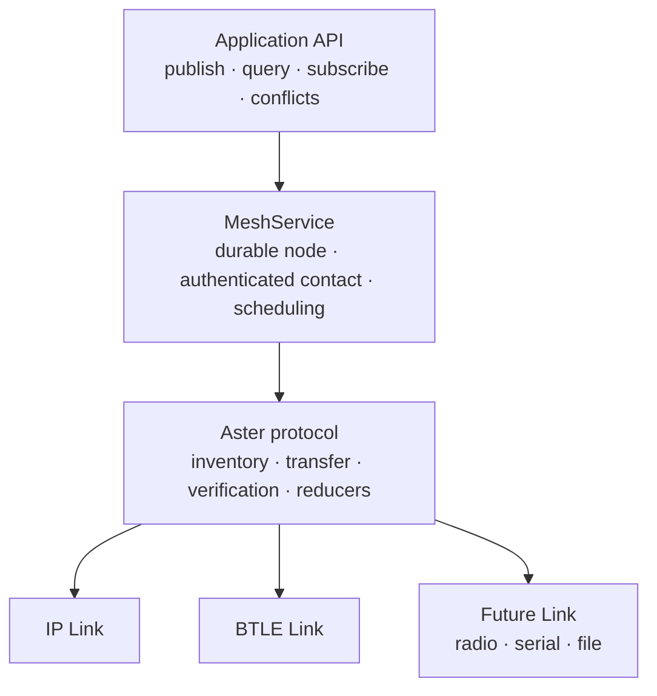

# Carriers and contacts

This guide explains how data moves between Aster nodes and what the current IP
and Bluetooth Low Energy adapters do. Read [Core concepts](concepts.md) first if
terms such as node, topic, or scope are new.

## The important separation

Application code publishes data. Deployment code configures carriers.



An item never names UDP, Bluetooth, a relay, or a particular peer. It commits to
the same durable store regardless of how future contacts happen. This separation
is what allows interrupted progress to resume through another peer or carrier.

In the current repository:

- `ApplicationNode` is the offline application surface.
- `MeshService` composes that application surface with authenticated sync, Blob
  transfer state, and configured `Link` implementations.
- `IpLink` and `BleLink` implement the same opaque-fragment contract.
- The maintained [capability-boundary table](README.md#current-capability-boundary)
  records which operations each Rust and language-binding surface exposes.

## What is implemented today

| Carrier path | Current capability | What is not yet claimed |
|---|---|---|
| Controlled in-memory link | Full high-level host contact, authentication, reconciliation, resume, and failure tests | It is a test carrier, not a deployment |
| UDP/IP | Nonblocking link, manual endpoint mapping, protected local discovery, rendezvous helpers, opaque relay components | Full application-host acceptance on physical or operational networks |
| NAT/rendezvous and relay | Bounded rendezvous, endpoint-punching, and opaque-relay helpers with local software tests | A two-device test on representative hardware behind two controlled NATs, proving direct contact where permitted and relay fallback otherwise |
| BTLE | MTU-aware link, unicast plus an advertisement primitive, disconnect handling, platform `BleRadio` seam | A shipped Android, iOS, Linux, or controller-specific radio implementation; complete one-to-many replication profile |
| LoRa, serial, file | The transport-neutral design does not preclude them | No adapters are shipped |

The distinction between code being present and a deployment claim is deliberate.
See [Conformance](conformance.md) for the current evidence and open gates.

## Contact lifecycle

The high-level host has a small, nonblocking lifecycle:

1. Open `MeshService`. It is immediately available for offline application
   operations.
2. Configure one or more carriers for known peer identities while no contact is
   active.
3. Call `begin_sync(peer)` when a contact opportunity exists.
4. Call `pump()` from the host event loop after carrier readiness, an application
   command, or the next scheduled wakeup.
5. Inspect application subscriptions or peer status for useful progress.
6. Call `pause_sync()` when the contact ends or another peer should be serviced.

The current bounded profile services one authenticated contact at a time. The
caller chooses the peer for that contact with `begin_sync(peer)`. If several
carriers are configured for that peer, `MeshService` chooses among them in
per-peer round-robin order; it does not currently score reachability,
bandwidth, cost, or emission characteristics, and a failed contact does not
automatically fail over to the next carrier. Pausing destroys session keys but
retains verified objects and partial Blob ranges. A later `begin_sync(peer)`
selects the next configured carrier for that peer.

`pump()` is nonblocking. Do not drive it in a busy loop. Integrate it with the
platform's I/O readiness and timer mechanism.

## Common Rust host setup

The transport quickstarts assume two **different** authority-issued node bundles
with compatible mission, scope, topic, and epoch access. Do not copy one bundle
to two nodes: that clones the identity and durable publisher counter owner.

Create the service policy once per node:

```rust
use aster_host::{ServiceOptions, SyncProfile};
use aster_mesh::{ApplicationNodeOptions, BlobStoreConfig, Priority, Scope, Topic};

let sync = SyncProfile::new(
    vec![Topic::new("position.current")?],
    vec![Scope::new("mission/team/alpha")?],
    Priority::Routine,
)?;

let options = ServiceOptions {
    node: ApplicationNodeOptions::default(),
    blobs: BlobStoreConfig::default(),
    sync,
};
```

`SyncProfile` is the interest used for authenticated contacts. It bounds the
topics, scopes, and minimum received priority; it is not an application
subscription and does not grant access beyond provisioning.

Open each node with separate durable database and Blob directories:

```rust
use aster_host::MeshService;

let mut alice = MeshService::open(
    "alice.db",
    "alice-blobs",
    &alice_provisioning_bundle,
    alice_options,
)?;

let mut bob = MeshService::open(
    "bob.db",
    "bob-blobs",
    &bob_provisioning_bundle,
    bob_options,
)?;
```

At this point both nodes can publish, query, and subscribe while offline.

## IP quickstart

`IpLink` uses nonblocking UDP. The simplest integration uses known peer socket
addresses:

```rust
use aster_ip::IpLink;
use std::net::{IpAddr, Ipv4Addr, SocketAddr};

let loopback_port = || SocketAddr::new(IpAddr::V4(Ipv4Addr::LOCALHOST), 0);

// This token groups protected discovery traffic. It is never transmitted, and
// IpLink rejects an all-zero value.
let discovery_token = [0x42; 16];
let discovery_target = None; // Use Some(multicast_addr) for broadcast discovery.

let alice_link = IpLink::bind(
    "alice-to-bob", loopback_port(), discovery_token, discovery_target,
)?;
let bob_link = IpLink::bind(
    "bob-to-alice", loopback_port(), discovery_token, discovery_target,
)?;

// Manual peering binds the expected authenticated NodeID to a UDP endpoint.
// Authentication still happens in Aster; this map does not replace it.
alice_link.register_peer(bob.identity(), bob_link.local_addr()?)?;
bob_link.register_peer(alice.identity(), alice_link.local_addr()?)?;

alice.configure_peer_carrier(bob.identity(), alice_link)?;
bob.configure_peer_carrier(alice.identity(), bob_link)?;

alice.begin_sync(bob.identity())?;
bob.begin_sync(alice.identity())?;
```

`IpLink::bind`'s fourth argument is `discovery_target`. `None` disables the
announcement/broadcast destination, as in the manual-peering example. `Some`
provides the address used by `announce()` and peerless link sends. When that
address is an IPv4 multicast address, `bind` also joins that group on the
unspecified interface and enables multicast loopback. Other `Some` addresses
are send targets only; the deployment remains responsible for any corresponding
receive-side network setup.

The 16-byte discovery token is provisioned group material, not a NodeID or a
bearer value. It is never transmitted: discovery packets carry fresh nonces and
derived proofs. `IpLink::bind` rejects the all-zero token, including when manual
peering uses `discovery_target = None`.

Drive both services from their host loops until the desired item appears in a
subscription or bounded query, then pause the contact. Aster does not make a
remote-delivery promise from the local publish result.

### IP discovery, rendezvous, and relay

The IP crate provides separate tools for three deployment situations:

- **Known address:** register a provisioned peer NodeID and socket address
  directly. This is the smallest path and the best place to begin.
- **Local discovery:** announcements use a provisioned opaque discovery token,
  fresh nonces, and a challenge/response before an endpoint becomes a candidate.
  Discovery does not replace authenticated session identity.
- **NAT/rendezvous:** rendezvous helpers can coordinate endpoint punching where
  the network permits it. NAT behavior is environmental; success is never
  universal.
- **Opaque relay:** the relay path can forward protected Aster traffic when
  direct reachability fails. A relay is useful infrastructure, not part of data
  correctness and not automatically a content reader.

Start with manually known addresses. Add discovery or rendezvous only after the
authenticated two-node path is understood and measured in the target network.

## BTLE quickstart

The BTLE crate deliberately does not choose an operating-system Bluetooth API.
Your platform integration implements the narrow `BleRadio` trait:

```rust
use aster_ble::{BlePacket, BleRadio};
use aster_mesh::NodeId;
use std::io;

struct PlatformRadio {
    // Android, iOS, BlueZ, controller, or device-specific handles live here.
}

impl BleRadio for PlatformRadio {
    fn name(&self) -> &str { "platform-btle" }
    fn unicast_mtu(&self) -> usize { 185 }
    fn broadcast_mtu(&self) -> Option<usize> { None }

    fn send(&self, peer: NodeId, bytes: &[u8]) -> io::Result<()> {
        // Send one already-fragmented opaque packet over L2CAP or GATT.
        todo!()
    }

    fn broadcast(&self, _bytes: &[u8]) -> io::Result<()> {
        Err(io::Error::new(io::ErrorKind::Unsupported, "no advertisements"))
    }

    fn try_receive(&self) -> io::Result<Option<BlePacket>> {
        // Return immediately; Ok(None) means no packet is ready.
        todo!()
    }

    fn set_discovery(&self, enabled: bool) -> io::Result<()> {
        // Map Aster's emission policy to scanning/advertising state.
        todo!()
    }

    fn bits_per_second(&self) -> Option<u64> {
        // Optional current estimate reported through LinkCharacteristics.
        Some(125_000)
    }
}
```

Wrap it and register it exactly like any other carrier:

```rust
use aster_ble::BleLink;

let link = BleLink::new(PlatformRadio { /* platform handles */ }, alice.identity());
link.set_peer_mtu(bob.identity(), negotiated_application_mtu)?;
alice.configure_peer_carrier(bob.identity(), link)?;
```

The radio must be nonblocking and must reject outbound packets above its current
useful MTU. `BleLink` silently drops an oversized inbound packet and continues
draining the radio. Override `BleRadio::bits_per_second` when the platform has a
useful current estimate; the default is unknown.

On disconnect, the platform integration must call
`BleLink::disconnected(&peer)` so the peer's link-local negotiated MTU is
removed; verified object progress remains in the core store. The current
`BleLink::new(radio, local_node)` API accepts `local_node` for its composition
shape but does not use it internally, so callers must not rely on the adapter to
check or bind the local identity.

BTLE advertisement support is currently a carrier primitive. It is not a claim
that the complete authenticated replication exchange has a one-to-many broadcast
profile.

## Adding another carrier

A new carrier implements the `Link` contract exposed by `aster-core`'s
`adapter-sdk` feature. It supplies:

- a stable diagnostic name;
- characteristics such as MTU, estimated bit rate, cost, emission footprint, and
  broadcast capability;
- nonblocking send and receive of opaque fragments; and
- discovery enable/disable behavior.

The carrier must not parse application items, invent routing semantics, perform
conflict resolution, or treat transport security as Aster authentication. The
core owns fragmentation, handshake, replay defense, exact reconciliation,
source verification, and reducers.

Use the [binding pattern](bindings/pattern.md) for a language API. Use the `Link`
trait and existing IP/BTLE adapters as the integration pattern for a carrier.

## Protocol versions you may see

Aster separates stable bytes from negotiated behavior:

- **Replication wire/profile version 1** identifies the current encoding and
  fixed security-object family.
- **Semantic version 2** is offered first by the current implementation and adds
  compact authenticated batches and authorized cross-scope routes.
- **Semantic version 1** remains a compatibility option for singleton transfer.

The process-wide version constants report implementation support, not what a
particular session negotiated. Application code normally does not branch on
these values. See the [compatibility and deprecation
policy](deprecation-policy.md) for support windows, stored-data obligations,
and the required procedure for retiring protocol, suite, ABI, binding, or
registry values.

Transcript binding rejects an unauthenticated on-path rewrite of the offer or
selection, but negotiation does not authenticate a responder's complete
capability set. An older, rolled-back, or modified peer can honestly complete
semantic version 1. A deployment that depends on downgrade resistance must
therefore fail closed at release authorization until it has the authority-signed
minimum, durable per-identity capability high-water, signed rollback
authorization, mixed-version evidence, and independent interoperability
evidence defined by the [deprecation policy](deprecation-policy.md). Version 1
compatibility is not downgrade-resistance evidence.

## Before a real deployment

- Issue distinct operational bundles through an approved provisioning process.
- Set quotas, retention, priority caps, and sync interests for the device tier.
- Decide how the host obtains peer identities and endpoints.
- Integrate nonblocking carrier readiness and wakeups without polling.
- Capture every enabled physical carrier and compare it with the privacy
  canaries in [Security](security.md).
- Run the relevant loss, bandwidth, restart, alternate-peer, and large-Blob
  scenarios in [Conformance](conformance.md).
- Treat every open item in [Conformance](conformance.md) as an explicit
  acceptance decision, not an implied guarantee.
